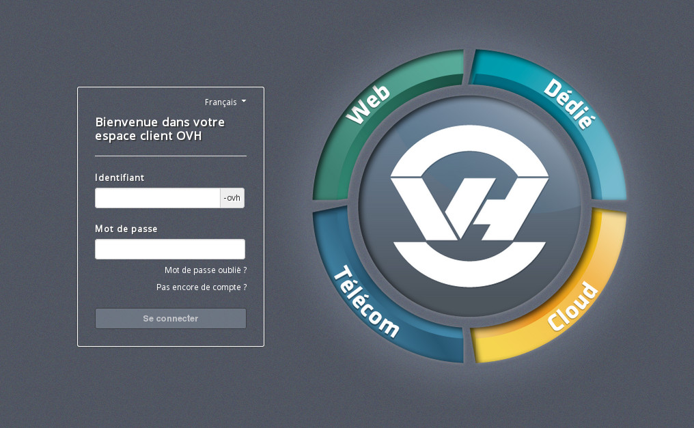
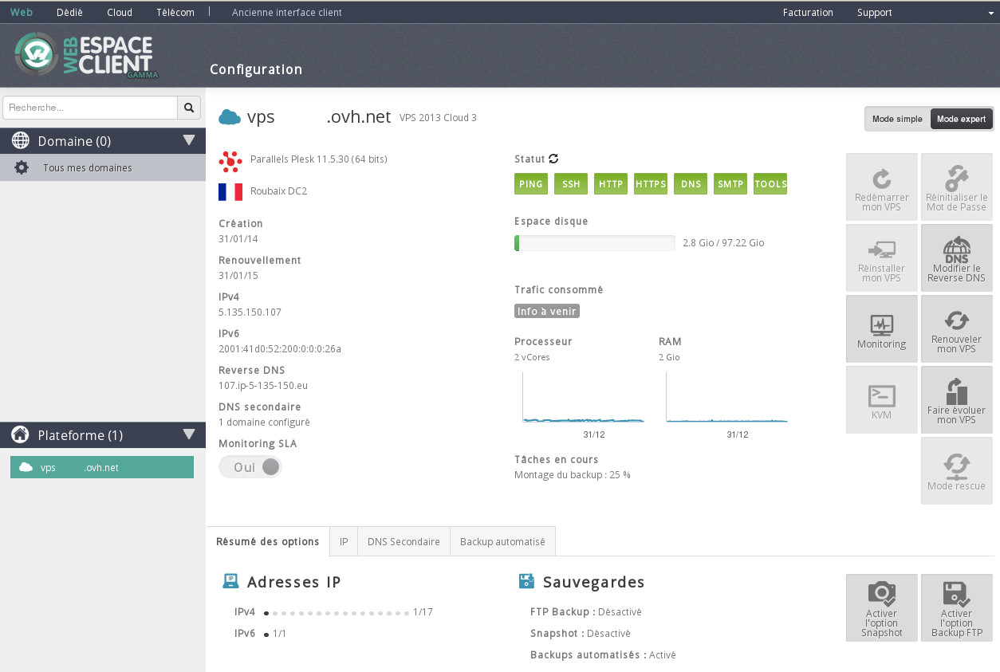
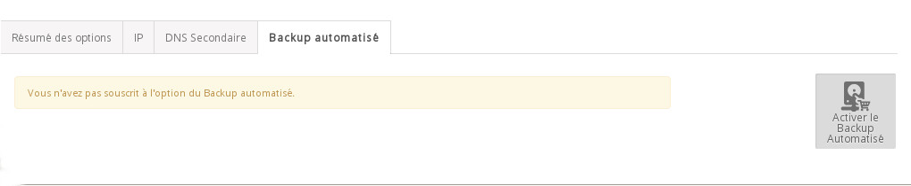
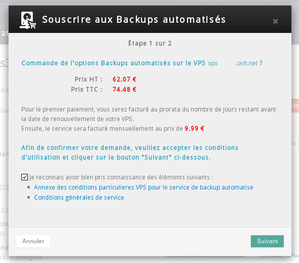
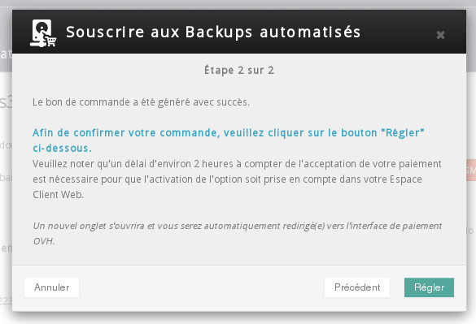
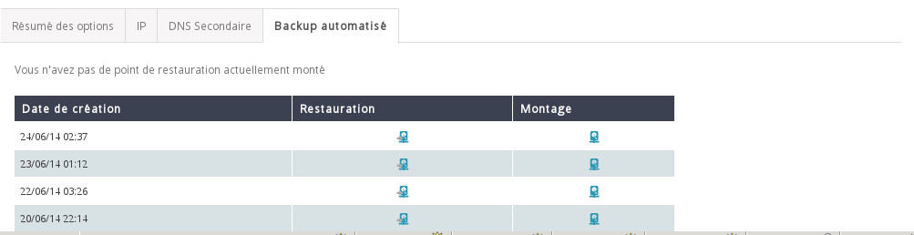
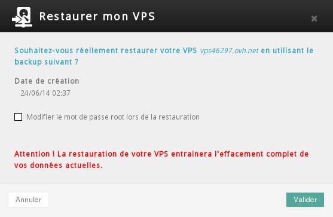
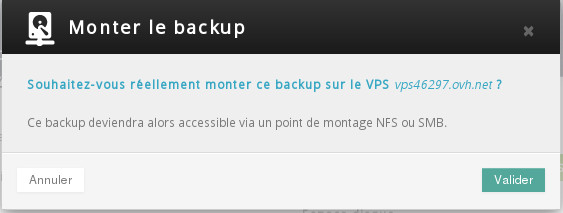

## 
Para utilizar el backup automatizado, necesitará:


- un VPS de la gama Cloud;
- sus claves de conexión al área de cliente;
- acceso a su servidor (SSH o RDP).


## Desde el área de cliente
En primer lugar, acceda al [área de cliente](https://www.ovh.com/manager/web/).

{.thumbnail}
Introduzca su ID de cliente y contraseña y conéctese.
En la columna izquierda, seleccione su VPS.

{.thumbnail}
En el panel principal, abra la pestaña «Backup automatizado» y haga clic en el botón «Activar el backup automatizado».

{.thumbnail}
Acepte los contratos y haga clic en «Siguiente».

{.thumbnail}
Se generará la orden de pedido. Haga clic en «Abonar» para acceder a ella.

{.thumbnail}
Una vez realizado el pago, se entregará la opción de backup automatizado.


## Desde el área de cliente
Conéctese al [área de cliente](https://www.ovh.com/manager/web/) y seleccione un VPS en el que tenga la opción activada.
En el panel principal, abra la pestaña «Backup automatizado», donde podrá ver la lista de backups disponibles.

Haga clic en el icono de la columna «Restauración» correspondiente al punto de restauración deseado.

{.thumbnail}
Acepte.

{.thumbnail}
A continuación, se creará una tarea de restauración (duración: entre 30 minutos y una hora, según el modelo de VPS).

Cuando finalice la restauración, recibirá por correo electrónico los datos de conexión a su VPS:


```
PARÁMETROS DE ACCESO:

Dirección IPv4 del VPS: Su IPv4
Dirección IPv6 del VPS: Su IPv6

Nombre del VPS: vpsXXXXX.ovh.net

La contraseña de su VPS es la misma que la utilizada el 2014-06-24 02:37:16.
```


## Desde el área de cliente
Conéctese al [área de cliente](https://www.ovh.com/manager/web/) y seleccione un VPS en el que tenga la opción activada.

En el panel principal, abra la pestaña «Backup automatizado», donde podrá ver la lista de backups disponibles.

Haga clic en el icono de la columna «Montaje» correspondiente al punto de restauración que quiera montar y acepte.

{.thumbnail}
Recibirá por correo electrónico los datos de conexión, así como los comandos necesarios para montar el backup por NFS o CIFS en su VPS:


```
Puede montar su backup en Linux con los siguientes comandos:

mount -t nfs -o ro,vers=3 IP.IP.IP.IP:/mnt/veeam/vpsXXXXX /mnt

Puede ser necesario instalar el paquete nfs-common en Debian y 
Ubuntu, o los paquetes nfs-utils y nfs-utils-lib en CentOS.

mount -t cifs -o username=vpsXXXXX,password=YYYYYY //IP.IP.IP.IP/VPSXXXXX /mnt

Puede ser necesario instalar el paquete cifs-utils en Debian, 
Ubuntu y CentOS.
```


