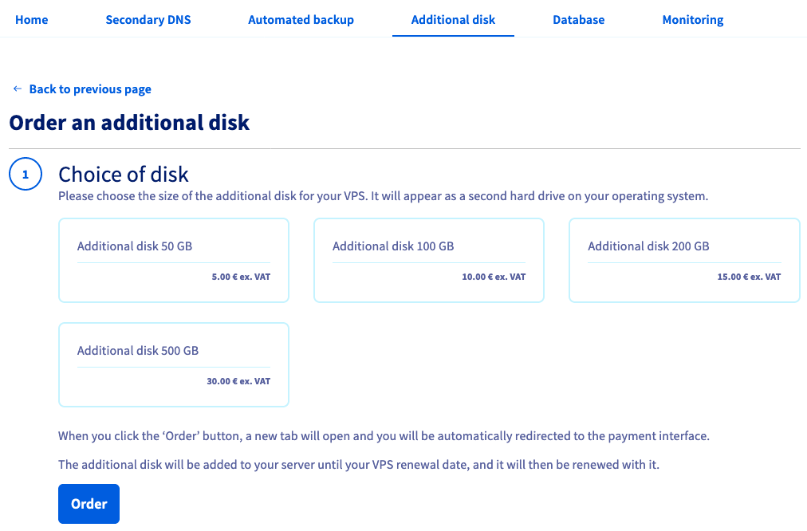

> [!primary]
> Esta tradução foi automaticamente gerada pelo nosso parceiro SYSTRAN. Em certos casos, poderão ocorrer formulações imprecisas, como por exemplo nomes de botões ou detalhes técnicos. Recomendamos que consulte a versão inglesa ou francesa do manual, caso tenha alguma dúvida. Se nos quiser ajudar a melhorar esta tradução, clique em “Contribuir” nesta página.
>

**Última atualização: 24/02/2021**

## Objetivo

Com os VPS OVHcloud, tem a possibilidade de adicionar um espaço de armazenamento seguro como opção de serviço. Este armazenamento é separado da capacidade de armazenamento interno da solução VPS, tornando-a num local seguro para os seus backups ou outros dados estáticos. O disco adicional só pode ser acedido a partir do endereço IP do servidor e os dados nele contidos não serão afetados, mesmo que o VPS seja reinstalado ou sofra perda de dados.

**Saiba como ativar a opção de disco adicional e configurar o espaço de armazenamento para o utilizar com o VPS.**

## Requisitos

- Ter um [VPS](https://www.ovhcloud.com/pt/vps/) na sua conta OVHcloud
- Estar ligado à [Área de Cliente OVHcloud](https://www.ovh.com/auth/?action=gotomanager&from=https://www.ovh.pt/&ovhSubsidiary=pt).
- Ter acesso administrativo via SSH ou RDP ao VPS

## Instruções

Ligue-se à sua [Área de Cliente OVHcloud](https://www.ovh.com/auth/?action=gotomanager&from=https://www.ovh.pt/&ovhSubsidiary=pt), vá à secção `Bare Metal Cloud`{.action} e selecione o seu servidor na secção `Servidor privado virtual`{.action}.

### Encomendar um disco adicional

Depois de selecionar o VPS, clique no separador `Disco Adicional`{.action} no menu horizontal. Clique em `Encomendar um disco suplementar`{.action} e escolha um tamanho de disco na seleção que aparecerá.

{.thumbnail}

Tome nota das informações de tarifação e clique em `Encomendar`{.action}. Será guiado pelo processo de encomenda e receberá um e-mail de confirmação assim que o disco estiver instalado.

### Montar o novo espaço de armazenamento

> [!warning]
> A OVHcloud fornece-lhe serviços pelos quais é responsável em termos de configuração e gestão. Assim, é responsável pelo seu bom funcionamento.
>
> Se encontrar dificuldades para realizar estas ações, contacte um fornecedor de serviços especializado e/ou discuta o problema com a nossa comunidade de utilizadores em <https://community.ovh.com/en/>. A OVHcloud não lhe pode fornecer apoio técnico sobre este assumpto.
>

#### Num VPS Linux

Se estiver instalada uma distribuição GNU/Linux no VPS, aceda SSH ao servidor a partir do terminal da linha de comando ou utilizando uma aplicação cliente SSH.

Os exemplos abaixo pressupõem que está ligado enquanto utilizador com taxas elevadas.

Pode utilizar o seguinte comando para verificar o nome do novo periférico:

```
$ lsblk

sda       8:0    0   80G  0 disk
├─sda1    8:1    0 79.9G  0 part /
├─sda14   8:14   0    4M  0 part
└─sda15   8:15   0  106M  0 part /boot/efi
sdb       8:16   0   50G  0 disk
```

Neste exemplo, o disco adicional é chamado `sdb`.

Execute o `fdisk` para criar uma partição no disco. Quando for convidado, insira `n` para uma nova partição e aceite os valores predefinidos seguintes, apoiando-se em Entrada (" ↩"). Por fim, utilize o comando `w` para escrever as modificações no disco.

```
$ sudo fdisk /dev/sdb

Welcome to fdisk (util-linux 2.34).
Changes will remain in memory only, until you decide to write them.
Be careful before using the write command.
```

```
Command (m for help): n

Partition type
   p   primary (0 primary, 0 extended, 4 free)
   e   extended (container for logical partitions)

Select (default p):
```

```
Partition number (1-4, default 1): 

First sector (2048-104857599, default 2048):
Last sector, +/-sectors or +/-size{K,M,G,T,P} (2048-104857599, default 104857599):

Created a new partition 1 of type 'Linux' and of size 50 GiB.
```

```
Command (m for help): w

The partition table has been altered.
Calling ioctl() to re-read partition table.
Syncing disks.
```

Agora que a partição `sdb1` foi criada, pode formá-la com ext4:

```
$ sudo mkfs.ext4 /dev/sdb1

Creating filesystem with 13106944 4k blocks and 3276800 inodes
Filesystem UUID: a667d351-cf36-49f2-94b4-daf03d7a86a6
Superblock backups stored on blocks:
32768, 98304, 163840, 229376, 294912, 819200, 884736, 1605632, 2654208,
4096000, 7962624, 11239424

Allocating group tables: done                           
Writing inode tables: done                           
Creating journal (65536 blocks): done
Writing superblocks and filesystem accounting information: done  
```

A última etapa consiste em montar o disco:

```
$ sudo mkdir /mnt/disk
$ sudo mount /dev/sdb1 /mnt/disk
```

Pode ver na última linha que o disco adicional está agora montado a `/mnt/disk`:

```
$ df -h
Filesystem      Size  Used Avail Use% Mounted on
udev            1.9G     0  1.9G   0% /dev
tmpfs           385M  1.1M  384M   1% /run
/dev/sda1        78G  2.4G   75G   4% /
tmpfs           1.9G     0  1.9G   0% /dev/shm
tmpfs           5.0M     0  5.0M   0% /run/lock
tmpfs           1.9G     0  1.9G   0% /sys/fs/cgroup
/dev/sda15      105M  3.9M  101M   4% /boot/efi
/dev/loop1       68M   68M     0 100% /snap/lxd/18150
/dev/loop3       32M   32M     0 100% /snap/snapd/10707
/dev/loop4       56M   56M     0 100% /snap/core18/1944
/dev/loop5       70M   70M     0 100% /snap/lxd/19188
tmpfs           385M     0  385M   0% /run/user/0
/dev/loop6       56M   56M     0 100% /snap/core18/1988
/dev/loop2       32M   32M     0 100% /snap/snapd/11036
tmpfs           385M     0  385M   0% /run/user/1000
/dev/sdb1        49G   53M   47G   1% /mnt/disk
```

> [!primary]
>
This previous step is not persistent because the disk will be detached if the VPS is restarted. In order to automate the mounting process, the `fstab` file needs to be edited.
>

Em primeiro lugar, obtenha a UUID (ID do bloco) do periférico:

```
$ sudo blkid
/dev/sda1: LABEL="cloudimg-rootfs" UUID="e616a2cd-3c02-4c79-9823-9b1bb5c13b26" TYPE="ext4" PARTUUID="a44089a3-f407-41e6-b7a5-1ed7672cef20"
/dev/sda15: LABEL_FATBOOT="UEFI" LABEL="UEFI" UUID="4411-1580" TYPE="vfat" PARTUUID="e1746ac7-80c1-4859-9b4d-fa6ce11b3ae9"
/dev/loop1: TYPE="squashfs"
/dev/loop2: TYPE="squashfs"
/dev/loop3: TYPE="squashfs"
/dev/loop4: TYPE="squashfs"
/dev/loop5: TYPE="squashfs"
/dev/loop6: TYPE="squashfs"
/dev/sda14: PARTUUID="7d19a2c9-75df-443e-8301-0bb85931df7d"
/dev/sdb1: UUID="87571b68-30e1-498b-a64c-49ec5cd4f31c" TYPE="ext4" PARTUUID="c965cbdf-01"
```

Abra `/etc/fstab` com um editor de texto:

```
$ sudo nano /etc/fstab
```

Adicione a linha abaixo ao ficheiro e substitua a UUID pela sua:

```
UUID=87571b68-30e1-498b-a64c-49ec5cd4f31c /mnt/disk ext4 nofail 0 0
```

Registe e saia do editor. Por conseguinte, o disco deve ser automaticamente montado após cada reinício.

#### Num VPS Windows

Se estiver instalado um sistema operativo Windows no seu VPS, estabeleça uma ligação Área de Trabalho remota (RDP) ao seu servidor.

Uma vez ligado, clique com o botão `Menu Iniciar`{.action} e abra a ferramenta de `Gestão dos discos`{.action}.

{.thumbnail}

O novo disco apresenta-se sob a forma de um volume desconhecido com espaço não atribuído.

{.thumbnail}

Se o disco estiver marcado como fora de ligação, deve ser iniciado. Para isso, pode utilizar a [interface gráfica Windows](#initDiskManagement) ou o [utilitário DISKPart](#initDiskpart). Caso contrário, [formate o disco na ferramenta "Gestão dos discos"](#formatDiskManagement).

##### **Iniciar o disco na ferramenta "Gestão dos discos"** <a name="initDiskManagement"></a>

 Clique com o botão direito do rato no disco e selecione `Online`{.action}. 

{.thumbnail}

 Clique com o botão direito do rato no disco e selecione `Iniciar o disco`{.action}.

{.thumbnail}

Selecione `MBR`{.action} (Sector de arranque principal) na nova janela e clique em `OK`{.action}.

{.thumbnail}

##### **Iniciar o disco com DISKPARTIDO** <a name="initDiskpart"></a>

 Clique com o botão direito do rato no `Menu Iniciar`{.action} e abra a `Executar`{.action}.

{.thumbnail}

Introduza `cmd` e clique em `OK`{.action} para abrir a aplicação de linha de comando.

{.thumbnail}

No convite à encomenda, abra o DISKPARTIDO:

```
C:\> diskpart
```

Utilize a seguinte série de comandos DISKPart para configurar o disco online:

```
DISKPARTIDA> san

SAN Policy: Offline Shared
```

```
DISKPART> san policy = OnlineAll

DiskPart successfully changed the SAN policy for the current operating system.

- Implementation of the strategy on the extra disk:
[Code] DISKPART> list disk

Disk ### Status Size Free Dyn Gpt
-------- ------------- ------- ------- --- ---
Disk 0 Online 200 GB 0 B
* Disk 1 Offline 10 GB 1024 KB
```

```
DISKPARTIDO> select disk 1

Disk 1 is now the selected disk.
```

```
DISKPart> atributos disk clear readonly

Disk atributos cleared successfully.
```

```
DISKPART> attributes disk

Current Read-only State : No
Read-only : No
Boot Disk : No
Pagefile Disk : No
Hibernation File Disk : No
Crashdump Disk : No
Clustered Disk : No
```

```
DISKPARTIDO> online disk

DiskPart successfully onlined the selected disk.
```

##### **Formar o disco na ferramenta "Gestão dos discos"** <a name="formatDiskManagement"></a>

Na `Gestão dos discos`{.action}, clique com o botão direito do rato no novo disco e selecione `Novo volume simples...`{.action}.

{.thumbnail}

No Assistente, clique em `Seguinte`{.action} para especificar o volume. Deve ser definido por defeito no máximo. Clique em `Seguinte`{.action} para continuar.

{.thumbnail}

Guarde a nova letra de leitor por predefinição ou selecione outra e clique em `Seguinte`{.action}.

{.thumbnail}

Dê um nome ao volume (facultativo) e confirme as opções de formatação ao clicar em `Seguinte`{.action}.

{.thumbnail}

Na última janela, clique em `Terminar`{.action} para formatar o disco. Ficará disponível como leitor no Explorador de ficheiros após a operação.

### Rescindir a opção de disco adicional

No separador `Página Inicial`{.action}, expanda o ecrã até à zona intitulada **Resumo das opções**. Clique em `...`{.action} em frente à opção "Discos adicionais". Clique em `Rescindir`{.action} no menu contextual.

{.thumbnail}

## Vá mais longe

Junte-se à nossa comunidade de utilizadores <https://community.ovh.com/en/>.
