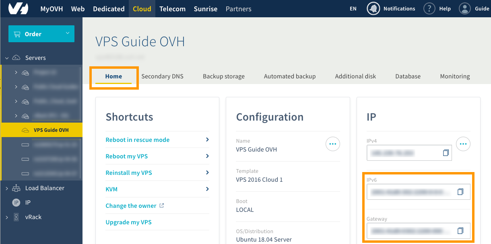

**Last updated 24th April 2019**

## Objective

IPv6 is the latest version of the *Internet Protocol* (IP). Each OVH VPS server comes with an IPv4 address and an IPv6 address. By default, only IPv4 is configured. However, for various reasons, you may also want to configure IPv6.

**Learn how to configure IPv6 on your OVH VPS server.**

> [!warning]
>
> OVH is providing you with machines that you will be responsible for. We have no access to these machines, and therefore cannot manage them. You are responsible for your own software and security management. We have provided you with this guide in order to help you with common tasks. However, we advise contacting a specialist provider if you experience any difficulties or doubts about administration, usage or server security. You can find more information in the "Go further" section of this guide.
> 

## Requirements

- You need to have an [OVH VPS server]({ovh_www}/vps/){.external}.
- You need to be connected via SSH to your VPS (root access).
- You need to have basic network knowledge.
- You need to have access to the `Dedicated`{.action} section of the [OVH Control Panel](https://www.ovh.com/auth/?action=gotomanager){.external}.

## Instructions

Configuring IPv6 on your VPS server is done in several steps. At several points in the process, you will be prompted to use commands, or to customise the configuration of your server. 

Before starting, and in order to use consistent terminology throughout these changes, we invite you to take note of the table below. It sets out terms that we will use throughout this guide:

|Term|Description|Example|
|---|---|---|
|YOUR_IPV6|This is the IPv6 address assigned to your service|2001:xxxx:xxxx:xxxx:xxxx:xxxx:xxxx:yyyy|
|IPv6_PREFIX|This is the prefix (or *netmask*) of your IPv6 block. This is usually 128|2001:xxxx:xxxx:xxxx::/128|
|IPv6_GATEWAY|This is the gateway of your IPv6 block|2001:xxxx:xxxx:xxxx:xxxx:xxxx:xxxx:zzzz|

### Step 1: Get the necessary network information

The first step is to access the IPv6 address and the IPv6 gateway assigned to your server. There are two ways of doing this. Use whichever method you prefer.

- [Get the network information via the OVH Control Panel](./#via-the-ovh-control-panel).
- [Get the network information via the OVH API](./#via-the-ovh-api).

#### Via the OVH Control Panel

Log in to the [OVH Control Panel](https://www.ovh.com/auth/?action=gotomanager){.external}, and open the`Cloud`{.action} section. Click `Servers`{.action} in the services bar on the left-hand side, then choose the VPS server concerned. Make sure you are on the `Home`{.action} tab.

The IPv6 address and the IPv6 gateway assigned to your server will appear in the `IP` section. Retrieve these and continue to step 2, "[Apply IPv6 Configuration](./#step-2-apply-the-ipv6-configuration_1){.external}".

{.thumbnail}

#### Via the OVH API

Go to <https://eu.api.ovh.com/console/> and log in with your OVH ID. Then use the two APIs below.

The first one allows you to recover the IPv6 address assigned to your server:

> [!api]
>
> @api {GET} /vps/{serviceName}/ips
>

The second allows you to recover the IPv6 gateway assigned to your server:

> [!api]
>
> @api {GET} /vps/{serviceName}/ips/{ipAddress}
>

Retrieve these and continue to step 2, "[Apply IPv6 Configuration](./#step-2-apply-the-ipv6-configuration_1)".

### Step 2: Apply the IPv6 configuration

Once you have the necessary information for the IPv6 configuration, log in to your VPS via SSH. If you require assistance, please refer to this guide: "[Introduction to SSH](../../dedicated/ssh-introduction/){.external}".

There are several ways to apply the IPv6 configuration. Use whichever method best suits your situation and requirements.

- [non-persistent application](./#non-persistent-application)
- [persistent application on Debian and its derivatives (i.e. Ubuntu, Crunchbang, SteamOS...)](./#persistent-application-on-debian-and-its-derivatives-ubuntu-crunchbang-steamos)
- [persistent application on Redhat and its derivatives (i.e. CentOS, ClearOS…)](./#persistent-application-on-redhat-and-its-derivatives-centos-clearos_1)
- [persistent application on Windows Server](./#persistent-application-on-windows-server)

#### Non-persistent application

> [!warning]
>
> This configuration will be lost after a restart of your VPS server (non-persistent configuration). 
> 

Connected SSH to your VPS via SSH, using the following commands. Take care to tailor these with:

- the generic elements (*YOUR_IPV6*, *IPV6_PREFIX* and* IPV6_GATEWAY*), using the information recovered earlier
- the network interface (if the one you are using is not **eth0**)

```bash
ip addr add YOUR_IPV6/IPV6_PREFIX dev eth0
ip -6 route add IPV6_GATEWAY dev eth0
ip -6 route add default via IPV6_GATEWAY dev eth0
```

#### Persistent application on Debian and its derivatives (Ubuntu, Crunchbang, SteamOS...)

There are two ways to configure your network according to the operating system installed on your server:

- **for Debian 8 and lower, Ubuntu 16.04 and lower**: use the method based on the file interfaces

- **for Debian 9, Ubuntu 17.04 and later**: use the method based on the Netplan function

In some cases (such as Debian 9), the appropriate method may not be the one specified above. To make sure, browse your system to check which one is active. Visit <https://netplan.io/> for more information, if necessary.

> [!warning]
>
> Before modifying a configuration file, remember to make a backup! This way, if something goes wrong, you can easily go back.
> 

Proceed with the method that best suits you:

- [configuration of the file interfaces](./#configuration-of-the-file-interfaces)
- [configuration via the Netplan function](./#configuration-via-the-netplan-function)

#####  Configuration of the file interfaces

Depending on the generation of the operating system installed on the server, you must change one of the following with *sudo* privileges:

- the `/etc/network/interfaces` file
- the `/etc/network/interfaces.d/50-cloud-init.cfg` file

We recommend that you start by backing up the relevant configuration file. For example, use the following command:

```bash
cp /etc/network/interfaces /etc/network/interfaces.back
```

You will then be able to go back, using the commands below:

```bash
rm -f /etc/network/interfaces
cp /etc/network/interfaces.back /etc/network/interfaces
```

As soon as you are ready to make the required changes, add the following lines to the configuration file. Take care to tailor them with the generic elements (i.e. *YOUR_IPV6*, *IPV6_PREFIX* and *IPV6_GATEWAY*), and also the network interface, if the one you are using is not **eth0**.

```
iface eth0 inet6 static
address YOUR_IPV6
netmask IPV6_PREFIX
post-up /sbin/ip -6 route add IPV6_GATEWAY dev eth0
post-up /sbin/ip -6 route add default via IPV6_GATEWAY dev eth0
pre-down /sbin/ip -6 route del default via IPV6_GATEWAY dev eth0
pre-down /sbin/ip -6 route del IPV6_GATEWAY dev eth0
```

Then restart your network service:

```bash
service networking restart
```

##### Configuration via the Netplan function

The network configuration files are located in the `/etc/netplan/` directory. We recommend that you start by backing up the relevant configuration file. In this case, copy the `50-cloud-init.yaml` file using the following commands:

```bash
cd /etc/netplan/
mkdir backup
cp 50-cloud-init.yaml backup/50-cloud-init.yaml
```

You will then be able to go back, using the commands below:

```bash
rm -f /etc/netplan/50-cloud-init.yaml
cp /etc/netplan/backup/50-cloud-init.yaml /etc/netplan/50-cloud-init.yaml
```

As soon as you are ready to perform the configuration, create a copy of the IPv4 file, for reworking at your convenience. 

```bash
cd /etc/netplan
cp 50-cloud-init.yaml 51-cloud-init-ipv6.yaml
```

Then edit the `51-cloud-init-ipv6.yaml` file, adding the IPv6 configuration of your server. Take care to tailor them with the generic elements (i.e. *YOUR_IPV6*, *IPV6_PREFIX* and *IPV6_GATEWAY*), and also the network interface, if the one you are using is not **eth0**.

```yaml
network:
    version: 2
    ethernets:
        eth0:
            dhcp6: false
            match:
              name: eth0
            addresses:
              - "YOUR_IPV6/IPv6_PREFIX"
            gateway6: "IPv6_GATEWAY"
```

> [!warning]
>
> It is important to respect the alignment of each element in the example above when writing your file. Do not use the tab key to create your spacing. Only the space key is needed.
>

Test your configuration using this command:

```bash
netplan try
```

If it is correct, apply it, using the following command:

```bash
netplan apply
```

#### Persistent application on Redhat and its derivatives (CentOS, ClearOS…)

The network configuration files are located in the `/etc/sysconfig/network-scripts/` directory. We recommend that you start by backing up the relevant configuration file. For example, copy the `ifcfg-eth0` file using the following commands. **Tailor the network interface if the one you are using is not eth0**.

```bash
cd /etc/sysconfig/network-scripts/
mkdir backup
cp ifcfg-eth0 backup/ifcfg-eth0
```

You will then be able to go back, using the commands below:

```bash
rm -f /etc/sysconfig/network-scripts/ifcfg-eth0
cp /etc/sysconfig/network-scripts/backup/ifcfg-eth0 /etc/sysconfig/network-scripts/ifcfg-eth0
```

As soon as you are ready, edit the current configuration file, adding the following lines. Take care to tailor the generic elements (i.e. *YOUR_IPV6*, *IPV6_PREFIX* and *IPV6_GATEWAY*).

```
IPV6INIT=yes
IPV6ADDR=YOUR_IPV6/IPV6_PREFIX
IPV6_DEFAULTGW=IPV6_GATEWAY
```

You will then need to create a file (with *sudo* privileges), indicating the default routes:

```bash
# touch /etc/sysconfig/network-scripts/route6-eth0
```

Edit it by tailoring the elements below (*IPV6_GATEWAY* and **eth0** interface, if necessary). 

```
IPV6_GATEWAY dev eth0
default via IPV6_GATEWAY
```

Once done, restart your network service to allow the system to assume the new configuration:

```bash
service network restart
```

#### Persistent application on Windows Server

By default, IPv6 is not configured on Windows Servers. To enable it, open the `OVH Control Panel`, click `View Network Status and Management`{.action}, and then click `Change card Settings`{.action}.

{.thumbnail}

Open the status of the `Ethernet` connection and click `Properties`{.action}. In the new window, select `Internet Protocol Version 6 (TCP / IPv6)` to highlight it, and then click the `Properties`{.action} button.

{.thumbnail}

In this new window, tick the "Use the following IPv6 address" box. Fill in the fields below with the information retrieved during the first step. 

Below "Use the following DNS server address", you have the option of entering the IPv6 DNS _resolvers_ of your choice in the fields provided. This extension is optional if the _resolvers_ mentioned in the IPv4 configuration are already working.

Once you have completed these items, tick the `Validate settings when quitting` box and click the `OK`{.action} button to validate your changes. An error message may appear if the entered gateway is not on the same IPv6 subnet (/128 and /64 for example). If this is the case, you should still be able to continue to the next step regardless.

{.thumbnail}

### Step 3: Verify the configuration and test the connection

To verify that the configuration is functional, there are several possible commands, depending on the operating system. 

- **For a Linux-based system**, here are two examples for the **eth0** interface (to be adapted if necessary):

```bash
ip -6 addr show eth0
2: eth0: <BROADCAST,MULTICAST,UP,LOWER_UP> mtu 1500 qlen 1000
    inet6 2001:xxxx:xxxx:xxxx:xxxx:xxxx:zzzz/128 scope global
       valid_lft forever preferred_lft forever
    inet6 fe80::f816:3eff:fec0:c336/64 scope link
       valid_lft forever preferred_lft forever
```

```bash
ifconfig eth0
eth0      Link encap:Ethernet  HWaddr ab:cd:ef:gf:ij:kl
          inet addr:aa.bb.cc.dd  Bcast:aa.bb.cc.ee  Mask:255.255.255.255
          inet6 addr: 2001:xxxx:xxxx:xxxx:xxxx:xxxx:zzzz/128 Scope:Global
          inet6 addr: fe80::f816:3eff:fec0:c336/64 Scope:Link
          UP BROADCAST RUNNING MULTICAST  MTU:1500  Metric:1
          [...]
```

To test the connection, use the following command: 

```bash
ping6 proof.ovh.net
```

- **For a Windows-based system**, use the following commands:

```
ipconfig
 
Windows IP Configuration

Ethernet adapter Ethernet:

   Connection-specific DNS Suffix  . : openstacklocal
   IPv6 Address. . . . . . . . . . . : 2001:xxxx:xxxx:xxxx::zzzz
   Link-local IPv6 Address . . . . . : fe80::d928:7a00:5ba6:951b%3
   IPv4 Address. . . . . . . . . . . : 51.xxx.xxx.xxx
   Subnet Mask . . . . . . . . . . . : 255.255.255.255
   Default Gateway . . . . . . . . . : 2001:xxxx:xxxx:xxxx::y
                                       51.xxx.xxx.y
```

To test the connection, use the following command: 

```
ping -6 proof.ovh.net
```

You can also test the connection to another remote server. However, it is necessary for IPv6 to be active on the remote server for this operation to work. 

> [!primary]
>
> If, despite these changes, IPv6 does not work on your server, it is possible (in rare cases) that you will have to carry out additional modifications. In such cases, try the following steps:
>
> - Depending on the operating system, try to change the prefix (or *netmask*) of your IP from /128 to /64. This will include the IPv6 gateway in your subnet.
>
> - In addition to restarting the network service, it may be necessary to reboot your server to finalise your IPv6 configuration.
>

### Step 4: Disable Cloud-init network management

> [!primary]
>
> This step does not apply to Windows-based systems.
>

Cloud-init is a package installed by default on VPS instances. It is a framework to run a script provided when creating your server or rebooting. The mechanics in place allow the OpenStack infrastructure to inject scripts into the Cloud-Init environment and, therefore, the server configuration.

Depending on the operating system, Cloud-init will manage: the network, the hostname, the resolv.conf file, or the automatic partitioning of the hard disk, in case of an upgrade.

In the case of newer distributions (such as CentOS, Debian 9, Ubuntu 16.x, and later), the default configuration of the Cloud.init is going to automatically reset the network configuration when the server starts up.

To avoid this, you need to disable automatic network management in the Cloud.init. To do this, use the following command to create a file `/etc/cloud/cloud.cfg.d/98-disable-network-config.cf` with the value `network: {config: disabled}`:

```bash
echo "network: {config: disabled}" > /etc/cloud/cloud.cfg.d/98-disable-network-config.cfg
```

Once done, reboot your server for handling to take effect. 

To return to automatic management of your network by Cloud-init, delete the newly created file. or move it to another directory.

## Go further

Join our community of users on <https://community.ovh.com/en/>.