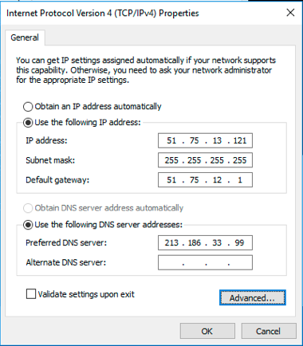
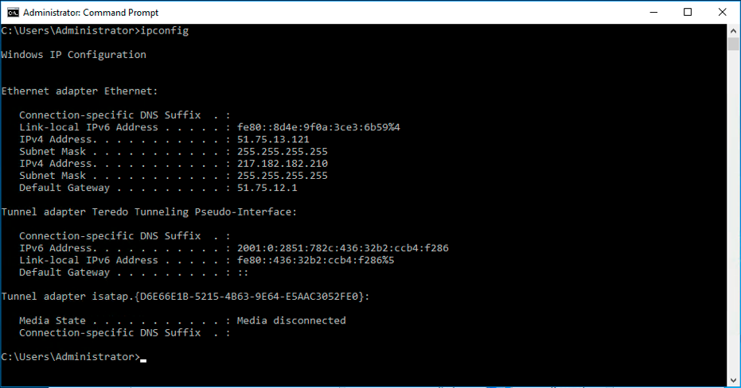
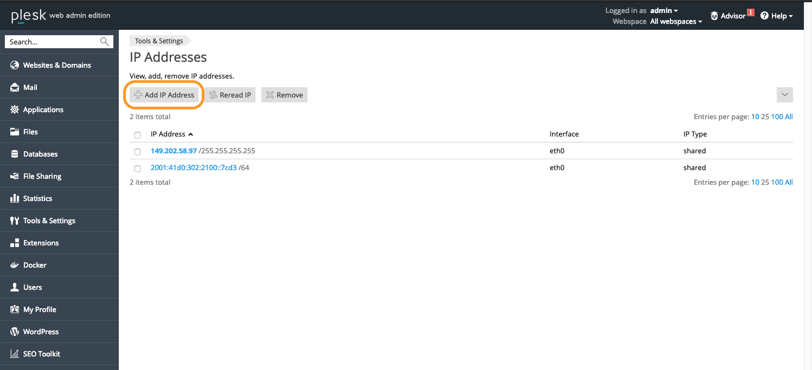
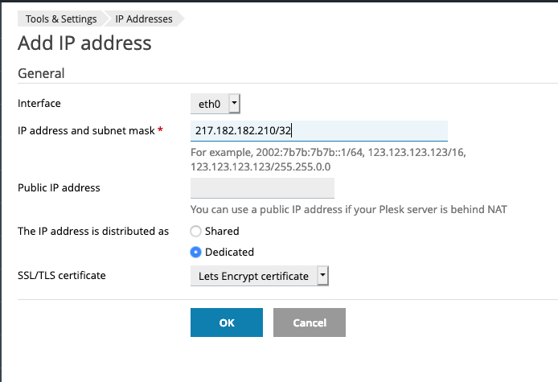

**Last updated 4th September 2018**

## Objective

IP aliasing is a special network configuration for your OVH servers, which allows you to associate multiple IP addresses with a single network interface.

**This guide explains how to add failover IPs to your VPS configuration.**

## Requirements

* a [Virtual Private Server](https://www.ovh.co.uk/vps/){.external}
* a failover IP address or a failover IP block (RIPE)
* administrative (root) access to the server via SSH

## Instructions

### Debian 9

#### Step 1: Disable automatic network configuration

First, open the following file, as shown below:

```sh
# nano /etc/cloud/cloud.cfg.d/99-disable-network-config.cfg
```
Next, edit the file with the configuration shown below. This will prevent changes from being made to your network configuration automatically.

```sh
network: {config: disabled}
```

### Step 2: Edit the network configuration file

Next, open the network configuration file for editing with the following command:

```sh
# nano /etc/network/interfaces.d/50-cloud-init.cfg
```
Then edit the file with the following configuration:

> [!primary]
>
Note that then names of the network interfaces in our example may differ from your own. Please substitute your own interfaces.
>

```sh
auto ens3
iface ens3 inet dhcp

auto ens3:0
iface ens3:0 inet static
address FailoverIP 0
netmask 255.255.255.255

auto ens3:1
iface ens3:1 inet static
address FailoverIP 1
netmask 255.255.255.255
```

### Ubuntu 18.04

Each failover IP address will need its own line within this file. The configuration file for your failover IP addresses should be called `50-cloud-init.yaml`.

#### Step 1: Create the configuration file

Connect to your server via SSH and run the following command:

```sh
# nano /etc/netplan/50-cloud-init.yaml
```

Next, edit the file with the content below:

```sh
network:
    version: 2
    ethernets:
        your_network_interface:
            dhcp4: true
            match:
                macaddress: fa:xx:xx:xx:xx:63
            set-name: your_network_interface
            addresses:
            - your_failover_ip/32
```
Finally, save and close the file.

Then apply config:

```sh
# netplan apply
# netplan try
```

Repeat this procedure for each failover IP address.

### CentOS 6/7

#### Step 1: Create a copy of the main network configuration file:

```sh
# cp /etc/sysconfig/network-scripts/ifcfg-eth0 /etc/sysconfig/network-scripts/ifcfg-eth0:0
```
#### Step 2: Modify the new file

Using a text editor we access to the new file:

```sh
sudo nano /etc/sysconfig/network-scripts/ifcfg-eth0:0
```
Then we must to define the additional IP information

```sh
# Created by cloud-init on instance boot automatically, do not edit.
#
BOOTPROTO=none
DEVICE=eth0:0
HWADDR=fa:16:3e:86:c0:22
ONBOOT=yes
TYPE=Ethernet
USERCTL=no
IPADDR=217.182.182.210
NETMASK=255.255.255.255
```
Now we must do a network restart:

```sh
systemctl restart network
```
Finally check the current network configuration:

```sh
ifconfig
eth0: flags=4163<UP,BROADCAST,RUNNING,MULTICAST>  mtu 1500
        inet 51.83.110.190  netmask 255.255.255.255  broadcast 51.83.110.190
        inet6 fe80::f816:3eff:fe86:c022  prefixlen 64  scopeid 0x20<link>
        ether fa:16:3e:86:c0:22  txqueuelen 1000  (Ethernet)
        RX packets 2223  bytes 180217 (175.9 KiB)
        RX errors 0  dropped 0  overruns 0  frame 0
        TX packets 1580  bytes 168953 (164.9 KiB)
        TX errors 0  dropped 0 overruns 0  carrier 0  collisions 0

eth0:0: flags=4163<UP,BROADCAST,RUNNING,MULTICAST>  mtu 1500
        inet 217.182.182.210  netmask 255.255.255.255  broadcast 217.182.182.210
        ether fa:16:3e:86:c0:22  txqueuelen 1000  (Ethernet)

lo: flags=73<UP,LOOPBACK,RUNNING>  mtu 65536
        inet 127.0.0.1  netmask 255.0.0.0
        inet6 ::1  prefixlen 128  scopeid 0x10<host>
        loop  txqueuelen 1000  (Local Loopback)
        RX packets 32  bytes 2592 (2.5 KiB)
        RX errors 0  dropped 0  overruns 0  frame 0
        TX packets 32  bytes 2592 (2.5 KiB)
        TX errors 0  dropped 0 overruns 0  carrier 0  collisions 0
```

### Windows Server 2016

#### Step 1: Check the main IP configuration

First of all we need to recover the information of the main IP:

{.thumbnail}

#### Step 2: Change the IPv4 Properties

Now we must change the IP properties from 'automatically configuration' to a 'static' configuration manually

{.thumbnail}

Now we can define the IP information obtained previously

{.thumbnail}

#### Step 3: Add the IP Fail Over in the 'Advanced configuration' section

{.thumbnail}

Here we must to define the IP FailOver information and the correspond netmask (normally the netmask is -> 255.255.255.255)

{.thumbnail}

#### Step 4: Rebooting the network interface

First we do the disabling process

{.thumbnail}

Then we do the enabling process

{.thumbnail}

#### Step 5: Checking the new network configuration

Using the console and the ___ipconfig___ command we can check the new network configuration

{.thumbnail}

### Plesk Onyx 17

#### Step 1: Access to the 'IP Adredsses' management inside the control panel:

Access to the ```Tools & Settings```>```IP Addresses``` section:

{.thumbnail}

#### Step 2: Add the additional IP information:

Click on the ``Add IP Address`` button:

{.thumbnail}

Then put the additional IP information in the form and press ```OK```

{.thumbnail}

#### Step 3: Check the current IP configuration inside Plesk panel:

{.thumbnail}
 
## Go further

Join our community of users on <https://community.ovh.com/en/>.
