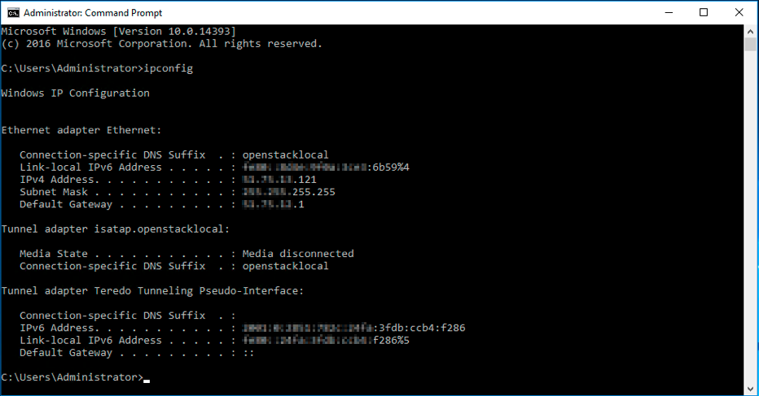

**Last updated 4th September 2018**

## Objective

IP aliasing is a special network configuration for your OVH servers, which allows you to associate multiple IP addresses with a single network interface.

**This guide explains how to add failover IPs to your VPS configuration.**

## Requirements

* a [Virtual Private Server](https://www.ovh.co.uk/vps/){.external}
* a failover IP address or a failover IP block (RIPE)
* administrative (root) access to the server via SSH

## Instructions

### Debian 9

#### Step 1: Disable automatic network configuration

First, open the following file, as shown below:

```sh
# nano /etc/cloud/cloud.cfg.d/99-disable-network-config.cfg
```
Next, edit the file with the configuration shown below. This will prevent changes from being made to your network configuration automatically.

```sh
network: {config: disabled}
```

### Step 2: Edit the network configuration file

Next, open the network configuration file for editing with the following command:

```sh
# nano /etc/network/interfaces.d/50-cloud-init.cfg
```
Then edit the file with the following configuration:

> [!primary]
>
Note that then names of the network interfaces in our example may differ from your own. Please substitute your own interfaces.
>

```sh
auto ens3
iface ens3 inet dhcp

auto ens3:0
iface ens3:0 inet static
address FailoverIP 0
netmask 255.255.255.255

auto ens3:1
iface ens3:1 inet static
address FailoverIP 1
netmask 255.255.255.255
```

### Ubuntu 18.04

Each failover IP address will need its own line within this file. The configuration file for your failover IP addresses should be called `50-cloud-init.yaml`.

#### Step 1: Create the configuration file

Connect to your server via SSH and run the following command:

```sh
# nano /etc/netplan/50-cloud-init.yaml
```

Next, edit the file with the content below:

```sh
network:
    version: 2
    ethernets:
        your_network_interface:
            dhcp4: true
            match:
                macaddress: fa:xx:xx:xx:xx:63
            set-name: your_network_interface
            addresses:
            - your_failover_ip/32
```
Finally, save and close the file.

Then apply config:

```sh
# netplan apply
# netplan try
```

Repeat this procedure for each failover IP address.

### CentOS and Fedora (25 and earlier)

#### Step 1: Create the source file

First, make a copy of the source file so that you can use it as a template:

```sh
cp /etc/sysconfig/network-scripts/ifcfg-eth0 /etc/sysconfig/network-scripts/ifcfg-eth0:0
```

#### Step 2: Edit the source file

You can now modify the eth0:0 file in order to replace the IP:

```sh
editor /etc/sysconfig/network-scripts/ifcfg-eth0:0
```

First, replace the name of the `device`, then replace the existing IP with the failover IP you have received:

```bash
DEVICE="eth0:0"
ONBOOT="yes"
BOOTPROTO="none" # For CentOS use "static"
IPADDR="IP_FAILOVER"
NETMASK="255.255.255.255"
BROADCAST="IP_FAILOVER"
```

#### Step 3: Restart the interface

You now need to restart your interface:

```sh
ifup eth0:0
```

### Windows Server 2012/2016

#### Step 1: Check the main IP configuration

First of all we need to recover the information of the main IP:

{.thumbnail}

#### Step 2: Change the IPv4 Properties

Now we must change the IP properties from 'automatically configuration' to a 'static' configuration manually:

{.thumbnail}

Now we can define the IP information obtained previously:

{.thumbnail}

#### Step 3: Add the IP Fail Over in the 'Advanced configuration' section

{.thumbnail}

Here we must to define the IP FailOver information and the correspond netmask (normally the netmask is -> 255.255.255.255)

{.thumbnail}

#### Step 4: Rebooting the network interface

First we do the disabling process

{.thumbnail}

Then we do the enabling process

{.thumbnail}

#### Step 5: Checking the new network configuration

Using the console and the ___ipconfig___ command we can check the new network configuration

{.thumbnail}


### cPanel

#### Step 1: Create the source file

First, make a copy of the source file, so that you can revert at any time:

```sh
cp /etc/ips /etc/ips.bak
```

#### Step 2: Edit the source file

You then need to edit the /etc/ips file:

```sh
editor /etc/ips
```
Then add the failover IP to the file:

```bash
IP_FAILOVER:255.255.255.255:IP_FAILOVER
```
Next, add the IP in `/etc/ipaddrpool``:

```bash
IP_FAILOVER
```

#### Step 3: Restart the interface

You now need to restart your interface:

```sh
/etc/init.d/ipaliases restart
```

### Plesk Onyx 17.x

#### Step 1: Access to the 'IP Addresses' management inside the control panel:

Access to the ```Tools & Settings```>```IP Addresses``` section:

{.thumbnail}

#### Step 2: Add the additional IP information:

Click on the ``Add IP Address`` button:

{.thumbnail}

Then put the additional IP information in the form and press ```OK```

{.thumbnail}

#### Step 3: Check the current IP configuration inside Plesk panel:

{.thumbnail}

### Troubleshooting

If you are unable to establish a connection from the public network to your alias IP and suspect a network problem, please reboot the server in Rescue Mode and setup the alias directly on the server.

In order to do that, once you’ve rebooted your server in Rescue Mode, please enter the following command:

```sh
ifconfig ens3:0 FAILOVER_IP netmask 255.255.255.255 broadcast FAILOVER_IP up
```

Where you will replace FAILOVER_IP by the actual IPFO.

Next, simply ping your IPFO from the outside. If it works, it probably means that there is a configuration error that requires to be fixed. If, on the contrary, the IP is still not working, please open a ticket to the support team via your Control Panel for further investigations.
 
## Go further

Join our community of users on <https://community.ovh.com/en/>.
