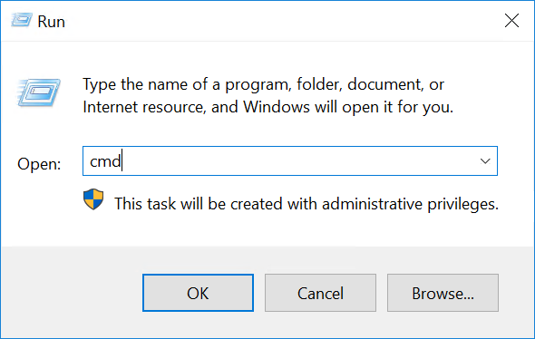

> [!primary]
> Esta traducción ha sido generada de forma automática por nuestro partner SYSTRAN. En algunos casos puede contener términos imprecisos, como en las etiquetas de los botones o los detalles técnicos. En caso de duda, le recomendamos que consulte la versión inglesa o francesa de la guía. Si quiere ayudarnos a mejorar esta traducción, por favor, utilice el botón «Contribuir» de esta página.
> 

**Última actualización: 30/11/2021**


## Objetivo

El alias de IP (*IP aliasing* en inglés) es una configuración especial de red para los servidores de OVHcloud, que permite asociar varias direcciones IP a una única interfaz de red.

**Esta guía explica cómo añadir direcciones Additional IP a su configuración de red.**

> [!warning]
>
> La responsabilidad sobre los servicios que OVHcloud pone a su disposición recae íntegramente en usted. Nuestros técnicos no son los administradores de las máquinas, ya que no tienen acceso a ellas. Por lo tanto, la gestión del software y la seguridad le corresponde a usted.
>
> Esta guía le ayudará a realizar las operaciones más habituales. No obstante, si tiene problemas o dudas sobre la administración, la utilización o la seguridad de su servidor, le recomendamos que contacte con un proveedor de servicios especializado. Para más información, consulte el apartado «Más información» de esta guía.
>

## Requisitos

- un [VPS](https://www.ovhcloud.com/es-es/vps/) en su cuenta OVHcloud
- una [dirección Additional IP](https://www.ovhcloud.com/es-es/bare-metal/ip/) o un bloque Additional IP
- un acceso de administrador (root) a través de SSH o GUI en su servidor
- conocimientos básicos de redes y administración

## Procedimiento

Esta guía explica las configuraciones de las distribuciones y sistemas operativos más habituales. En primer lugar, conéctese al servidor por SSH o a través de una sesión de conexión a la interfaz gráfica de usuario (RDP para un VPS Windows). Los siguientes ejemplos suponen que está conectado como usuario con permisos muy exigentes (administrador/sudo).

> [!primary]
>
En cuanto a las distintas versiones de distribuciones, tenga en cuenta que puede haber cambiado el procedimiento adecuado para configurar la interfaz de red y los nombres de archivos. Si necesita ayuda, le recomendamos que consulte la documentación relativa a su sistema operativo.
>

**Tome nota de la siguiente terminología que se utilizará en los ejemplos de código y en las instrucciones que se explican en esta guía:**

|Valor|Descripción|Ejemplos|
|---|---|---|
|ADDITIONAL_IP|Dirección Additional IP atribuida a su servicio|169.254.10.254|
|NETWORK_INTERFACE|Nombre de la interfaz de red|*eth0*, *ens3*|
|ID|ID del alias IP, comenzando por *0* (en función del número de direcciones IP adicionales a configurar)|*0*, *1*|

### Debian 10/11

#### 1\. desactivar la configuración automática de red

Abra la ruta al siguiente archivo con un editor de texto:

```bash
sudo nano /etc/cloud/cloud.cfg.d/99-disable-network-config.cfg
```

Introduzca la siguiente línea y, a continuación, guarde y cierre el editor.

```bash
network: {config: disabled}
```

La creación de este archivo de configuración impide la ejecución automática de los cambios realizados en la configuración de su red.

#### 2\. editar el archivo de configuración de red

Para comprobar el nombre de la interfaz de red, utilice el siguiente comando:

```bash
ip a
```

Abra el archivo de configuración de red para modificarlo con el siguiente comando:

```bash
sudo nano /etc/network/interfaces.d/50-cloud-init
```

Añada las siguientes líneas:

```bash
auto NETWORK_INTERFACE:ID
iface NETWORK_INTERFACE:ID inet static
address ADDITIONAL_IP
netmask 255.255.255.255
```

#### 3\. reiniciar la interfaz

Aplique los cambios con el siguiente comando:

```bash
sudo systemctl restart networking
```

### Ubuntu 20.04

El archivo de configuración de las direcciones Additional IP se encuentra en `/etc/netplan/`. En este ejemplo, se llama "50-cloud-init.yaml". Antes de realizar cualquier cambio, compruebe el nombre del archivo real en esta carpeta. Cada dirección Additional IP necesita su propia línea en el archivo.

#### 1\. desactivar la configuración automática de red

Abra la ruta al siguiente archivo con un editor de texto:

```bash
sudo nano /etc/cloud/cloud.cfg.d/99-disable-network-config.cfg
```

Introduzca la siguiente línea y, a continuación, guarde y cierre el editor.

```bash
network: {config: disabled}
```

La creación de este archivo de configuración impide la ejecución automática de los cambios realizados en la configuración de su red.

#### 2\. editar el archivo de configuración

Para comprobar el nombre de la interfaz de red, utilice el siguiente comando:

```bash
ip a
```

Abra el archivo de configuración de red para modificarlo con el siguiente comando:

```bash
sudo nano /etc/netplan/50-cloud-init.yaml
```

No modifique las líneas existentes en el archivo de configuración. Añada su dirección Additional IP añadiendo un segundo bloque de configuración para la interfaz pública, como se muestra a continuación:

```yaml
network:
    version: 2
    ethernets:
        NETWORK_INTERFACE:
            dhcp4: true
            match:
                macaddress: fa:xx:xx:xx:xx:63
            set-name: NETWORK_INTERFACE            
        NETWORK_INTERFACE:
            dhcp4: true
            match:
                macaddress: fa:xx:xx:xx:xx:63
            set-name: NETWORK_INTERFACE
            addresses:
            - ADDITIONAL_IP/32
```

> [!warning]
>
> Es importante mantener la alineación de cada elemento del archivo, tal y como se muestra en el ejemplo anterior. No use la tecla de tabulación para crear el espacio.
>

Guarde y cierre el archivo.

#### 3\. aplicar la nueva configuración de red

Para probar su configuración, utilice el siguiente comando:

```bash
sudo netplan try
```

Si es correcta, puede aplicarla con el siguiente comando:

```bash
sudo netplan apply
```

Repita este procedimiento para cada dirección Additional IP.

### Windows Server 2016

#### 1\. comprobar la configuración de red

Haga clic derecho en el botón `Menú Iniciar`{.action} y abra `Ejecutar`{.action}.

Pulse `cmd` y haga clic en `Aceptar`{.action} para abrir la aplicación de línea de órdenes.

{.thumbnail}

Para obtener la configuración de IP actual, introduzca `ipconfig` en la consola de comandos.

{.thumbnail}

#### 2\. modificar las propiedades IPv4

Ahora deberá modificar las propiedades IP en una configuración estática.

Abra la configuración del adaptador en el Panel de control Windows y abra las `Propiedades`{.action} del `Protocolo de Internet versión 4 (TCP/IPv4)`{.action}.

{.thumbnail}

En la ventana Propiedades IPv4, seleccione `Usar la siguiente`{.action} dirección IP. Introduzca la dirección IP que haya obtenido en el primer paso y haga clic en `Avanzado`{.action}.

#### 3\. añadir la dirección Additional IP en los Parámetros TCP/IP avanzados

En la nueva ventana, haga clic en `Añadir...`{.action} en "Direcciones IP". Introduzca su dirección Additional IP y la máscara de subred (255.255.255.255).

{.thumbnail}

Confirme haciendo clic en `Añadir`{.action}.

{.thumbnail}

#### 4\. reiniciar la interfaz de red

En el panel de configuración (`Conexiones de red`{.action}), haga clic derecho en la interfaz de red y seleccione `Desactivar`{.action}.

{.thumbnail}

Para reiniciarla, haga clic derecho sobre ella y seleccione `Activar`{.action}.

{.thumbnail}

#### 5\. comprobar la nueva configuración de red

Abra la consola de comandos (cmd) e introduzca `ipconfig`. La configuración debe incluir ahora la nueva dirección Additional IP.

{.thumbnail}

### cPanel (CentOS 7)/Red Hat

#### 1\. editar el archivo de configuración de red

Para comprobar el nombre de la interfaz de red, utilice el siguiente comando:

```bash
ip a
```

Abra el archivo de configuración de red para modificarlo:

```bash
sudo nano /etc/sysconfig/network-scripts/ifcfg-NETWORK_INTERFACE:ID
```

Añada las siguientes líneas:

```bash
DEVICE=NETWORK_INTERFACE:ID
BOOTPROTO=static
IPADDR=ADDITIONAL_IP
NETMASK=255.255.255.255
BROADCAST=ADDITIONAL_IP
ONBOOT=yes
```

#### 2\. reiniciar la interfaz

Aplique los cambios con el siguiente comando:

```bash
sudo systemctl restart networking
```

### Plesk

#### 1\. acceder a la gestión de IP de Plesk

En el panel de configuración de Plesk, seleccione `Tools & Settings`{.action} en la columna izquierda.

{.thumbnail}

Haga clic en `IP Addresses`{.action} bajo **Tools & Settings**.

#### 2\. añadir la información IP adicional

En esta sección, haga clic en el botón `Add IP Address`{.action}.

{.thumbnail}

Introduzca su dirección Additional IP como `xxx.xxx.xxx.xxx/32` en el campo "IP address and subnet mask" y haga clic en `OK`{.action}.

{.thumbnail}

#### 3\. comprobar la configuración IP actual

En la sección "Direcciones IP", compruebe que la dirección Additional IP se haya añadido correctamente.

{.thumbnail}

### Diagnóstico

En primer lugar, reinicie el servidor a través de la línea de comandos o la interfaz de usuario. Si todavía no consigue establecer una conexión entre la red pública y su dirección IP de alias y si sospecha que existe algún problema de red, deberá reiniciar el servidor en [modo de rescate](../rescue/). A continuación, podrá configurar la dirección Additional IP directamente en el servidor.

Una vez que se haya conectado al servidor por SSH, introduzca el siguiente comando:

```bash
ifconfig ens3:0 ADDITIONAL_IP netmask 255.255.255.255 broadcast ADDITIONAL_IP up
```

Para probar la conexión, solo tiene que enviar un ping a su dirección Additional IP desde el exterior. Si responde en modo de rescate, probablemente significa que se ha producido un error de configuración. No obstante, si la IP todavía no funciona, informe a nuestro equipo del soporte creando un tíquet de soporte desde el [Panel de configuración de OVHcloud](https://www.ovh.com/auth/?action=gotomanager&from=https://www.ovh.es/&ovhSubsidiary=es).

## Más información

[Activar el modo de rescate en un VPS](../rescue/)

Interactúe con nuestra comunidad de usuarios en <https://community.ovh.com/en/>.
