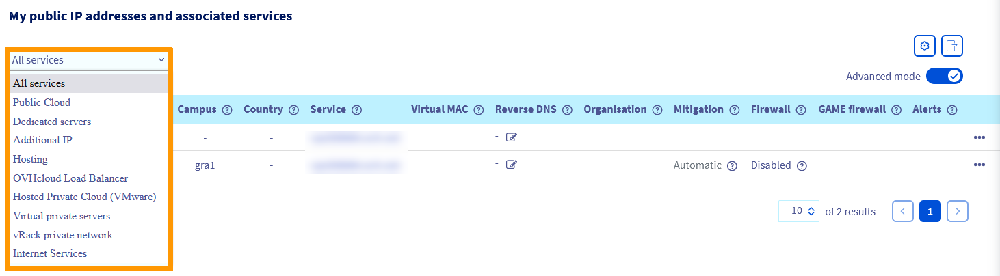

**Last updated 5th January 2023**

## Objective

Reverse DNS is the complement to "forward" DNS resolution which resolves domain names into IP addresses. With reverse DNS resolution, an IP address can resolve into the domain name (or host name) it is mapped to. This means that DNS queries of the associated IP address will return this domain name.

Configuring the reverse DNS resolution for a VPS is especially useful when sending emails. A mail server's validation by spam protection systems will improve if a DNS lookup of the IP address resolves properly.

**This guide explains how to configure the reverse DNS path for the IP address(es) of your VPS.**

## Requirements

- A [Virtual Private Server](https://www.ovhcloud.com/en-ca/vps/) in your OVHcloud account
- A domain name with its `A` record pointing to the VPS
- Access to the [OVHcloud Control Panel](https://ca.ovh.com/auth/?action=gotomanager&from=https://www.ovh.com/ca/en/&ovhSubsidiary=ca)

## Instructions

Log in to the [OVHcloud Control Panel](https://ca.ovh.com/auth/?action=gotomanager&from=https://www.ovh.com/ca/en/&ovhSubsidiary=ca), switch to the `Bare Metal Cloud`{.action} section and open `IP`{.action}.

The drop-down menu underneath **"My public IP addresses and associated services"** allows you to filter your services according to category.

{.thumbnail}

Click on `...`{.action} in the row of the IP address concerned and select `Modify the reverse path`{.action}.

{.thumbnail}

In the new window, enter your reverse path and click on `Confirm`{.action}.

{.thumbnail}

You can also edit the reverse path directly via the icon in the **Reverse DNS** column of the table.

> [!primary]
>
If the modification does not work as expected, verify that the `A` record is correctly configured in the DNS zone of your domain name. Bear in mind that it might take up to 24 hours for DNS zone changes to be effective, in case you have only recently edited the `A` record.
>
If the domain name is managed by OVHcloud as its registrar and it uses OVHcloud DNS servers, you can refer to [this guide](https://docs.ovh.com/ca/en/domains/web_hosting_how_to_edit_my_dns_zone/).
>

## Go further 

[Getting started with a VPS](../getting-started-vps/)

[Editing an OVHcloud DNS zone](https://docs.ovh.com/ca/en/domains/web_hosting_how_to_edit_my_dns_zone/)

Join our community of users on <https://community.ovh.com/en/>.
