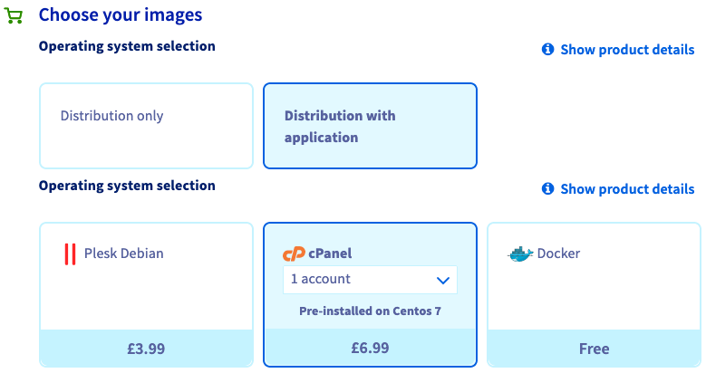

**Last updated 2020/05/28**

## Objective

cPanel is a control panel designed for web hosting. Web hosting tasks are simplified, as it is made up of a graphical interface that allows the automation of settings.

**Learn how to deploy cPanel with pre-installed applications on a VPS.**

## Requirements

- a current [VPS solution]({ovh_www}/vps/) (VPS ranges Value, Essential, Comfort, or Elite) in your OVHcloud account
- access to the [OVHcloud Control Panel](https://ca.ovh.com/auth/?action=gotomanager)

## Instructions

In order to install your cPanel server, you will first need to order a VPS with a cPanel distribution.

{.thumbnail}

When your VPS is ready, you will receive an email providing the information to connect to your cPanel server:

>Your application(s):
>
>You can connect to cPanel from https://*hostname*:2087/*session_parameters*

If you already have a VPS and want to have cPanel on it, you can reinstall the VPS from your [OVHcloud Control Panel](https://ca.ovh.com/auth/?action=gotomanager) with the "CentOS 7 - cPanel" template (available only with a compatible VPS solution).

> [!warning]
>
> If you reinstall a VPS, all data stored on the VPS will be lost.
>

### First connection

Once you received the email with the unique link, please proceed to the link to do the initial setup. 

> [!primary]
>
> If the link has expired already, please reinstall the VPS again with cPanel.
>

The URL above allows you to log in without credentials (user and password) to your WHM manager.

#### Step 1: Read and accept the terms of cPanel

{.thumbnail}

#### Step 2: Provide your email and nameservers you wish to set on the VPS

{.thumbnail}

#### Step 3: Set the root password

{.thumbnail}

Now you should be able to login to WHM and SSH using the root user with the password that was just set.

### Securing your service

We recommend that you take further additional steps to ensure you secure your WHM and VPS. For this we recommend reading the recommendations provided by cPanel [here](https://docs.cpanel.net/knowledge-base/security/tips-to-make-your-server-more-secure/).

Furthermore we recommend setting up the [OVHcloud network firewall](../dedicated/firewall-network/) and [setup a backup solution](../tips-for-securing-a-vps/#backing-up-your-system-and-your-data) on your VPS.

## Go further

Join our community of users on <https://community.ovh.com/en/>.
