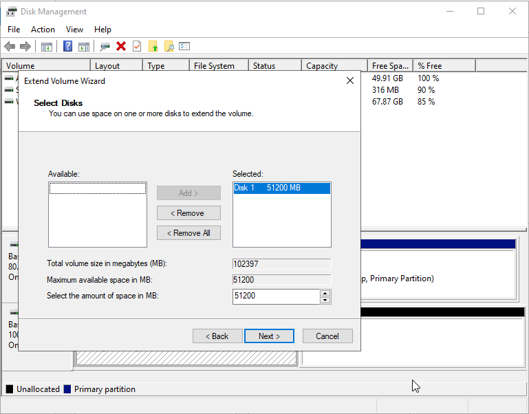
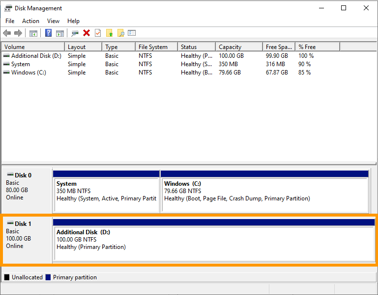

> [!primary]
> Esta traducción ha sido generada de forma automática por nuestro partner SYSTRAN. En algunos casos puede contener términos imprecisos, como en las etiquetas de los botones o los detalles técnicos. En caso de duda, le recomendamos que consulte la versión inglesa o francesa de la guía. Si quiere ayudarnos a mejorar esta traducción, por favor, utilice el botón «Contribuir» de esta página.
> 

**Última actualización: 14/03/2023**

## Objetivo

Si ha alcanzado la capacidad máxima de su disco adicional, puede añadir almacenamiento aumentando su tamaño.

**Esta guía explica cómo aumentar el tamaño de un disco adicional y ampliar la partición principal en consecuencia.**

## Requisitos

- Un [VPS](https://www.ovhcloud.com/es/vps/) en su cuenta de OVHcloud.
- Un [disco adicional](/pages/cloud/vps/config_additional_disk) configurado en el VPS.
- Tienes acceso a tu [Panel de configuración de OVHcloud](https://ca.ovh.com/auth/?action=gotomanager&from=https://www.ovh.com/world/&ovhSubsidiary=ws).
- Tener acceso al VPS por SSH o RDP para la administración.

## Procedimiento

Los pasos que se indican a continuación suponen que ha configurado un disco adicional siguiendo las instrucciones de [esta guía](/pages/cloud/vps/config_additional_disk).

### Cambiar el tamaño del disco <a name="extend"></a>

Conéctese al [Panel de configuración de OVHcloud](https://ca.ovh.com/auth/?action=gotomanager&from=https://www.ovh.com/world/&ovhSubsidiary=ws), acceda a la sección `Bare Metal Cloud`{.action} y seleccione el servidor entre los `Servidores privados virtuales`{.action}.

En el cuadro **Resumen de las opciones**, haga clic en el botón `...`{.action} situado en la sección `Discos adicionales`. Seleccione `Aumentar el tamaño del disco`{.action}.

{.thumbnail}

Seleccione el nuevo tamaño de disco en la ventana que aparece y haga clic en `Aumentar`{.action}.

{.thumbnail}

Aparecerá un mensaje confirmando su solicitud. Haga clic en el enlace dentro del mensaje y siga el proceso de pedido. Es posible que se haya abierto automáticamente una nueva pestaña de navegación para el pedido.

{.thumbnail}

El aumento de la capacidad del disco tardará unos minutos después de la validación del pago. Puede consultar el progreso en la pestaña `Discos adicionales`{.action}: si se muestra el nuevo tamaño seleccionado, el disco está listo.

{.thumbnail}

> [!warning]
>
> Guarde sus datos en el disco adicional antes de continuar.
>

### Extensión de la partición

> [!warning]
> La configuración, la gestión y la responsabilidad de los servicios que OVHcloud pone a su disposición recaen sobre usted. Por lo tanto, usted deberá asegurarse de que estos funcionan correctamente.
>
> Esta guía le ayudará a realizar las tareas más habituales. No obstante, si necesita ayuda, le recomendamos que contacte con un [proveedor especializado](https://partner.ovhcloud.com/es-es/directory/) o con [nuestra comunidad](https://community.ovh.com/en/).
>

#### En un VPS Linux

> [!primary]
>
> Tenga en cuenta que esta sección describe un enfoque general de los pasos necesarios, basado en un sistema operativo Ubuntu Server. Algunos comandos pueden necesitar personalizar la distribución que utilice.
>

Si tiene instalada una distribución GNU/Linux en su VPS, conéctese por SSH al servidor desde el terminal de línea de comandos o utilizando una aplicación cliente SSH.

Los siguientes ejemplos suponen que está conectado como usuario con permisos muy exigentes.

Asegúrese de que el disco no se haya montado con el siguiente comando:

```bash
ubuntu@server:~$ sudo umount /mnt/disk
```

Sustituya `/mnt/disk` por su ruta de montaje real al disco adicional, si es necesario.

Indique los nombres de los discos y las particiones:

```bash
ubuntu@server:~$ lsblk
NAME    MAJ:MIN RM   SIZE RO TYPE MOUNTPOINTS
loop0     7:0    0  63.2M  1 loop /snap/core20/1623
loop1     7:1    0  63.3M  1 loop /snap/core20/1828
loop2     7:2    0 111.9M  1 loop /snap/lxd/24322
loop3     7:3    0  49.8M  1 loop /snap/snapd/18357
loop4     7:4    0   103M  1 loop /snap/lxd/23541
sda       8:0    0   160G  0 disk
├─sda1    8:1    0 159.9G  0 part /
├─sda14   8:14   0     4M  0 part
└─sda15   8:15   0   106M  0 part /boot/efi
sdc       8:32   0   100G  0 disk
└─sdc1    8:33   0    50G  0 part 
```

En este ejemplo, el disco se denomina `sdc` y tiene el nuevo tamaño de disco correcto de 100 GB tras la actualización explicada en la [primera parte](#extend) de esta guía. La partición `sdc1` existe en el disco y utiliza 50 GB.

Recargue la partición en el disco ejecutando `fdisk`:

```bash
ubuntu@server:~$ sudo fdisk /dev/sdc
```

Introduzca los siguientes comandos en el `fdisk`:

```console
Welcome to fdisk (util-linux 2.37.2).
Changes will remain in memory only, until you decide to write them.
Be careful before using the write command.

Command (m for help): d
Selected partition 1
Partition 1 has been deleted.

Command (m for help): n
```

Confirme todos los valores predeterminados pulsando `Entrar`:

```console
Partition type
   p   primary (0 primary, 0 extended, 4 free)
   e   extended (container for logical partitions)
Select (default p):

Using default response p.
Partition number (1-4, default 1):
First sector (2048-209715199, default 2048):
Last sector, +/-sectors or +/-size{K,M,G,T,P} (2048-209715199, default 209715199):

Created a new partition 1 of type 'Linux' and of size 100 GiB.
```

Por último, introduzca `n` y `w` :

```console
Partition #1 contains a ext4 signature.

Do you want to remove the signature? [Y]es/[N]o: n

Command (m for help): w

The partition table has been altered.
Calling ioctl() to re-read partition table.
Syncing disks.
```

Compruebe la partición y amplíe el sistema de archivos:

```bash
ubuntu@server:~$ sudo e2fsck -f /dev/sdc1
e2fsck 1.46.5 (30-Dec-2021)
/dev/sdc1: recovering journal
Pass 1: Checking inodes, blocks, and sizes
Pass 2: Checking directory structure
Pass 3: Checking directory connectivity
Pass 4: Checking reference counts
Pass 5: Checking group summary information
/dev/sdc1: 11/3276800 files (0.0% non-contiguous), 284558/13106944 blocks
```
```bash
ubuntu@server:~$ sudo resize2fs /dev/sdc1
resize2fs 1.46.5 (30-Dec-2021)
Resizing the filesystem on /dev/sdc1 to 26214144 (4k) blocks.
The filesystem on /dev/sdc1 is now 26214144 (4k) blocks long.
```

Por último, monte el disco:

```bash
ubuntu@server:~$ sudo mount /dev/sdc1 /mnt/disk/
```

La partición 1 utiliza ahora el tamaño máximo del disco.

```bash
ubuntu@server:~$ df -h
Filesystem      Size  Used Avail Use% Mounted on
tmpfs           776M  992K  776M   1% /run
/dev/sda1       155G  2.2G  153G   2% /
tmpfs           3.8G     0  3.8G   0% /dev/shm
tmpfs           5.0M     0  5.0M   0% /run/lock
/dev/sda15      105M  5.3M  100M   5% /boot/efi
tmpfs           776M  4.0K  776M   1% /run/user/1000
/dev/sdc1        99G   24K   94G   1% /mnt/disk
```

#### En un VPS Windows

Si tiene un SO Windows instalado en su VPS, conéctese a su servidor RDP (Remote Desktop).

Una vez que se haya conectado, haga clic derecho en el botón `Menú Iniciar`{.action} y abra `Gestión de discos`{.action}.

{.thumbnail}

El [disco ampliado](#extend) muestra la capacidad adicional en forma de espacio no asignado. Haga clic derecho en el volumen de su disco adicional y seleccione `Ampliar el volumen`{.action} en el menú contextual.

{.thumbnail}

En el Asistente para la extensión de volumen, haga clic en `Siguiente`{.action} para continuar.

Si lo necesita, podrá modificar el espacio en disco. Haga clic en `Siguiente`{.action}.

{.thumbnail}

Haga clic en `Finalizar`{.action} para finalizar el proceso.

El volumen redimensionado incluye ahora el espacio en disco adicional.

{.thumbnail}

## Más información

Interactúe con nuestra comunidad de usuarios en <https://community.ovh.com/en/>.
