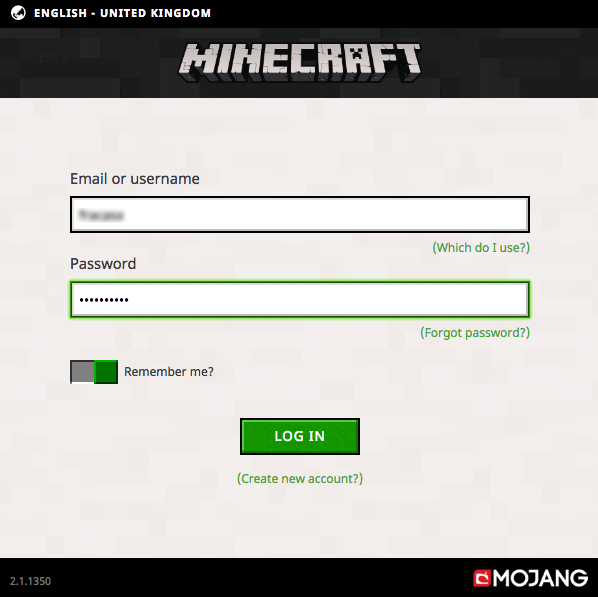

**Last updated 2020/07/22**

## Objective

Minecraft is successful sandbox video game. It needs to be hosted on a server if you wish to play in multiplayer.

You can rent a pre-build minecraft server or you can set it up yourself on a [VPS]({ovh_www}/vps/) or on a [dedicated server]({ovh_www}/dedicated-servers/){.external}. This will reduce the cost and give you full control over your game instance.

In this tutorial, we will create a Minecraft Java Edition on a OVHcloud VPS and test its connectivity.

> [!warning]
> 
> 
OVHcloud offers servers where you are responsible for its configuration. OVHcloud does not have access to your server and we will not administer or offer software assistance. It is your responsibility to manage and secure your services.
>
> 
This document is offered as a guideline. We invite you to contact a specialized provider if you need help in managing your server. Do not hesitate to visit our [community forum] (https://community.ovh.com/en/) {.external} to exchange with others.
>

## Requirements

### Knowledge

- Some general knowledge on how to administer Linux.
- SSH connection
- Install a Linux distribution (in this case, Debian 9 or Ubuntu 18.04).

### The must have

- Own a [VPS]({ovh_www}/vps/){.external}. with 2 Gb of RAM minimum.
- Download *minecraft_server.1.16.1.jar* via <https://www.minecraft.net/en-us/download/server/>.

## Instructions

### Step 1 : Prepare the server

We will set up our VPS server to install Minecraft. If possible, please reinstall your VPS from your control panel (Ubuntu or Debian is recommended).

Once the distribution is installed, connect to your VPS with SSH as root using a terminal. Update the packages:

```sh
apt update
```

Update the system: 

```sh
apt full-upgrade
```

We will need to install packages that are not present by default. Here is the command:  

```sh
apt install default-jre screen nano wget git
```

To avoid vulnerabilities on your system, we will create a user named « minecraft.» This user will execute the minecraft process:

```sh
adduser minecraft --disabled-login --disabled-password
```

Several information is requested ; simply press the `Enter`{.action} key to validate.

The user is now created. Please note that no password was specified which is normal. This account is only accessible by SSH and will only be accessible through the root account.

It is now time to connect to the « minecraft » user :

```sh
su - minecraft
```

To complete the operating system set up, we will create a folder named `server`.

```sh
mkdir ~/server && cd ~/server
```

> [!primary]
>
> Reminder : This last command needs to be done by the user « minecraft ».
> 
  

### Step 2 : install your Vanilla Minecraft server.

> [!primary]
> 
> A Vanilla server is an instance without any add-ons or plugins. You will experience the game the way it was made by the developers.
>
> 


Please go to [the official Minecraft website](https://minecraft.net/download/server) to download the file. Just right click on `minecraft_server.1.16.1.jar` to copy the link.

Now that we have the URL, download it on the VPS. Make sure you are located in the `server` folder you created earlier and type:

```sh
wget <paste the URLt>
```


Before launching the server, you need to agree to the End User License Agreement.

In the same folder, use the following command:

```sh
echo "eula=true" > eula.txt
```

This action will create the file `eula.txt` on the root lever of your server. It will contain `eula=true` which means that you accept the terms and conditions of Minecraft. We invite you to review the terms and conditions on the Minecraft official website.

Your server can now be started.


During step 1, we installed the `screen` package which gives you the possibility to have multiple session of the terminal (*shell*). We will start Minecraft in a new session and launch it in the background. `screen` can be very handy, it gives us the possibility to launch multiple Minecraft servers simultaneously.

First, we will create a new `shell` named `minecraft1` :

```sh
screen -S minecraft1
```

The active terminal window will change, this automatically toggles to a new `shell` session. You can create other `shells` if necessary and list them with this command:

```sh
screen -ls
```

To switch from one `shell` to another, you can use a shortcut such as `CTRL+a n`{.action}. You can also achieve this in command line by typing the `shell` name:

```sh
screen -x another_shell
```

Move to the `minecraft1` shell that you have created and launch the Minecraft server wit the following command:

```sh
java -jar name.of.the.downloaded.file.jar
```

If you wish to shut down your server, use the command `stop`.

### Step 3 : connect to the server

Your server instance is now functionnal, let's test the connection. You will need to download the Minecraft client from this website: <https://minecraft.net/>

Install and launch the Minecraft client and sign-in.
{.thumbnail}


On the next screen, in the field `Server name`, enter your server name. In the field `Server Address`, enter your VPS IP address.
{.thumbnail}

By default, no port needs to be specified.

## Conclusion

Your Vanilla Minecraft server is now installed on your VPS. 

Please note that this installation guide should also work on a [dedicated server]({ovh_www}/dedicated-servers/){.external}. or an OVHcloud [Public Cloud]({ovh_www}/public-cloud/){.external}. instance. With those services, you will enjoy better stability since the hardware is dedicated.

Finally, for add-ons, mods and to personalize your Minecraft experience, please consult this official documentation <https://help.mojang.com/>. 
