## Objective

OpenVPN is a software giving you the possibility to create a Private Virtual Network (VPN).

## Requirements

- access to the [OVHcloud Control Panel](https://ca.ovh.com/auth/?action=gotomanager)
- an OVHcloud [VPS service]({ovh_www}/vps/){.external}


## Order

To create your OpenVPN server, you will have to order a VPS. (If you already have a VPS, you can install the OpenVPN template via your OVHcloud control panel)

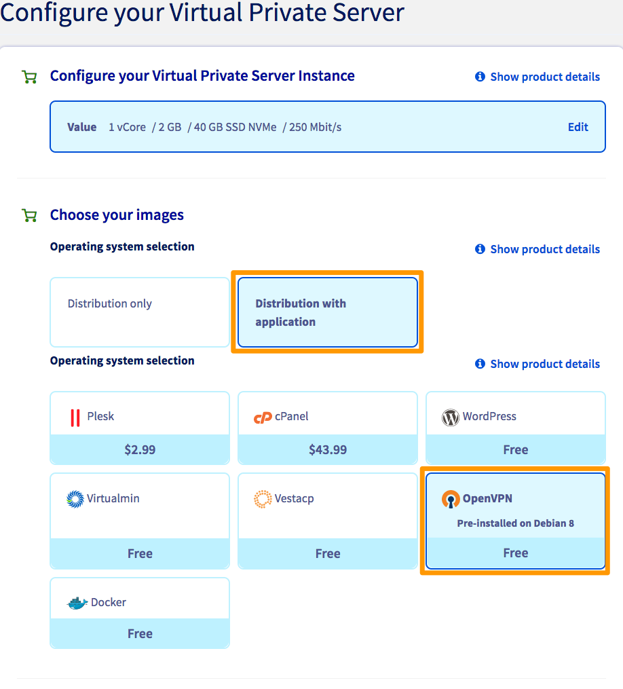{.thumbnail}

Once your VPS is installed, you will receive an email with your credentials:

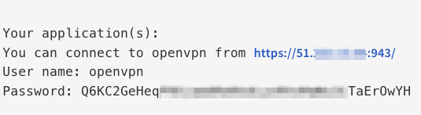{.thumbnail}

Your VPN server is now ready.

Click on the link inside the credentials email.

Sign-in with the credentials in the email.

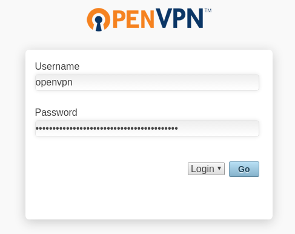{.thumbnail}

## Client

### For Windows

Select `OpenVPN client for Windows`{.action}

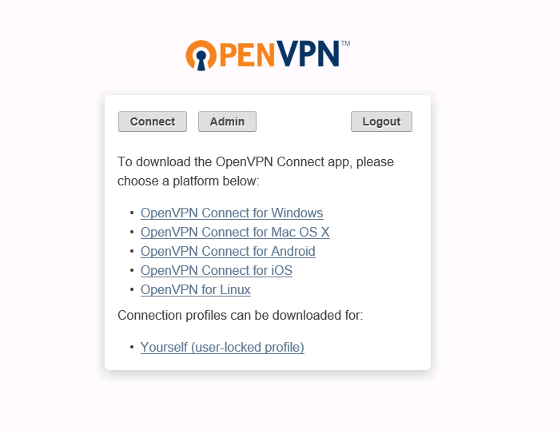{.thumbnail}

Save the file and execute it.

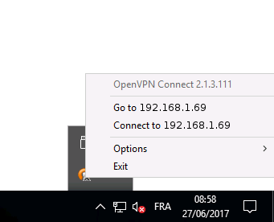{.thumbnail}

Connect to the VPN:

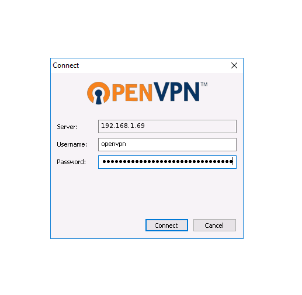{.thumbnail}

You will now be communicating over the internet with the IP of your VPN.

You can check your IP with this web page [https://ifconfig.ovh/](https://ifconfig.ovh/){.external}

### On linux

For distributions such as Fedora/CentOS/RedHat:

```sh
sudo yum install openvpn
```

For distributions such as Ubuntu/Debian:

```sh
sudo apt-get install openvpn
```

You will have to download the configuration file `client.ovpn` here:
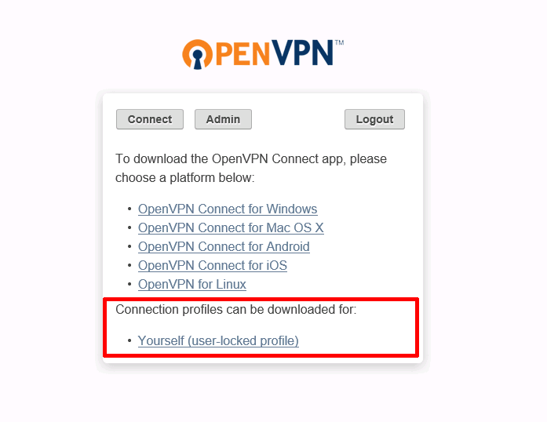{.thumbnail}

**Launch of the OpenVPN client with a configuration file**

```sh
sudo openvpn --config client.ovpn
```

You will be prompted to enter your credentials:

```sh
 Enter Auth Username: openvpn
 Enter Auth Password: ******************************************
```

You will now be communicating over the internet with the IP of your VPN.

You can check your IP with this web page [https://ifconfig.ovh/](https://ifconfig.ovh/){.external}.

### On MacOS

Select `OpenVPN client for Mac OS X`{.action}:

{.thumbnail}

Save the file and execute it.

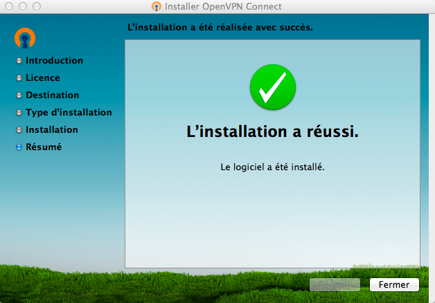{.thumbnail}

Once the installation is completed, connect to the VPN.

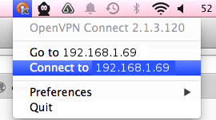{.thumbnail}

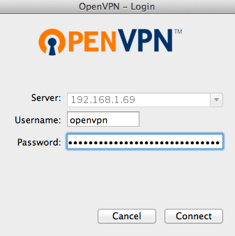{.thumbnail}

You will now be communicating over the internet with the IP of your VPN.

You can check your IP with this web page [https://ifconfig.ovh/](https://ifconfig.ovh/){.external}.


## Server 

Go the URL inside the email and select `Admin`:

{.thumbnail}


Sign-in with the credentials received in the email and accept the terms and conditions.

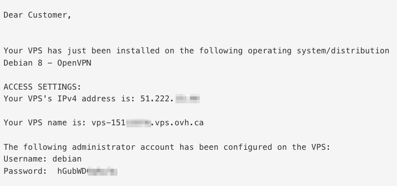{.thumbnail}

You now have access to the control panel:

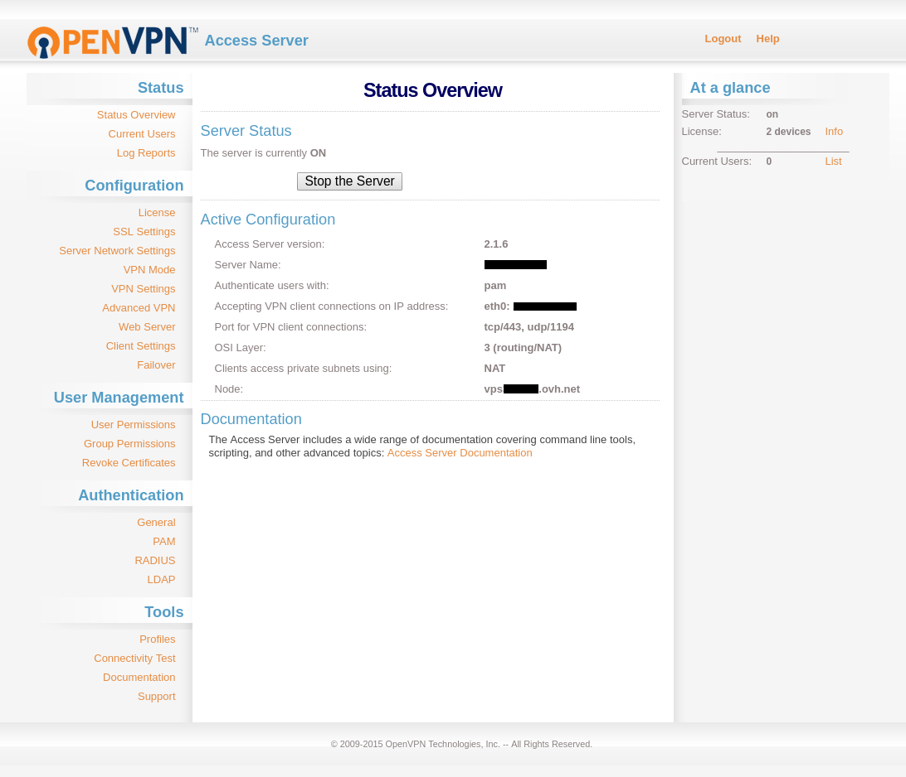{.thumbnail}


## Go further

[Getting started with a VPS](../getting-started-vps/)

Join our user community on <https://community.ovh.com/en/>.

