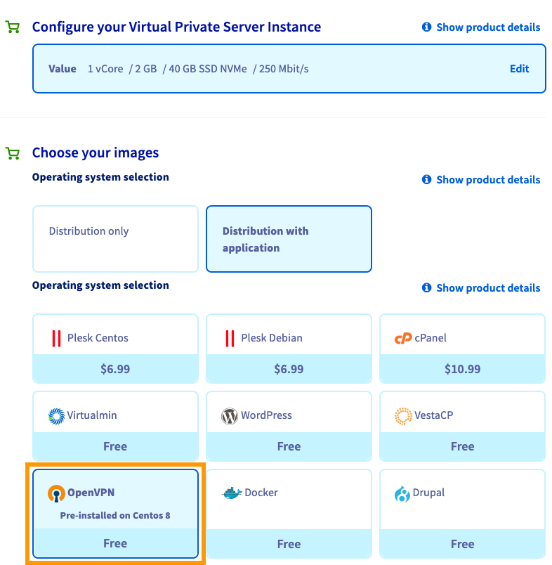
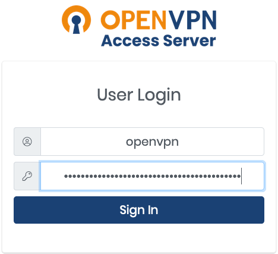
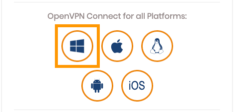
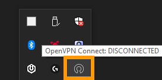
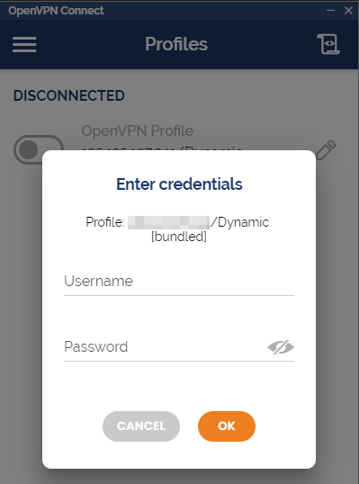
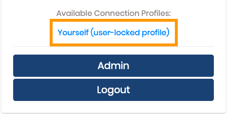
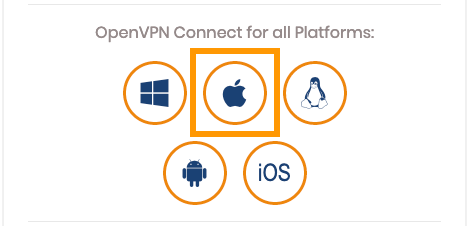
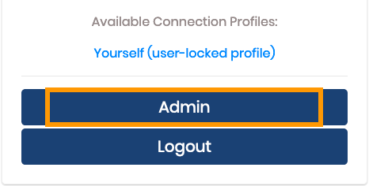
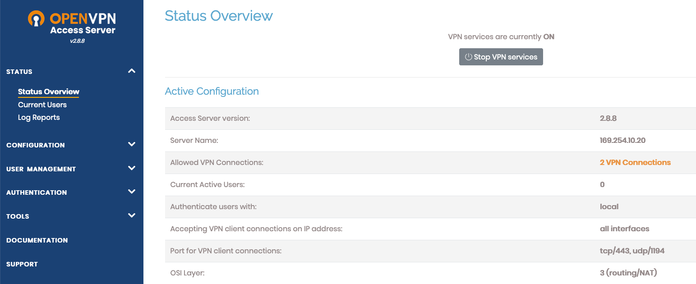

**Dernière mise à jour le 24 juin 2021**

## Objectif

OpenVPN est un logiciel qui vous permet de créer un réseau privé virtuel (VPN). En utilisant le template VPS OVHcloud pour un serveur OpenVPN, vous pourrez installer et utiliser votre service VPN personnel en quelques étapes.

**Découvrez comment créer votre propre service VPN avec un VPS et OpenVPN.**

## Prérequis

- Disposer d'un [VPS](https://www.ovhcloud.com/fr-ca/vps/) dans votre espace client OVHcloud.
- Être connecté à votre [espace client OVHcloud](https://ca.ovh.com/auth/?action=gotomanager&from=https://www.ovh.com/ca/fr/&ovhSubsidiary=qc).

## En pratique

### Installer le serveur OpenVPN

> [!primary]
>
Si vous souhaitez utiliser un service VPS existant, vous pouvez le faire depuis votre [espace client OVHcloud](https://ca.ovh.com/auth/?action=gotomanager&from=https://www.ovh.com/ca/fr/&ovhSubsidiary=qc) en [réinstallant ce service avec le template OpenVPN](../debuter-avec-vps/#installation-ou-reinstallation-de-votre-vps-gamme-vps-actuelle).
>

Commandez votre VPS sur la [page produit](https://www.ovhcloud.com/fr-ca/vps/). Lors de la sélection de l'image, choisissez `Distribution avec application`{.action}, puis `OpenVPN`{.action} comme système d'exploitation.

{.thumbnail}

Une fois votre VPS installé, vous recevrez un e-mail contenant vos informations d'identification.

{.thumbnail}

Votre serveur VPN est alors prêt. Pour vous connecter, cliquez sur le lien dans l'e-mail d'installation qui ouvrira l'interface Web OpenVPN Client. Entrez vos informations d'identification OpenVPN fournies dans le même e-mail.

{.thumbnail}

### Installation et utilisation du client OpenVPN

#### Sur Windows

Dans l'interface Web du client, sélectionnez le `symbole Windows`{.action}.

{.thumbnail}

Enregistrez le fichier `.msi` et lancez-le.

Une fois l'application cliente installée, vous pouvez la lancer via le menu Windows ou depuis la barre des tâches.

{.thumbnail}

Connectez-vous avec vos identifiants OpenVPN fournis dans l'e-mail d'installation.

{.thumbnail}

Vous naviguerez dorénavant sur Internet avec l'adresse IP de votre VPN.

Vous pouvez vérifier votre adresse IP en vous rendant sur la page [https://ifconfig.ovh/](https://ifconfig.ovh/){.external}.

#### Sur Linux

##### **Installer le client OpenVPN**

Pour installer le client pour les distributions du type Fedora/CentOS/RedHat :

```sh
sudo yum install openvpn
```

Pour installer le client pour les distributions du type Ubuntu/Debian :

```sh
sudo apt-get install openvpn
```

Vous devez également télécharger le fichier de configuration `client.ovpn` à partir de l'interface Web du client OpenVPN.

{.thumbnail}

##### **Lancer le client OpenVPN avec votre fichier de configuration**

```sh
sudo openvpn --config client.ovpn
```

Vous serez invité à entrer vos identifiants :

```sh
 Enter Auth Username: openvpn
 Enter Auth Password: ******************************************
```

Vous naviguerez dorénavant sur Internet avec l'adresse IP de votre VPN.

Vous pouvez vérifier votre adresse IP en vous rendant sur la page [https://ifconfig.ovh/](https://ifconfig.ovh/){.external}.

#### Sur MacOS

Après vous être connecté, sélectionnez le `symbole Apple`{.action}.

{.thumbnail}

Enregistrez le fichier et lancez-le.

{.thumbnail}

Connectez-vous avec vos identifiants OpenVPN fournis dans l'e-mail d'installation.

{.thumbnail}

Vous naviguerez dorénavant sur Internet avec l'adresse IP de votre VPN.

Vous pouvez vérifier votre adresse IP en vous rendant sur la page [https://ifconfig.ovh/](https://ifconfig.ovh/){.external}.

### Accès à votre serveur OpenVPN

Dans l'interface Web OpenVPN Client (accessible via l'URL fournie dans l'e-mail d'installation), cliquez sur le bouton `Admin`{.action}.

{.thumbnail}

Vous pouvez également ajouter `admin` à l'URL OpenVPN pour accéder directement à la page de connexion :

```sh
https://IP_of_your_VPS:943/admin
```

Connectez-vous avec les mêmes identifiants OpenVPN fournis dans l'e-mail et acceptez les termes et conditions.

Vous avez maintenant accès au panneau de configuration du serveur OpenVPN.

{.thumbnail}

## Aller plus loin

[Débuter avec un VPS](../debuter-avec-vps)

[OpenVPN](https://openvpn.net/)

Rejoignez notre communauté d'utilisateurs sur <https://community.ovh.com/>.
