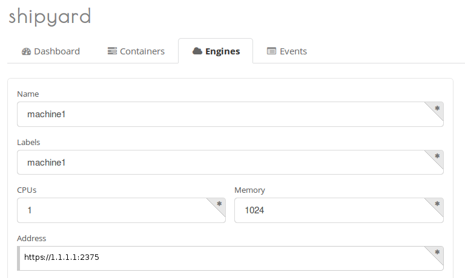
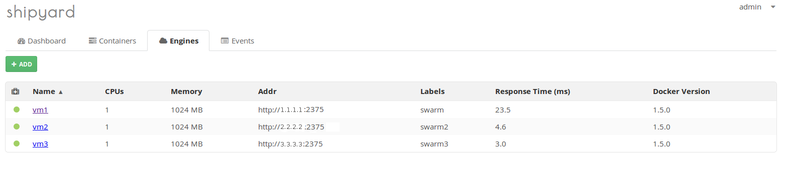
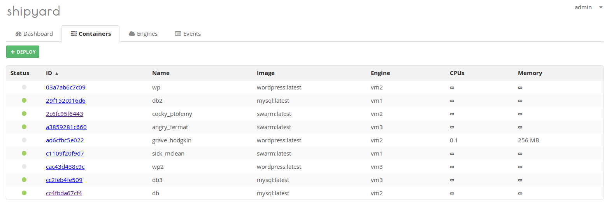
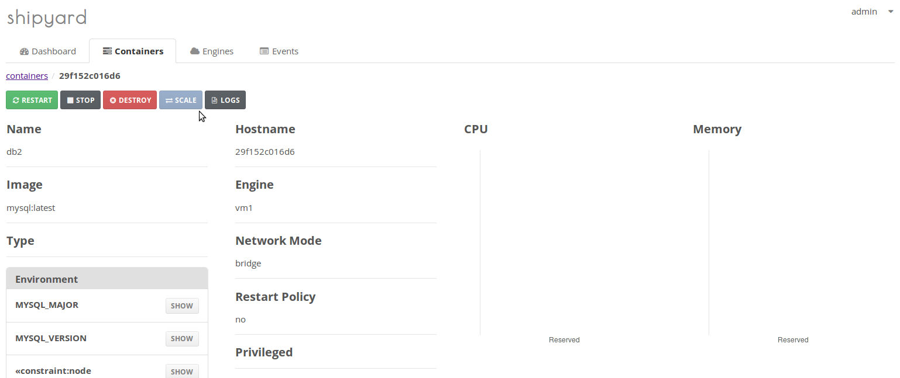
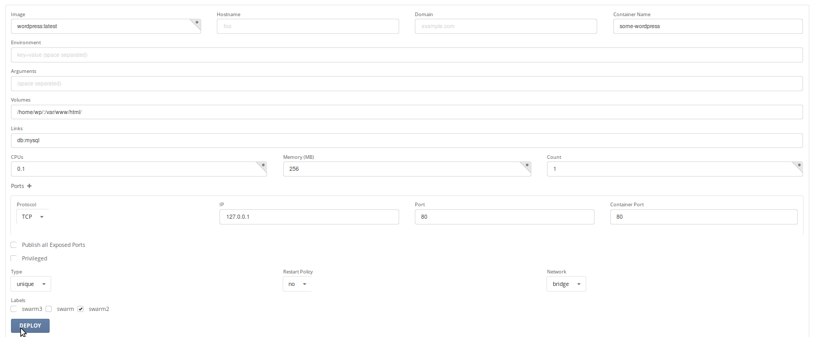

## 
The Shipyard application was developed by the Docker user community. It can be a good alternative to Swarm and has a GUI for managing a cluster of Docker servers, enabling you to order tasks and allocate resources to containers in a resource pool. We will firstly generate keys and certificates that will allow us to log in to our various servers, and use TLS to secure communications between our machines to prevent any non-authorised people getting control of our nodes. Only servers with a certificate will be able to connect to the Docker clients on our remote servers. 

To do this, follow the steps in the official Docker documentation: [https://docs.docker.com/articles/https/](https://docs.docker.com/articles/https/)

Once you've generated your certificates, let's move on to the client servers (nodes). In our example, our cluster will contain 3 servers (IP: 1.1.1.1, 2.2.2.2 and 3.3.3.3).

Copy the keys and certificates generated in the /etc/docker/certs/ folder to your nodes with the following command:


```
scp ca.pem server-cert.pem server-key.pem user@1.1.1.1:/etc/docker/certs/
scp ca.pem server-cert.pem server-key.pem user@2.2.2.2:/etc/docker/certs/
scp ca.pem server-cert.pem server-key.pem user@3.3.3.3:/etc/docker/certs/
```


To increase the security at cluster level, we will set up iptable rules on our master server and our nodes. Below is an example of the iptable rules that can be applied:

on to the nodes:

To install iptable rules:


```
# Keep established connections
iptables -A INPUT -m state --state RELATED,ESTABLISHED -j ACCEPT

# Authorise loopback
iptables -t filter -A INPUT -i lo -j ACCEPT

# ICMP (Ping)
iptables -t filter -A INPUT -p icmp -j ACCEPT

# SSH In
iptables -t filter -A INPUT -s 4.4.4.4 -p tcp --dport 22 -j ACCEPT

# /!\ ATTENTION: make sure you enter the correct IP address at this level. It should be the connection IP or the IP address of the master server, for example. These will be the only IPs able to connect via SSH to the nodes.

# HTTP In
iptables -t filter -A INPUT -p tcp --dport 80 -j ACCEPT

# SSL In
iptables -t filter -A INPUT -p tcp --dport 443 -j ACCEPT

# Docker In
iptables -t filter -A INPUT -s 4.4.4.4 -p tcp --dport 2375 -j ACCEPT

# /!\ ATTENTION: make sure you enter the correct IP address at this level. It should be the IP address of the master server, which will be the only IP able to connect to port 2375.

# Prevent all incoming connections
iptables -P INPUT DROP
iptables -P FORWARD DROP
```


Once the rules have been defined, we need to save them so that they launch on startup:


```
apt-get install iptables-persistent
```


And select "yes" when asked if we need to save IPv4 iptables.

/!\ ATTENTION: we advise you to check that the rules are working properly before saving them. If you need to reset any unsaved rules, simply reboot your servers.

You can add iptable rules at any time and save them via:


```
iptables-persistent save
```


On the master server:

Let's install the iptable rules:


```
# Keep established connections
iptables -A INPUT -m state --state RELATED,ESTABLISHED -j ACCEPT

# Authorise loopback
iptables -t filter -A INPUT -i lo -j ACCEPT

# ICMP (Ping)
iptables -t filter -A INPUT -p icmp -j ACCEPT

# Shipyard web In
iptables -t filter -A INPUT -s "The public IP of your connection or VPN" -p tcp --dport 8080 -j ACCEPT

# /!\ ATTENTION: make sure you enter the correct IP address at this level. It should be the IP of your connection of VPN, for example. These will be the only IPs which can connect to the Shipyard interface.

# SSH In
iptables -t filter -A INPUT -s "The public IP of your connection or VPN" -p tcp --dport 22 -j ACCEPT

# /!\ ATTENTION: make sure you enter the correct IP address at this level. It should be the IP of your connection of VPN, for example. These will be the only IPs which can connect via SSH to the master server.

# Prevent all incoming connections
iptables -t filter -P INPUT DROP
iptables -t filter -P FORWARD DROP
```


Once the rules have been defined, we need to save them so that they launch on startup:


```
apt-get install iptables-persistent
```


And select "yes" when asked if we need to save IPv4 iptables.

/!\ ATTENTION: we advise you to check that the rules are working properly before saving them. If you need to reset any unsaved rules, simply reboot your servers.

You can add iptable rules at any time and save them via:


```
iptables-persistent save
```


## 
Once Docker is installed on our 3 servers (see [this guide](https://community.runabove.com/kb/en/instances/docker-in-5-minutes-on-runabove-with-docker-machine.html)). We're going bind the Docker daemon to a port, e.g. port 2375 - the official port assigned by [the IANA](http://www.iana.org/assignments/service-names-port-numbers/service-names-port-numbers.xhtml?search=docker), so that these servers can communicate with the master server. Start by stopping Docker on every one of our servers with this command:


```
service docker stop
```


Then open the folder that contains our certificates:


```
cd /etc/docker/
```


Then, to launch Docker, we will communicate to port 2375 with TLS authentication by running the below command on every one of our nodes:


```
docker -d --tlsverify --tlscacert=/etc/docker/certs/ca.pem --tlscert=/etc/docker/certs/server-cert.pem --tlskey=/etc/docker/certs/server-key.pem -H=0.0.0.0:2375 --label name=node1

docker -d --tlsverify --tlscacert=/etc/docker/certs/ca.pem --tlscert=/etc/docker/certs/server-cert.pem --tlskey=/etc/docker/certs/server-key.pem -H=0.0.0.0:2375 --label name=node2

docker -d --tlsverify --tlscacert=/etc/docker/certs/ca.pem --tlscert=/etc/docker/certs/server-cert.pem --tlskey=/etc/docker/certs/server-key.pem -H=0.0.0.0:2375 --label name=node3
```


/!\ ATTENTION: these are not persistant options. If the machine reboots, you will need to relaunch Docker with these options. The best thing would be to define them in $DOCKER_OPTS. In Ubuntu, they can be easily defined in /etc/default/docker

Here "--label name=node1" will allow us to give each of our nodes with a unique label. Then we will be able to launch a Docker container on a particular node with a set of constraints.

We can now install Shipyard on the manager server.


## 
We will start by launching a RethinkDB data volume instance:


```
docker run -it -d --name shipyard-rethinkdb-data --entrypoint /bin/bash shipyard/rethinkdb -l
```


We will launch RethinkDB with the previously created data volume:


```
docker run -it -P -d --name shipyard-rethinkdb --volumes-from shipyard-rethinkdb-data shipyard/rethinkdb
```


/!\ ATTENTION: if your server can be accessed directly from the internet, take note that RethinkDB will listen to ports 49153 (local instance), 49154 (cluster) and 49155 (web interface).

We will then run Shipyard by connecting it to the database via (--link shipyard-rethinkdb:rethinkdb):


```
docker run -it -p 8080:8080 -d --name shipyard --link shipyard-rethinkdb:rethinkdb shipyard/shipyard
```


Shipyard will then automatically set up an "admin" user, with "shipyard" as the default password.

Before you log in to the web interface, we recommend that you change your Shipyard password. We will begin by launching a container that will allow us to access the Shipyard CLI:


```
docker run -it shipyard/shipyard-cli
```


Enter:


```
shipyard cli> shipyard login
URL:http://<YOUR_SERVER>:8000
Username: admin
Password: shipyard
Then we will change the password
shipyard cli> shipyard change-password
Password: <YOUR_PASSWORD>
Confirm: <RE-ENTER_YOUR_PASSWORD>
```


Once we've completed the operation, we will use ctrl+d to exit the CLI. 

You can now access the Shipyard interface via http://<your-host-ip>:8080 by logging in with the "admin" username and your password.

Once you're in, we're going to add engines (nodes) via the Shipyard web interface under Engines:

{.thumbnail}
Don't forget to copy/paste the security certificates that your generated in the SSL certificates, SSL key and CA certificate sections.
You need to do this for each node (make sure you give each node a unique label).

{.thumbnail}
You can also add engines via the CLI. Firstly, launch the Shipyard CLI container:


```
docker run -it -v /etc/docker/certs/:/home/ shipyard/shipyard-cli
```


"-v /etc/docker/certs/:/home/" will allow us to create a common repository between the host server (the master server) and the Shipyard CLI container that runs on the same machine, so that the container can access the previously geenrated certificates.

Enter:


```
shipyard cli> shipyard login
URL:http://<VOTRE_MACHINE>:8000
Username: admin
Password: votre_mot_de_passe
```


And then launch this command:


```
shipyard add-engine --id node1 --addr https://1.1.1.1:2375 --label node1 --ssl-cert /home/client-cert.pem --ssl-key /home/client-key.pem --ca-cert /home/ca.pem
```


Once the operation is complete, use ctrl+d to exit the CLI.


## 
We can now see and manage all the containers deployed on our various nodes under Containers:

{.thumbnail}

{.thumbnail}
Lastly, we will click DEPLOY to launch the containers on all nodes, or on specific nodes (by selecting the label for each node).

{.thumbnail}
You now have a Docker server orchestration system which allows you to easily and quickly provision applications and containers in your cluster via a GUI. If you'd like to test Docker, you can sign up for our Sailabove alpha here: https://labs.runabove.com/docker. We've also just put in place an Ubuntu 14.04 + Docker (pre-installed) image on VPS Cloud & Classic (available on all our VPSs except VPS Classic 1, which doesn't have enough disk space), which will enable you to obtain container-ready servers directly and benefit from the inherent advantages of the OVH VPS.

