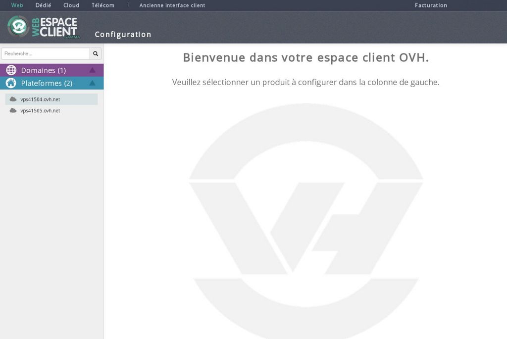
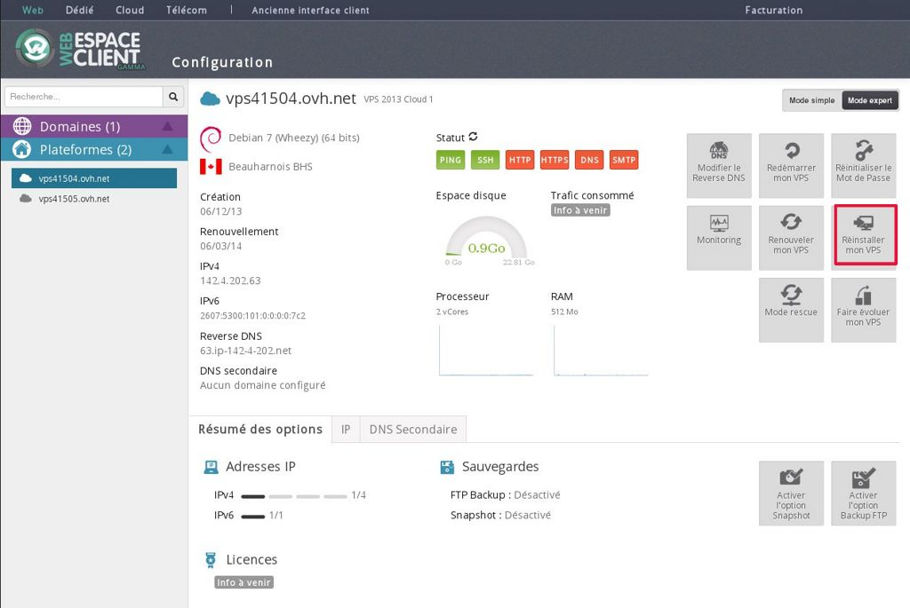
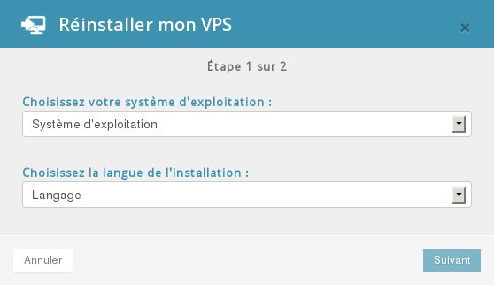
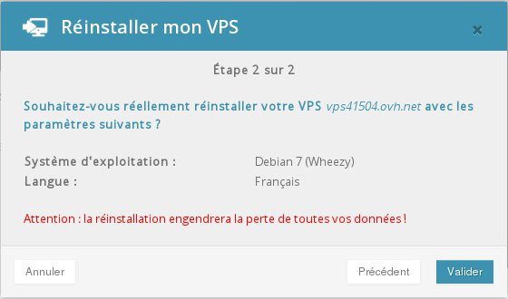

## 
Ti basta accedere a questo link e inserire i tuoi identificativi (NIC + password)


```
https://www.ovh.it/managerv3/
```


In questo modo trovi il menu con i tuoi VPS sulla sinistra:

{.thumbnail}


## 
Sulla pagina del tuo VPS ti basta selezionare la funzione "Reinstalla il tuo VPS" perché si apra il menu da cui scegliere il sistema operativo:

{.thumbnail}
Dopo aver cliccato, visualizzi la lista di sistemi operativi disponibili alla reinstallazione sul suo VPS:

{.thumbnail}
Conferma la tua scelta:

{.thumbnail}

## Attenzione:
dopo aver confermato non puoi più tornare indietro, ti consigliamo di fare un backup dei tuoi file prima di validare la reinstallazione.
A reinstallazione terminata ricevi una mail con i nuovi accessi al tuo VPS.

