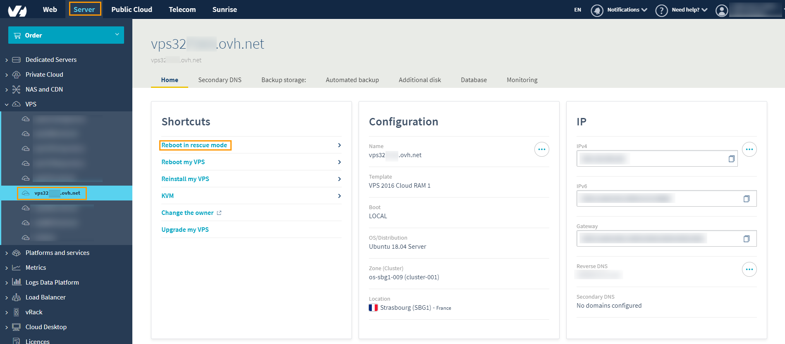

**Last updated 15th June 2019**

## Objective

Rescue mode is a tool on your VPS. You can use it to boot your VPS into a temporary Operating System, in order to diagnose and resolve issues on your primary OS.

These issues could include:

  - Resetting your root password
  - Diagnosing network problems
  - Repairing broken Operating System
  - Fixing a software firewall misconfiguration
  - Testing disk performance

  Performing checks in Rescue Mode helps you determine if an issue is software or hardware related.

> [!warning]
>
> If you have any services online, rescue mode will interrupt them as the machine is being rebooted into the OVH rescue environment.
>

This guide will show you how to reboot your VPS in rescue mode.

## Requirements

- You must be logged in to your [Control Panel](https://www.ovh.com/auth/?action=gotomanager).

## Instructions

Once you have logged in to your [Control Panel](https://www.ovh.com/auth/?action=gotomanager){.external}, you simply go to the `Server`{.action} section, then to `VPS`{.action} in the left-hand column to select your VPS. In this section, you will you will see a button labelled `Reboot in rescue mode`{.action} and confirm the popup:

{.thumbnail}

A progress bar will show how the reboot task is progressing (this can take several minutes):

{.thumbnail}

> [!primary]
>
> Once you have completed this step, you will receive an automated email with the SSH credentials for rescue mode. This email is also available on your Control Panel, in the `My account`{.action} section, then `Emails received`{.action}.
>

You can now connect via SSH to your VPS in rescue mode. Once these changes have been completed with rescue mode, you can reboot the VPS on your main hard drive by pressing the `Reboot my VPS`{.action} button.

## Go further

[Introduction to SSH](https://docs.ovh.com/gb/en/dedicated/ssh-introduction/)

Join our user community on <https://community.ovh.com/en/>.
