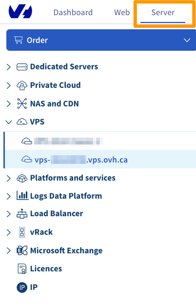
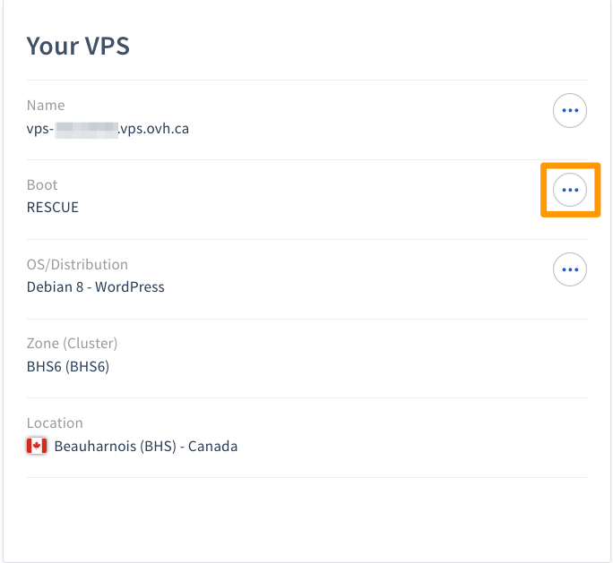

**Last updated 2020/07/15**

## Objective

In rescue mode, you can reboot your server on an independent OVHcloud configuration. Your disk can then be mounted like an independent partition.

The advantage of this is that you can carry out tests and make configuration changes when it is most convenient for you, and when it will have the least impact on the operations performed by your server. This also allows you to correct any configuration errors made, which prevented you from accessing the server from the drive.

In rescue mode, you can :

- Change your root password ;
- Troubleshoot network problems ;
- Fix a defective operating system ;
- Correct a bad firewall configuration ;
- test disk performance.

Performing rescue mode checks also helps you determine if there is a software or hardware issue.

> [!warning]
>
> If you have any services online, rescue mode will interrupt them as the machine is being rebooted into the OVH rescue environment.
> 

This guide will show you how to reboot your VPS in rescue mode.

## Requirements

- You must be logged in to your [Control Panel](https://ca.ovh.com/auth/?action=gotomanager).

## Instructions

Once you have logged in to your Control Panel, click to the Server tab, then in the left-hand column choose your VPS.

{.thumbnail}

On the main screen of your VPS, under Your VPS, click on boot `···`{.action} button and select `Reboot in rescue mode`{.action}.

{.thumbnail}

The reboot can take several minutes.

> [!primary]
>
> Once you have completed this step, you will receive an automated email with the SSH credentials for rescue mode. This email is also available on your Control Panel, in the `Service emails`{.action} section.
> 
{.thumbnail}

You can now connect via SSH to your VPS in rescue mode. To switch back to normal mode, simply reboot your VPS by clicking on boot `···`{.action} button and select `Reboot my VPS`{.action}.

## Go further

[Introduction to SSH](https://docs.ovh.com/ca/en/dedicated/ssh-introduction/)

Join our user community on <https://community.ovh.com/en/>.

