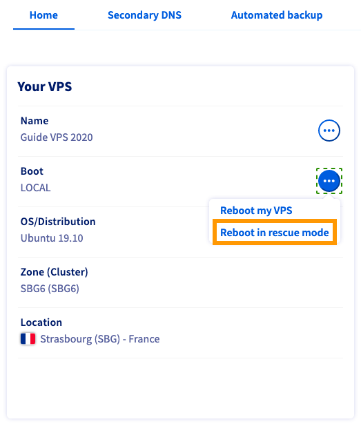
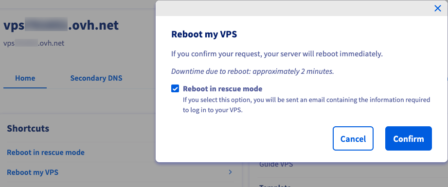
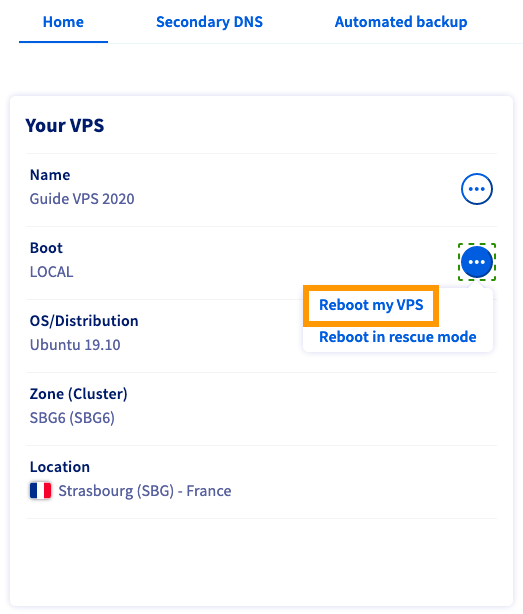

**Dernière mise à jour le 02/05/2022**

## Objectif

Le mode rescue est un outil de votre VPS. Celui-ci vous permet de démarrer votre serveur sur un système d'exploitation temporaire. Vous aurez ainsi la possibilité de diagnostiquer et résoudre les problèmes sur votre système d'exploitation principal. 

Via le mode rescue, vous pouvez :

  - changer votre mot de passe root ;
  - diagnostiquer des problèmes réseau ;
  - réparer un système d'exploitation défectueux ;
  - corriger une mauvaise configuration du pare-feu logiciel ;
  - tester les performances du disque.

Effectuer des vérifications en mode rescue vous aide également à déterminer si un problème est lié au logiciel ou au matériel. Nous vous recommandons de le faire avant de contacter nos équipes de support.

> [!warning]
>
> Si vous avez des services en production sur votre VPS, le mode rescue les interrompt tant que la machine n’a pas été redémarrée en mode normal.
> 

**Ce guide explique comment activer et utiliser le mode rescue sur votre VPS.**

## Prérequis

- Être connecté à votre [espace client OVHcloud](https://ca.ovh.com/auth/?action=gotomanager&from=https://www.ovh.com/ca/fr/&ovhSubsidiary=qc){.external}.
- Avoir votre [VPS OVHcloud](https://www.ovhcloud.com/fr/vps/){.external} déjà configuré.

> [!warning]
>
> OVHcloud met à votre disposition des machines dont la responsabilité vous revient. En effet, n’ayant aucun accès à ces machines, nous n’en sommes pas les administrateurs. Il vous appartient de ce fait d’en assurer la gestion logicielle et la sécurisation au quotidien. Nous mettons à votre disposition ce guide afin de vous accompagner au mieux sur des tâches courantes. Néanmoins, nous vous recommandons de faire appel à un prestataire spécialisé si vous éprouvez des difficultés ou des doutes concernant l’administration, l’utilisation ou la sécurisation d’un serveur. Plus d’informations dans la section “Aller plus loin” de ce guide.
> 

## En pratique

### Activation du mode rescue

Connectez-vous à votre [espace client OVHcloud](https://ca.ovh.com/auth/?action=gotomanager&from=https://www.ovh.com/ca/fr/&ovhSubsidiary=qc), rendez-vous dans la section `Bare Metal Cloud`{.action} et sélectionnez votre serveur sous la partie `Serveur privés virtuels`{.action}.

#### Avec une offre VPS actuelle

Sous l'onglet `Accueil`{.action}, cliquez sur `...`{.action} à côté de « Boot » dans la zone **Votre VPS**.

{.thumbnail}

Sélectionnez `Redémarrer en mode rescue`{.action} dans le menu.

#### Avec une ancienne offre VPS

Sous l'onglet `Accueil`{.action}, cliquez sur le lien de raccourci intitulé `Redémarrer en mode rescue`{.action}.

{.thumbnail}

Une fenêtre s'affiche, cliquez sur `Confirmer`{.action} pour lancer le redémarrage en mode rescue.

### Utilisation du mode rescue

Une fois que vous avez lancé le redémarrage, une barre de progression indique l'avancement de la tâche. Notez que cela peut prendre plusieurs minutes.

> [!primary]
>
> Vous recevrez un email automatisé avec les informations d'identification SSH pour accéder au mode rescue. Veuillez attendre la réception de l'e-mail avant de prendre toute autre mesure. Cet e-mail est également disponible dans votre [espace client OVHcloud](https://ca.ovh.com/auth/?action=gotomanager&from=https://www.ovh.com/ca/fr/&ovhSubsidiary=qc). Pour le retrouver, cliquez sur le nom associé à votre identifiant OVHcloud dans la barre de menus située dans le coin supérieur droit, puis sélectionnez `E-mails de service`{.action}.
>

Vous devrez ensuite accéder à votre serveur en ligne de commande ou via un outil SSH, en utilisant le mot de passe root généré pour le mode rescue.

Par exemple :

```bash
ssh root@your_server_IP
root@your_server_password:
```

> [!warning]
> 
> Votre client SSH bloquera probablement la connexion en premier lieu, en raison d'une incompatibilité de l'empreinte ECDSA. Ceci est normal, car le mode rescue utilise son propre serveur SSH temporaire.
>
> Pour contourner ce problème, vous pouvez commenter l'empreinte de votre système habituel en ajoutant un `#` devant sa ligne dans le fichier *known_hosts*. Prenez soin de retirer ce caractère avant le redémarrage du serveur en mode normal.
>
La plupart des modifications apportées à votre serveur via SSH en mode rescue nécessitent le montage d’une partition. En effet, ce mode possède son propre système de fichiers temporaires. Par conséquent, les modifications apportées au système de fichiers en mode rescue seront perdues lors du redémarrage du serveur en mode normal.

Une fois connecté, vérifiez les disques disponibles avec cette commande :

```bash
[RESCUE] root@vps-111111d:~ $ lsblk
NAME   MAJ:MIN RM  SIZE RO TYPE MOUNTPOINT
sda      8:0    0  2.5G  0 disk
└─sda1   8:1    0  2.5G  0 part /
sdb      8:16   0   80G  0 disk
└─sdb1   8:17   0   80G  0 part
```

Ensuite, montez la partition :

```
[RESCUE] root@vps-111111d:~ $ mount /dev/sdb1 /mnt
```

Vos données seront maintenant accessibles depuis le dossier `/mnt`.

Une fois vos actions terminées en mode rescue, redémarrez le VPS en mode « normal » à partir de votre [espace client OVHcloud](https://ca.ovh.com/auth/?action=gotomanager&from=https://www.ovh.com/ca/fr/&ovhSubsidiary=qc).

{.thumbnail}

## Aller plus loin

[Changer le mot de passe root sur un VPS](../root-password/)

[Introduction au SSH](../../dedicated/ssh-introduction/)

Rejoignez notre communauté d'utilisateurs sur <https://community.ovh.com/>.

