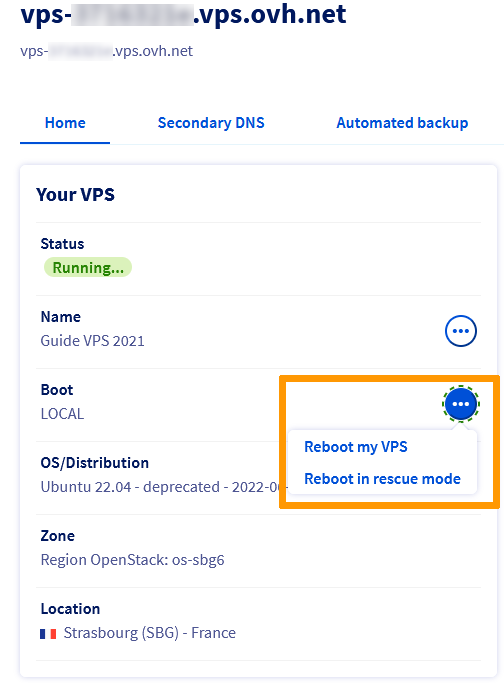

> [!primary]
> Diese Übersetzung wurde durch unseren Partner SYSTRAN automatisch erstellt. In manchen Fällen können ungenaue Formulierungen verwendet worden sein, z.B. bei der Beschriftung von Schaltflächen oder technischen Details. Bitte ziehen Sie beim geringsten Zweifel die englische oder französische Fassung der Anleitung zu Rate. Möchten Sie mithelfen, diese Übersetzung zu verbessern? Dann nutzen Sie dazu bitte den Button «Mitmachen» auf dieser Seite.
>

**Letzte Aktualisierung am 25.03.2022**
 
## Ziel

Ein Virtual Private Server oder VPS ist ein virtualisierter Dedicated Server. Im Gegensatz zum Webhosting (so genanntes Shared Hosting), bei dem die technische Verwaltung von OVHcloud übernommen wird, sind Sie es, die Ihren VPS vollständig verwalten.

**In dieser Anleitung erfahren Sie, wie Sie Ihren VPS selbst verwalten können.**

> [!warning]
>OVHcloud stellt Ihnen Dienste zur Verfügung, für deren Konfiguration und Verwaltung Sie verantwortlich sind. Sie sind also verantwortlich für das ordnungsgemäße Funktionieren dieser Systeme.
>
>Sollten Sie Schwierigkeiten haben, diese Aktionen durchzuführen, kontaktieren Sie bitte einen [spezialisierten Dienstleister](https://partner.ovhcloud.com/de/directory/) und/oder besprechen Sie das Problem mit unserer User Community unter https://community.ovh.com/en/. OVHcloud kann Ihnen diesbezüglich keinen technischen Support bieten.
>

## Voraussetzungen

- Sie haben einen [VPS](https://www.ovhcloud.com/de/vps/) in Ihrem Kunden-Account.
- Sie haben Zugriff auf Ihr [OVHcloud Kundencenter](https://www.ovh.com/auth/?action=gotomanager&from=https://www.ovh.de/&ovhSubsidiary=de).
- Sie verfügen über die nach der Installation per E-Mail versandten Zugangsdaten.

## In der praktischen Anwendung

Loggen Sie sich in Ihr [OVHcloud Kundencenter](https://www.ovh.com/auth/?action=gotomanager&from=https://www.ovh.de/&ovhSubsidiary=de) ein, gehen Sie in den Bereich `Bare Metal Cloud`{.action} und wählen Sie unter `Virtual Private Server`{.action} Ihren Server aus.

Dieses Dashboard enthält wichtige Informationen zu Ihrem Dienst und erlaubt Ihnen, grundlegende Operationen auszuführen. Es unterscheidet sich je nach Reihe Ihres VPS.

- Wenn Sie gerade erst einen VPS bestellt haben, sieht seine Referenz wie folgt aus: *vps-XXXXXXX.vps.ovh.net* (*X* steht für eine Folge aus Ziffern und Buchstaben).
- Wenn Sie einen älteren VPS verwalten, ist dessen Referenz anders strukturiert: *vpsXXXX.ovh.net* (hier steht *X* für Zahlen).

Zu einem VPS Service der aktuellen Reihe lesen Sie den nachfolgenden Abschnitt: **Erste Schritte (aktuelle VPS Reihe)**.

Für Informationen zur Verwendung älterer VPS Modelle, fahren Sie weiter unten fort unter [Erste Schritte (alte VPS Reihe)](./#erste-schritte-alte-vps-reihe_1).

### Erste Schritte (aktuelle VPS Reihe)

#### Mit Ihrem VPS verbinden (aktuelle Reihe)

Bei Erstinstallation oder Neuinstallation über das Kundencenter wird ein Nutzer erstellt, der über alle Rechte zur Serververwendung verfügt, und Sie erhalten eine E-Mail mit den Login-Daten für diesen Nutzer.<br>
Der Nutzername wird je nach Betriebssystem generiert, zum Beispiel “ubuntu” oder “debian”.

Sie können sich mit dem Nutzernamen und Passwort per SSH mit Ihrem VPS verbinden. (SSH ist ein sicheres Kommunikationsprotokoll. Weitere Informationen hierzu finden Sie in der [Einführung zur Verwendung von SSH](../../dedicated/ssh-einfuehrung/). Sie können auf Ihren Server über ein Terminal (Linux OS oder Mac OS) oder unter Windows über eine Drittanbieter-Software (wir empfehlen PuTTY) zugreifen.

Wenn Sie zum Beispiel PuTTY verwenden, öffnen Sie einfach die Anwendung und geben Sie den Namen des Servers oder seine IPv4-Adresse ein, um eine Verbindung herzustellen. Sie werden aufgefordert, den Nutzernamen und das Passwort einzugeben, und können anschließend auf die Kommandozeile (CLI) zugreifen.

{.thumbnail}

Wenn Sie sich über Terminal/Konsole verbinden, geben Sie folgenden Befehl ein, um sich mit den Zugangsdaten aus der E-Mail auf Ihrem VPS einzuloggen (Nutzername und IPv4-Adresse).

```bash
ssh nutzername@IPv4_Ihres_VPS
```

Da Sie nun mit hohen Berechtigungen verbunden sind (ein *sudo* Benutzer), können Sie Befehle für administrative Aufgaben eingeben. Wir empfehlen Ihnen, vorher Ihr Passwort zu ändern:

```bash
~$ sudo passwd nutzername
New password:
Retype new password:
passwd: password updated successfully
```

Beachten Sie, dass die Passwörter nicht angezeigt werden. Wechseln Sie anschließend zum Root-Benutzer und legen Sie Ihr Admin-Passwort fest:

```bash
~$ sudo su -
~# passwd
New password:
Retype new password:
passwd: password updated successfully
```

#### Aktivierung von Root-Logins

Aus Sicherheitsgründen ist das Verbinden mit dem Root-Benutzer standardmäßig deaktiviert. Wenn Sie diese Verbindungen erlauben möchten, folgen Sie den Instruktionen in [dieser Anleitung](../root-password/#rooterlauben).

#### Neustart Ihres VPS (aktuelle Reihe) <a name="reboot-current-range"></a>

Ein Neustart kann notwendig sein, um aktualisierte Konfigurationen anzuwenden oder Fehler zu beheben. Wenn möglich, führen Sie über die Befehlszeile einen "Soft Reboot" des Servers durch:

```bash
reboot
```

Sie können jedoch jederzeit einen "Hard Reboot" in Ihrem [OVHcloud Kundencenter](https://www.ovh.com/auth/?action=gotomanager&from=https://www.ovh.de/&ovhSubsidiary=de) ausführen. Klicken Sie im Tab `Start`{.action} auf `...`{.action} neben "Boot" im Bereich **Ihr VPS** und klicken Sie dann im Kontextmenü auf `VPS neu starten`{.action} und `Bestätigen`{.action}.

{.thumbnail}

#### VPS installieren oder neu installieren (aktuelle Reihe) <a name="reinstallvps"></a>

Sie können jede Neuinstallation über das OVHcloud Kundencenter durchführen. Gehen Sie im Tab “Start” im Bereich **Ihr VPS** zu “Betriebssystem / Distribution”. Klicken Sie auf `...`{.action} und dann auf `VPS reinstallieren`{.action}.

{.thumbnail}

Es wird ein Fenster geöffnet, in dem Sie Folgendes auswählen:

- Ihr Betriebssystem aus dem Drop-down-Menü
- Einen [SSH-Schlüssel](../../dedicated/ssh-schluessel-erzeugen/) (optional)

{.thumbnail}

> [!primary]
>
>Einige Betriebssysteme bzw. Verwaltungsoberflächen wie Plesk oder cPanel benötigen Lizenzen, die zusätzliche Kosten verursachen. Lizenzen können im OVHcloud Kundencenter verwaltet werden: gehen Sie zum Bereich `Bare Metal Cloud`{.action} und klicken Sie in der linken Menüleiste auf `Lizenzen`{.action}.
>
Um ein **Windows** Betriebssystem auf einem VPS zu betreiben, muss es **bei der Bestellung des Dienstes** ausgewählt werden. Ein VPS mit einem anderen Betriebssystem kann nicht nachträglich auf dem beschriebenen Weg mit Windows reinstalliert werden.
>

In Ihrem Kundencenter wird ein Ladebalken eingeblendet, der Ihnen den Fortschritt der Neuinstallation anzeigt. Diese kann bis zu 30 Minuten dauern.

### Erste Schritte (alte VPS Reihe)

#### Mit Ihrem VPS verbinden (alte Reihe)

Bei der Installation (oder Neuinstallation) Ihres VPS wird Ihnen eine E-Mail mit dem Passwort für den Root-Zugriff, also die Verbindung via SSH-Protokoll, zugeschickt. SSH ist ein sicheres Kommunikationsprotokoll. Weitere Informationen hierzu finden Sie in der [Einführung zur Verwendung von SSH](../../dedicated/ssh-einfuehrung/). 

Der Zugang erfolgt über Kommandozeile/Terminal (Linux OS oder Mac OS) oder über Drittanbieter-Software unter Windows (z.B. PuTTY).

Wenn Sie zum Beispiel PuTTY verwenden, öffnen Sie einfach die Anwendung und geben Sie den Namen des Servers oder seine IPv4-Adresse ein, um eine Verbindung herzustellen. Sie werden dann aufgefordert, den Nutzernamen und das Passwort einzugeben, und können anschließend auf die Kommandozeile (CLI) zugreifen.

{.thumbnail}

Wenn Sie sich über Terminal/Konsole verbinden, geben Sie folgenden Befehl ein, um die Verbindung zu Ihrem VPS herzustellen:

```bash
ssh root@IPv4_Ihres_VPS
```

Alternativ:

```bash
ssh root@Referenz_Ihres_VPS
```

#### Neustart Ihres VPS (alte Reihe) <a name="reboot-older-range"></a>

Ein Neustart kann notwendig sein, um aktualisierte Konfigurationen anzuwenden oder Fehler zu beheben. Wenn möglich, führen Sie über die Befehlszeile einen "Soft Reboot" des Servers durch:

```bash
reboot
```

Sie können jedoch jederzeit einen "Hard Reboot" in Ihrem [OVHcloud Kundencenter](https://www.ovh.com/auth/?action=gotomanager&from=https://www.ovh.de/&ovhSubsidiary=de) ausführen. Klicken Sie im Tab `Start`{.action} auf `VPS neu starten`{.action} und `Bestätigen`{.action}.

{.thumbnail}

#### VPS installieren oder neu installieren (alte Reihe)

Jede Neuinstallation erfolgt direkt in Ihrem Kundencenter. Klicken Sie einfach auf die Schaltfläche `VPS reinstallieren`{.action}.

{.thumbnail}

Es wird ein Fenster geöffnet, in dem Sie Folgendes auswählen:

- Ihr Betriebssystem aus dem Drop-down-Menü
- Die Nutzersprache
- Einen [SSH-Schlüssel](../../dedicated/ssh-schluessel-erzeugen/) (optional)

{.thumbnail}

> [!primary]
>
>Einige Betriebssysteme bzw. Verwaltungsoberflächen wie Plesk oder cPanel benötigen Lizenzen, die zusätzliche Kosten verursachen. Lizenzen können im OVHcloud Kundencenter verwaltet werden: gehen Sie zum Bereich `Bare Metal Cloud`{.action} und öffnen Sie `Lizenzen`{.action}.
>
Um ein **Windows** Betriebssystem auf einem VPS zu betreiben, muss es **bei der Bestellung des Dienstes** ausgewählt werden. Ein VPS mit einem anderen Betriebssystem kann nicht nachträglich auf dem beschriebenen Weg mit Windows reinstalliert werden.
>

In Ihrem Kundencenter wird ein Ladebalken eingeblendet, der Ihnen den Fortschritt der Neuinstallation anzeigt. Diese kann bis zu 30 Minuten dauern.

### Sicherheit Ihres VPS

Wie im Abschnitt "Ziel" dieser Anleitung erläutert, sind Sie der Administrator Ihres VPS. Als solcher sind Sie für Ihre Daten und deren Sicherheit verantwortlich.

Für grundlegende Tipps lesen Sie die Anleitung zur [VPS Sicherheit](../vps-sicherheit/).

### Eine Domain zuweisen

Um Ihren VPS über das Web erreichbar zu machen, wird in der Regel eine Domain über DNS daran gebunden. Wenn Sie Ihre Domain bei OVHcloud verwalten, können Sie hierzu unserer Anleitung zur [Bearbeitung Ihrer DNS Zone](../../domains/webhosting_bearbeiten_der_dns_zone/) folgen.

### Domain mit einem SSL-Zertifikat sichern

Sobald Sie Ihren VPS eingerichtet haben, können Sie auch Ihre Domain und Ihre Website absichern. Dazu ist ein SSL-Zertifikat erforderlich, das den Zugriff auf die Website über *https* statt nur über *http* erlaubt.

Sie können das SSL-Zertifikat manuell auf dem VPS installieren. Bitte beachten Sie dazu die offizielle Dokumentation Ihrer VPS Distribution.

OVHcloud bietet auch die SSL Gateway-Lösung zur Automatisierung dieses Prozesses an. Weitere Informationen finden Sie auf der [Produktseite](https://www.ovh.com/de/ssl-gateway/){.external} oder in unseren [Anleitungen](https://docs.ovh.com/de/ssl-gateway/).

## Weiterführende Informationen

[SSH Einführung](../../dedicated/ssh-einfuehrung/)

[VPS absichern](../vps-sicherheit/)

[Eine neue Windows Server Installation konfigurieren](../windows-first-config/)

Für den Austausch mit unserer Community gehen Sie auf <https://community.ovh.com/en/>.
