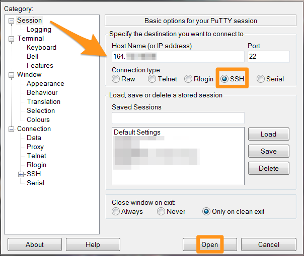
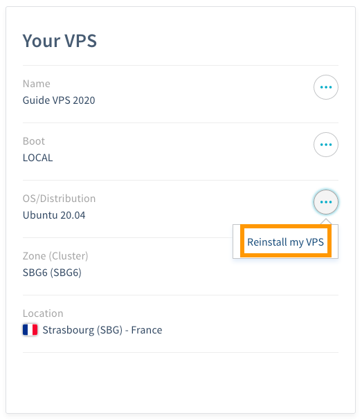
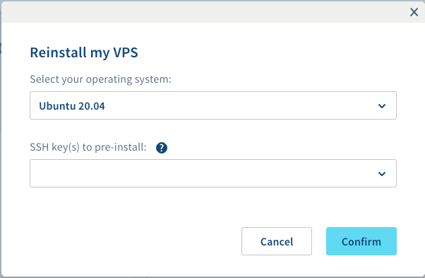
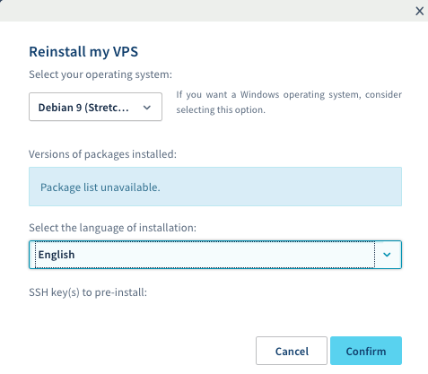

**Letzte Aktualisierung am 07.06.2020**
 
## Ziel

Ein Virtual Private Server oder VPS ist ein virtualisierter dedizierter Server. Im Gegensatz zum Webhosting (auch „Shared Hosting“ genannt), bei dem die technische Verwaltung von OVHcloud geleistet wird, sind Sie allein für die Verwaltung Ihres VPS verantwortlich.

**Diese Anleitung erläutert einige Grundlagen zur Erstverwendung eines VPS.**


> [!warning]
>OVHcloud stellt Ihnen Dienstleistungen zur Verfügung, für deren Konfiguration und Verwaltung Sie die alleinige Verantwortung tragen. Es liegt somit bei Ihnen, sicherzustellen, dass diese ordnungsgemäß funktionieren.
>
>Wir stellen Ihnen diese Anleitung zur Verfügung, um Ihnen bei der Bewältigung alltäglicher Verwaltungsaufgaben zu helfen. Dennoch empfehlen wir Ihnen, falls Sie Hilfe brauchen, einen spezialisierten Dienstleister und/oder den Herausgeber des Dienstes zu kontaktieren. Für externe Dienstleistungen bietet OVHcloud leider keine Unterstützung. Weitere Hinweise finden Sie im Teil „Weiterführende Informationen” dieser Anleitung.
>


## Voraussetzungen

- Sie haben einen [VPS](https://www.ovhcloud.com/de/vps/) in Ihrem Kunden-Account.
- Sie haben Zugriff auf Ihr [OVHcloud Kundencenter](https://www.ovh.com/auth/?action=gotomanager).
- Sie verfügen über die Zugangsdaten, die Ihnen nach der Installation per E-Mail zugesandt wurden.

## In der praktischen Anwendung

Loggen Sie sich in Ihr [OVHcloud Kundencenter](https://www.ovh.com/auth/?action=gotomanager) ein, gehen Sie in den Bereich `Server`{.action} und wählen Sie links im Menü unter `VPS`{.action} Ihren Server aus. 

Dieses Dashboard enthält wichtige Informationen zu Ihrem Dienst und erlaubt Ihnen, grundlegende Operationen auszuführen. Es unterscheidet sich je nach Reihe Ihres VPS. 

- Wenn Sie gerade erst einen VPS bestellt haben, sieht seine Referenz wie folgt aus: *vps-XXXXXXX.vps.ovh.net* (*X* sind eine Folge aus Ziffern und Buchstaben). 
- Wenn Sie einen älteren VPS verwalten, ist dessen Referenz anders strukturiert: *vpsXXXX.ovh.net* (hier sind *X* stets Zahlen). 

Zu einem VPS Service der aktuellen Reihe lesen Sie den nachfolgenden Abschnitt, **Erste Schritte (aktuelle VPS Reihe)**. 

Für Informationen zur Verwendung älterer VPS Modelle, klicken Sie auf folgenden Link: [Erste Schritte (alte VPS Reihe)](./#erste-schritte-alte-vps-reihe_1).

### Erste Schritte (aktuelle VPS Reihe)

#### Mit Ihrem VPS verbinden (aktuelle Reihe)

Bei Erstinstallation oder Neuinstallation über das Kundencenter wird ein Nutzer erstellt, der über alle Rechte zur Serververwendung verfügt, und Sie erhalten eine E-Mail mit den Login-Daten für diesen Nutzer.
Der Nutzername wird je nach Betriebssystem generiert, zum Beispiel „ubuntu“ oder „debian“. 

Sie können sich mit dem Nutzernamen und Passwort per SSH mit Ihrem VPS verbinden. (SSH ist ein sicheres Kommunikationsprotokoll. Weitere Informationen hierzu finden Sie in der [Einführung zur Verwendung von SSH für dedizierte Server von OVHcloud](../../dedicated/ssh-einfuehrung/). Sie können auf Ihren Server über ein Terminal (Linux OS oder Mac OS) oder unter Windows über eine Drittanbieter-Software (wir empfehlen PuTTY) zugreifen.

Wenn Sie zum Beispiel PuTTY verwenden, öffnen Sie einfach die Anwendung und geben Sie den Namen des Servers oder seine IPv4-Adresse ein, um eine Verbindung herzustellen. Sie werden aufgefordert, den Nutzernamen und das Passwort einzugeben, und können anschließend auf die Kommandozeile (CLI) zugreifen.

{.thumbnail}

Wenn Sie sich über Terminal/Konsole verbinden, geben Sie folgenden Befehl ein, um sich mit den Zugangsdaten aus der E-Mail auf Ihrem VPS einzuloggen (Nutzername und IPv4-Adresse).

```sh
ssh nutzername@IPv4_Ihres_VPS
```

Da Sie nun mit "Root"-Berechtigungen (sudo-Nutzer) eingeloggt sind, können Sie Befehle zur Ausführung administrativer Tasks eingeben. Wir empfehlen Ihnen, vorher Ihr Passwort zu ändern:

```sh
$ sudo passwd
New password:
Retype new password:
passwd: password updated successfully
```

Beachten Sie, dass die Passwörter nicht angezeigt werden. Wechseln Sie anschließend zum root-Nutzer und vergeben Sie Ihr Admin-Passwort:

```sh
$ sudo su -
# passwd
New password:
Retype new password:
passwd: password updated successfully
```

#### VPS installieren oder neu installieren (aktuelle Reihe)

Sie können jede Neuinstallation über das OVHcloud Kundencenter durchführen. Gehen Sie im Tab „Startseite“ im Bereich **Ihr VPS** zu „Betriebssystem / Distribution“. Klicken Sie auf `...`{.action} und dann auf `VPS reinstallieren`{.action}.

{.thumbnail}

Es wird ein Fenster geöffnet, in dem Sie Folgendes auswählen:

- Ihr Betriebssystem aus dem Drop-down-Menü
- einen SSH-Schlüssel, falls Sie in Ihrem Kundencenter bereits einen Schlüssel erstellt haben

{.thumbnail}

> [!primary]
>
> Für einige Distributionen wie Plesk oder Windows benötigen Sie vor der Installation eine Lizenz, die Sie bei OVHcloud oder einem Reseller erwerben können. Diese müssen Sie dann manuell oder über Ihr Kundencenter einbinden. Die Verwaltung Ihrer Lizenzen geschieht im Bereich `Server`{.action} unter `Lizenzen`{.action}.
Auf dieser Seite können Sie außerdem Lizenzen bestellen oder Ihre eigene Windows- oder SQL-Server-SPLA-Lizenz hinzufügen (Button `Aktionen`{.action} und dann `Eine SPLA-Lizenz hinzufügen`{.action}).
>

In Ihrem Kundencenter wird ein Ladebalken eingeblendet, der Ihnen den Fortschritt der Neuinstallation anzeigt. Diese kann bis zu 30 Minuten dauern.

### Erste Schritte (alte VPS Reihe)

#### Mit Ihrem VPS verbinden (alte Reihe)

Bei der Installation (oder Neuinstallation) Ihres VPS wird Ihnen eine E-Mail mit dem Passwort für den Root-Zugriff, also die Verbindung via SSH-Protokoll, zugeschickt. SSH ist ein sicheres Kommunikationsprotokoll. Weitere Informationen hierzu finden Sie in der [Einführung zur Verwendung von SSH für dedizierte Server von OVHcloud](../../dedicated/ssh-einfuehrung/). 

Der Zugang erfolgt über Kommandozeile/Terminal (Linux OS oder Mac OS) oder über Drittanbieter-Software unter Windows (z.B. PuTTY).

Wenn Sie zum Beispiel PuTTY verwenden, öffnen Sie einfach die Anwendung und geben Sie den Namen des Servers oder seine IPv4-Adresse ein, um eine Verbindung herzustellen. Sie werden dann aufgefordert, den Nutzernamen und das Passwort einzugeben, und können anschließend auf die Kommandozeile (CLI) zugreifen.

{.thumbnail}

Wenn Sie sich über Terminal/Konsole verbinden, geben Sie folgenden Befehl ein, um die Verbindung zu Ihrem VPS herzustellen:

```sh
ssh root@IPv4_Ihres_VPS
```

Alternativ:

```sh
ssh root@Referenz_Ihres_VPS
```

#### VPS installieren oder neu installieren (alte Reihe)

Jede Neuinstallation erfolgt direkt in Ihrem Kundencenter. Klicken Sie einfach auf die Schaltfläche `VPS reinstallieren`{.action}.

{.thumbnail}

Es wird ein Fenster geöffnet, in dem Sie Folgendes auswählen:

- Ihr Betriebssystem aus dem Drop-down-Menü
- die Nutzersprache
- einen SSH-Schlüssel, falls Sie in Ihrem Kundencenter bereits einen Schlüssel erstellt haben


{.thumbnail}

> [!primary]
>
> Für einige Distributionen wie Plesk oder Windows benötigen Sie vor der Installation eine Lizenz, die Sie bei OVHcloud oder einem Reseller erwerben können. Diese müssen Sie dann manuell oder über Ihr Kundencenter einbinden. Die Verwaltung Ihrer Lizenzen geschieht im Bereich `Server`{.action} unter `Lizenzen`{.action}.
Auf dieser Seite können Sie außerdem Lizenzen bestellen oder Ihre eigene Windows- oder SQL-Server-SPLA-Lizenz hinzufügen (Button `Aktionen`{.action} und dann `Eine SPLA-Lizenz hinzufügen`{.action}).
>

In Ihrem Kundencenter wird ein Ladebalken eingeblendet, der Ihnen den Fortschritt der Neuinstallation anzeigt. Diese kann bis zu 30 Minuten dauern.

### Sicherheit Ihres VPS

Wie zu Beginn dieser Anleitung erklärt, sind Sie der Administrator Ihres VPS. Deshalb sind Sie allein für Ihre Daten und deren Sicherheit verantwortlich.

Detaillierte Informationen zu diesem Thema finden Sie in unserer [Anleitung zur VPS Sicherheit](../vps-sicherheit/){.external}.


### Domain mit einem SSL-Zertifikat sichern

Sobald Ihr VPS installiert und gesichert ist, können Sie Ihre Domain und Ihre Website ebenfalls absichern. Installieren Sie hierfür ein SSL-Zertifikat, damit Ihre Website statt nur über *http* auch über *https* erreichbar ist.

Sie können das SSL-Zertifikat manuell direkt auf Ihrem VPS installieren. Bitte beachten Sie dazu die offizielle Dokumentation der von Ihnen verwendeten Distribution.

Sie können aber auch die automatische Lösung von OVHcloud nutzen: [SSL Gateway](https://www.ovh.de/ssl-gateway/). Weitere Informationen zu SSL Gateway finden Sie auf der [Produktseite](https://www.ovh.com/de/ssl-gateway/){.external} oder in der zugehörigen [Dokumentation](https://docs.ovh.com/de/ssl-gateway/){.external}.

## Weiterführende Informationen

[SSH Einführung](../../dedicated/ssh-einfuehrung/)

Für den Austausch mit unserer User Community gehen Sie auf <https://community.ovh.com/en/>.