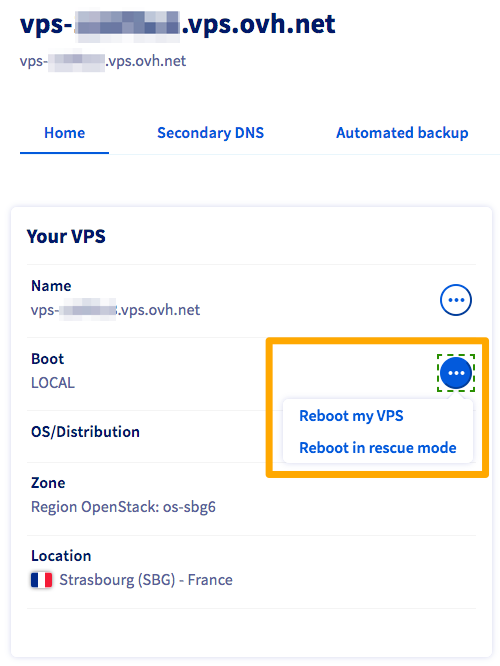

**Last updated 25th March 2022**

## Objective

A Virtual Private Server (VPS) is a virtualised dedicated server. Unlike Web Hosting plans (also referred to as "shared hosting"), which are managed on the technical level by OVHcloud, you are fully responsible for administrating your VPS.

**This guide provides some basic information for getting started with a VPS.**

> [!warning]
>OVHcloud is providing you with services for which you are responsible, with regard to their configuration and management. You are therefore responsible for ensuring they function correctly.
>
>If you encounter any difficulties performing these actions, please contact a specialised service provider and/or discuss the issue with our community on https://community.ovh.com/en/. OVHcloud cannot provide you with technical support in this regard.
>

## Requirements

- A [Virtual Private Server](https://www.ovhcloud.com/en-sg/vps/) in your OVHcloud account
- Access to the [OVHcloud Control Panel](https://ca.ovh.com/auth/?action=gotomanager&from=https://www.ovh.com/sg/&ovhSubsidiary=sg)
- Login credentials received via email after the installation

## Instructions

Log in to the [OVHcloud Control Panel](https://ca.ovh.com/auth/?action=gotomanager&from=https://www.ovh.com/sg/&ovhSubsidiary=sg), go to the `Bare Metal Cloud`{.action} section and select your server from `Virtual Private Servers`{.action}. This dashboard contains important information about your service and allows you to perform essential operations. It will appear differently, depending on the product range of your VPS solution.

- If you have recently ordered a VPS, its reference name will look like this: *vps-XXXXXXX.vps.ovh.net* (where *X* can be a number or a letter).

- If you are managing an older VPS, you will notice that the reference name is structured differently: *vpsXXXX.ovh.net* (in which *X* stands for a number).

For the current VPS range, please continue with the next section, **First steps (current VPS range)**. For an older VPS model, skip to [**First steps (older VPS range)**](./#first-steps-older-vps-range_1) in this guide.

### First steps (current VPS range)

#### Connecting to your VPS

At the first installation or when reinstalling from the Control Panel, a user with elevated permissions will be created and you will be sent an email containing the login credentials. The username will be chosen according to the operating system, for example "ubuntu" or "debian".

You can now connect to your VPS via SSH with username and password. (SSH is a secure communication protocol. Find out more in [this guide about SSH on dedicated servers](../../dedicated/ssh-introduction/)). You can access your server through a command line terminal (Linux or MAC) or through third-party software on Windows (we can recommend PuTTy).

Using PuTTy for example, simply open the application and enter the servername or its IPv4 address to establish a connection. You will be prompted for username and password and then you can proceed with the command line interface (CLI).

{.thumbnail}

Once you have opened the terminal, type the following command to log in to your VPS with the information provided in the email (username and IPv4 address):

```bash
ssh username@IPv4_of_your_VPS
```

Since you are now logged in with elevated privileges (a *sudo* user), you can enter commands to perform administrative tasks. It is recommendable to first change your password:

```bash
~$ sudo passwd username
New password:
Retype new password:
passwd: password updated successfully
```
Note that passwords are not displayed. Next, switch to the "root" user and set your admin password:

```bash
~$ sudo su -
~# passwd
New password:
Retype new password:
passwd: password updated successfully
```

#### Enabling root logins

Connecting with the "root" user is disabled by default as a security measure. If you need to permit these connections, refer to the instructions in [this guide](../root-password/#enabling-root-login_1).

#### Restarting your VPS (current VPS range) <a name="reboot-current-range"></a>

A reboot might become necessary in order to apply updated configurations or to fix an issue. Whenever feasible, perform a "soft reboot" via the command line:

```bash
reboot
```

However, you can carry out a "hard reboot" at any time in your [OVHcloud Control Panel](https://ca.ovh.com/auth/?action=gotomanager&from=https://www.ovh.com/sg/&ovhSubsidiary=sg). From the `Home`{.action} tab, click on `...`{.action} next to "Boot" in the **Your VPS** box, then click `Reboot my VPS`{.action} and `Confirm`{.action} the action in the popup window.

{.thumbnail}

#### Installing or reinstalling your VPS <a name="reinstallvps"></a>

You can carry out any reinstallations directly in your Control Panel. From the `Home`{.action} tab, look for "OS/Distribution" in the box **Your VPS**. Click on `...`{.action} and then on `Reinstall my VPS`{.action}.

{.thumbnail}

In the popup window, you will be asked to choose:

- An operating system from the drop-down list
- [An SSH Key](../../dedicated/creating-ssh-keys-dedicated/) (optional)


{.thumbnail}

> [!primary]
>
> Some proprietary operating systems or platforms such as Plesk or cPanel require licences which generate additional fees. Licences can be managed from the OVHcloud Control Panel: go to the `Bare Metal Cloud`{.action} section, then click on `Licences`{.action} in the left-hand navigation.
>
In order to have a **Windows** operating system running on a VPS, it has to be **selected in the order process**. A VPS with another OS installed cannot be reinstalled with Windows in the described way.
>

A progress bar for the reinstallation will appear in your Control Panel - please note that installation can take up to 30 minutes.

### First steps (older VPS range)

#### Connecting to your VPS (for older ranges)

When you install (or reinstall) your VPS, you will be sent an email containing your password for root access. Root access lets you connect via SSH to your VPS. SSH is a secure communication protocol. You can access your server through a command terminal (Linux or MAC) or through third-party software on Windows (we can recommend PuTTy).

Using PuTTy for example, simply open the application and enter the servername or its IPv4 address to establish a connection. You will be prompted for username and password and then you can proceed with the command line interface (CLI).

{.thumbnail}

Once you have opened the terminal, type the following command to log in to your VPS, replacing the text after the @ symbol with the information required (IPv4 address or VPS reference name):

```bash
ssh root@IPv4_of_your_VPS
```

Or:

```bash
ssh root@your_VPS_reference_name
```

#### Restarting your VPS (for older ranges) <a name="reboot-older-range"></a>

A reboot might become necessary in order to apply updated configurations or to fix an issue. Whenever feasible, perform a "soft reboot" via the command line:

```bash
reboot
```

However, you can carry out a "hard reboot" at any time in your [OVHcloud Control Panel](https://ca.ovh.com/auth/?action=gotomanager&from=https://www.ovh.com/sg/&ovhSubsidiary=sg). From the `Home`{.action} tab, click on `Reboot my VPS`{.action}, then click `Confirm`{.action} in the popup window.

{.thumbnail}

#### Installing or reinstalling your VPS (for older ranges)

You can carry out any reinstallations directly in your Control Panel. Simply click `Reinstall my VPS`{.action} in the "Home" tab:

{.thumbnail}

A window will open, and you will be asked to choose:

- Your operating system from the drop-down list
- The language
- [An SSH Key](../../dedicated/creating-ssh-keys-dedicated/) (optional)


{.thumbnail}

> [!primary]
>
> Some proprietary operating systems or platforms such as Plesk or cPanel require licences which generate additional fees. Licences can be managed from the OVHcloud Control Panel: go to the `Bare Metal Cloud`{.action} section, then open `Licences`{.action}.
>
In order to have a **Windows** operating system running on a VPS, it has to be **selected in the order process**. A VPS with another OS installed cannot be reinstalled with Windows in the described way.
>

A progress bar for the reinstallation will appear in your Control Panel - please note that installation can take up to 30 minutes.

### Securing your VPS

As explained in the "Objective" section of this guide, you are the administrator of your VPS. As such, you are responsible for your data and its security.

Please refer to the guide on [Securing a VPS](../tips-for-securing-a-vps/) for some basic advice.

### Attaching a domain

Making your VPS available on the web usually includes attaching a domain name to it via DNS. If you manage your domain at OVHcloud, you can refer to our guide on [Editing your DNS zone](../../domains/web_hosting_how_to_edit_my_dns_zone/) for instructions.

### Securing a domain with an SSL certificate

Once you have configured your VPS, you may want to secure your domain name and your website as well. This will require an SSL certificate, allowing the website to be accessed via *https* as opposed to *http* only.

You can install this SSL certificate manually, directly on the VPS. Please refer to the official documentation of your VPS distribution.

 
## Go further

[Introduction to SSH](../../dedicated/ssh-introduction/)

[Securing a VPS](../tips-for-securing-a-vps/)

[Configuring a new Windows Server installation](../windows-first-config/)

Join our community of users on <https://community.ovh.com/en/>.
