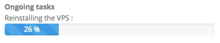

**Ultimo aggiornamento: 18/04/2018**
 
## Obiettivo

Un Virtual Private Server (VPS) è un server dedicato virtualizzato. A differenza di un hosting Web, la cui gestione tecnica è affidata a OVHcloud, per un VPS l’amministrazione è sotto la tua completa responsabilità.

**Questa guida ti mostra le operazioni di base da effettuare sul tuo server virtuale appena consegnato e installato.**


> [!warning]
>
> OVHcloud mette a disposizione i server, ma non è autorizzata ad accedervi e non si occupa quindi della loro amministrazione. Garantire quotidianamente la gestione software e la sicurezza di queste macchine è quindi responsabilità dell’utente. Questa guida ti aiuta a muovere i primi passi nell’utilizzo del tuo VPS. Tuttavia, in caso di difficoltà o dubbi relativi ad amministrazione e sicurezza, ti consigliamo di contattare un fornitore specializzato. Per maggiori informazioni consulta la sezione “Per saperne di più” di questa guida.
> 


## Prerequisiti

- Aver ordinato un VPS sul [sito OVHcloud](https://www.ovhcloud.com/it/vps/){.external}
- Avere a disposizione le credenziali di accesso ricevute via email dopo l'installazione


## Procedura

Per visualizzare le informazioni relative al tuo VPS, accedi alla sezione `Cloud`{.action} del tuo [Spazio Cliente OVHcloud](https://www.ovh.com/auth/?action=gotomanager){.external} e, nella colonna di sinistra, clicca su `Server`{.action} e poi seleziona il tuo servizio. Nell’interfaccia vengono mostrate le informazioni generali al centro, le operazioni disponibili nei pulsanti a destra e, in basso, le opzioni aggiuntive.

### Accedi al tuo VPS

Durante l'installazione (o la reinstallazione) del VPS, ricevi un’email con la password di accesso root per stabilire una connessione totalmente sicura utilizzando il protocollo SSH. Questo tipo di accesso viene effettuato su Linux e MAC tramite un terminale e, con Windows, utilizzando un software di terze parti (ad esempio Putty).

Una volta avviato il terminale, accedi al tuo VPS digitando il comando:

```sh
ssh root@indirizzo_IPv4_del_tuo_VPS
```

o

```sh
ssh root@indirizzo_di_riferimento_del_tuo_VPS
```

L’indirizzo di riferimento inizia sempre con vpsXXXX.ovh.net (dove XXXX è una serie di cifre).


### Installa o reinstalla il tuo VPS

Le operazioni di installazione possono essere effettuate direttamente dallo Spazio Cliente OVHcloud cliccando sul pulsante `Reinstalla il tuo VPS`{.action}:

{.thumbnail}

Si apre una finestra da cui puoi scegliere:

- il sistema operativo da utilizzare
- la lingua di installazione
- una chiave SSH (se hai già creato chiavi nel tuo Spazio Cliente OVHcloud)


{.thumbnail}

> [!primary]
>
> Alcune distribuzioni come Plesk e Windows richiedono l’utilizzo di una licenza, che può essere acquistata in OVHcloud o presso un altro rivenditore. La licenza dovrà poi essere integrata manualmente o dallo Spazio Cliente OVHcloud. Accedendo alla sezione `Dedicato`{.action} > `Licenze`{.action} è possibile gestire le tue licenze, ordinarne di nuove (pulsante `Ordina`{.action}) o aggiungere una licenza SPLA Windows o SPLA SQL Server (pulsante `Aggiungi una licenza SPLA`{.action}).
> 

L’operazione di reinstallazione potrebbe richiedere fino a 30 minuti. Una barra di progressione ti mostrerà lo stato di avanzamento del processo:

{.thumbnail}


### Metti in sicurezza il tuo VPS

Come spiegato nella parte iniziale di questa guida, in quanto amministratore del tuo VPS sei anche responsabile della sua sicurezza e dei dati in esso contenuti.

Per ulteriori informazioni sulla [protezione di un VPS](https://docs.ovh.com/it/vps/consigli-sicurezza-vps/){.external}, consulta la nostra guida dedicata all’argomento.


### Proteggi il tuo dominio con un certificato SSL

Una volta installato e reso sicuro il VPS, è utile proteggere anche il tuo dominio e il tuo sito. Utilizzare un certificato SSL consente agli utenti di accedere alle tue pagine Web anche tramite *HTTPS*, oltre che in *HTTP*.

Questo tipo di certificato può essere installato manualmente direttamente sul VPS. Per eseguire questa operazione, fai riferimento alla documentazione ufficiale della distribuzione utilizzata.

Se invece preferisci una soluzione automatica, scegli il servizio [SSL Gateway](https://www.ovh.it/ssl-gateway/){.external} offerto da OVHcloud e consulta le [nostre guide](https://docs.ovh.com/it/ssl-gateway/){.external} per utilizzarlo.

## Per saperne di più

[Introduzione a SSH](https://docs.ovh.com/it/dedicated/introduzione-ssh/){.external}

Contatta la nostra Community di utenti all’indirizzo <https://www.ovh.it/community/>.
