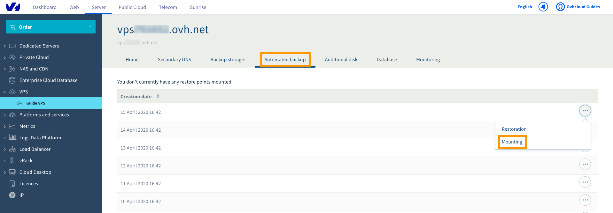

**Última atualização: 22 de abril de 2020**


## Sumário

Esta opção oferece-lhe uma forma prática de ter backups VPS completos e disponíveis na sua Área de Cliente OVHcloud sem ter de se conectar ao servidor para os criar e restaurar manualmente. Outra vantagem é que também pode optar por montar um backup e depois aceder ao mesmo via SSH.

**Este guia explica-lhe como utilizar backups automáticos no seu alojamento VPS OVHcloud.**

> [!primary]
>
Antes de aplicar as opções de backup, recomendamos que consulte as [páginas e perguntas frequentes do produto](https://www.ovhcloud.com/pt/vps/options/) para obter uma comparação de preços e outras informações.
>

## Requisitos

- acesso à [Área de Cliente OVHcloud](https://www.ovh.com/auth/?action=gotomanager)
- um [serviço VPS](https://www.ovhcloud.com/pt/vps/) OVHcloud já instalado
- acesso administrativo (root) via SSH ao seu alojamento VPS (opcional)

## Instruções

Aceda à sua [Área de Cliente OVHcloud](https://www.ovh.com/auth/?action=gotomanager), navegue até à seção "Servidor" e selecione o seu servidor na barra situada à esquerda dentro do separador `VPS`{.action}.

### Passo 1: Subscrever a opção Backups automáticos

Após selecionar o seu alojamento VPS, clique no separador `Backup automático`{.action} no menu horizontal.

Na etapa seguinte, tome nota da informação relativa ao preço e depois clique em `Encomendar`{.action}. Será então guiado através do processo de encomenda que será confirmado com o envio de um e-mail. Os backups diários serão criados até que a opção volte a ser cancelada.


### Passo 2: Restaurar um backup a partir da Área de Cliente OVHcloud

Após selecionar o seu alojamento VPS, clique no separador `Backup automático`{.action} no menu horizontal. Serão disponibilizados no máximo 15 backups diários. Clique em `...`{.action} junto ao backup pretendido e selecione `Restauro`{.action}.

{.thumbnail}

Caso tenha modificado recentemente a palavra-passe da raiz (root), assegure-se de que assinala na janela pop-up a opção “Modificar a palavra-passe da raiz ao restaurar”, com vista a manter a sua palavra-passe atual, e depois clique em `Confirmar`{.action}. Irá receber um e-mail assim que o processo estiver concluído. Este poderá demorar algum tempo, dependendo do espaço do disco utilizado.

> [!alert]
>
Tenha em atenção que os backups automáticos não incluem os seus discos adicionais.
>

### Como montar e aceder a um backup

Não é necessário restaurar completamente o seu atual serviço. A opção “Montar” permite-lhe aceder aos dados do seu backup para obter os seus ficheiros. 

> [!warning]
>A OVHcloud presta-lhe serviços cuja configuração e gestão são da sua inteira responsabilidade, cabendo-lhe a si assegurar o seu correto funcionamento.
>
>Este guia foi concebido para o ajudar, tanto quanto possível, nas tarefas mais comuns. No entanto, caso tenha alguma dificuldade, recomendamos que contacte um fornecedor especializado e/ou o editor do software do serviço, uma vez que não poderemos assisti-lo pessoalmente. Para mais informações, consulte a secção “Vá mais longe” neste guia.
>

#### Passo 1: Área de Cliente 

Clique em `...`{.action} junto ao backup pretendido e selecione `Montar`{.action}.

{.thumbnail}

Após concluir o processo, irá receber um e-mail de confirmação. Poderá então ligar-se ao seu alojamento VPS e adicionar a partição onde o seu backup está localizado.

#### Passo 2: Secure Shell

Primeiro, conecte-se ao seu alojamento VPS via SSH.

Pode utilizar o seguinte comando para verificar o nome do novo dispositivo adicionado:

```
# lsblk
```

Aqui está um exemplo deste comando:

```
NAME    MAJ:MIN RM  SIZE RO TYPE MOUNTPOINT
sda       8:0    0   25G  0 disk 
├─sda1    8:1    0 24.9G  0 part /
├─sda14   8:14   0    4M  0 part 
└─sda15   8:15   0  106M  0 part 
sdb       8:16   0   25G  0 disk 
├─sdb1    8:17   0 24.9G  0 part 
├─sdb14   8:30   0    4M  0 part 
└─sdb15   8:31   0  106M  0 part /boot/efi
sdc       8:32   0   50G  0 disk 
```
Neste exemplo, a partição que contém o backup do seu “filesystem” designa-se "sdb1".
Em seguida, crie um diretório para esta partição e defina-o como “mountpoint”:

```
# mkdir -p /mnt/restore
# mount /dev/sdb1 /mnt/restore
```

Pode agora passar para esta pasta e aceder aos dados do seu backup.


## Saiba mais

[Utilizar snapshots num alojamento VPS](../utilizar-snapshots-num-alojamento-vps)


Junte-se à nossa comunidade de utilizadores em <https://community.ovh.com/en/>.
