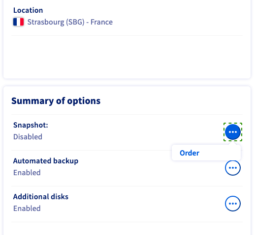
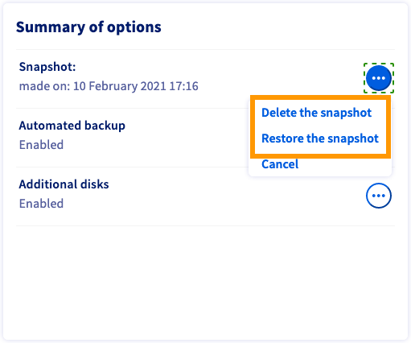

**Last updated 20th July 2020**

## Objective

Creating a snapshot is a fast and simple way to secure a functioning system before making changes that might have undesired or unforeseen consequences, for example testing a new configuration or software. It does not, however, constitute a complete system backup strategy.

**This guide explains the usage of snapshots for your OVHcloud VPS.**

> [!primary]
>
Before applying backup options, we recommend to consult the [product pages and FAQ](https://www.ovhcloud.com/en-ie/vps/options/) for pricing comparisons and further details.
>

## Requirements

- access to the [OVHcloud Control Panel](https://www.ovh.com/auth/?action=gotomanager)
- an OVHcloud [VPS service](https://www.ovhcloud.com/en-ie/vps/) already set up


## Instructions

Log in to your [OVHcloud Control Panel](https://www.ovh.com/auth/?action=gotomanager), navigate to the "Server" section, and select your server from the left-hand sidebar under `VPS`{.action}.

### Step 1: Subscribing to the snapshot option

From the `Home`{.action} tab, scroll down to the box labelled "Summary of options". Click on `...`{.action} next to the option "Snapshot" and in the context menu click on `Order`{.action}.

{.thumbnail}

In the next step, please take note of the pricing information, then click on `Order`{.action}. You will be guided through the order process and receive a confirmation email.

### Step 2: Taking a snapshot

Once the option is enabled, click on `...`{.action} next to the option "Snapshot" and in the context menu click `Take a snapshot`{.action}. Creating the snapshot might take a few minutes. Afterwards, the timestamp of the creation will appear in the "Summary of options" box.

### Step 3: Deleting / restoring a snapshot

Since you can only have one snapshot activated at a time, the existing snapshot has to be deleted before creating a new one. Simply choose `Delete the snapshot`{.action} from the context menu.

{.thumbnail}

If you are sure that you would like to reset your VPS to the status of the snapshot, click `Restore the snapshot`{.action} and confirm the restoration task in the popup window.

Please note that when you restore a VPS from a snapshot, the snapshot will be deleted.

### Best practice for using snapshots

#### Configuring the QEMU agent on a VPS

Snapshots are instantaneous images of your running system ("live snapshot"). To ensure the availability of your system when the snapshot is created, the QEMU agent is used to prepare the filesystem for the process.

The required *qemu-guest-agent* is not installed by default on most distributions. Moreover, licensing restrictions may prevent OVHcloud from including it in the available OS images. Therefore, it is best practice to verify and install the agent in case it is not activated on your VPS. Connect to your VPS via SSH and follow the instructions below, according to your operating system.

##### **Debian-based distributions (Debian, Ubuntu)**

Use the following command to check whether the system is properly set up for snapshots:

```
$ file /dev/virtio-ports/org.qemu.guest_agent.0
/dev/virtio-ports/org.qemu.guest_agent.0: symbolic link to ../vport2p1
```
If the output is different ("No such file or directory"), install the latest package:

```
$ sudo apt-get update
$ sudo apt-get install qemu-guest-agent
```

Start the service to ensure it is running:

```
$ sudo service qemu-guest-agent start
```

##### **Redhat-based distributions (Centos, Fedora)**

Use the following command to check whether the system is properly set up for snapshots:

```
$ file /dev/virtio-ports/org.qemu.guest_agent.0
/dev/virtio-ports/org.qemu.guest_agent.0: symbolic link to ../vport2p1
```

If the output is different ("No such file or directory"), install and enable the agent:

```
$ sudo yum install qemu-guest-agent
$ sudo chkconfig qemu-guest-agent on
```

Start the agent and verify that it is running:

```
$ sudo service qemu-guest-agent start
$ sudo service qemu-guest-agent status
```

##### **Windows**

You can install the agent via MSI file, available from the Fedora project website: <https://fedorapeople.org/groups/virt/virtio-win/direct-downloads/latest-qemu-ga/>

Verify that the service is running by using this powershell command:

```
PS C:\Users\Administrator> Get-Service QEMU-GA

Status   Name               DisplayName
------   ----               -----------
Running  QEMU-GA            QEMU Guest Agent
```


## Go further

[Using automated backups on a VPS](../using-automated-backups-on-a-vps)


Join our community of users on <https://community.ovh.com/en/>.