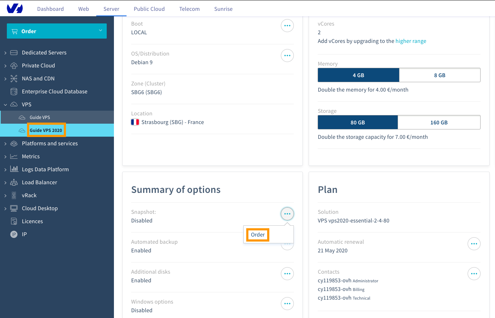

**Last updated 22th April 2020**

## Objective

> [!primary]
>
Before applying backup options, we recommend to consult the [product pages and FAQ](https://www.ovhcloud.com/en-ie/vps/options/) for pricing comparisons and further details.
>

Creating a snapshot is a fast and simple way to secure a functioning system before making changes that might have undesired or unforeseen consequences, for example testing a new configuration or software. It does not, however, constitute a complete system backup strategy.

**This guide explains the usage of snapshots for your OVHcloud VPS.**

## Requirements

- access to the [OVHcloud Control Panel](https://www.ovh.com/auth/?action=gotomanager)
- an OVHcloud [VPS service](https://www.ovhcloud.com/en-ie/vps/) already set up

## Instructions

Log in to your [OVHcloud Control Panel](https://www.ovh.com/auth/?action=gotomanager), navigate to the "Server" section, and select your server from the left-hand sidebar under `VPS`{.action}.

### Step 1: Subscribing to the snapshot option

From the `Home`{.action} tab, scroll down to the box labelled "Summary of options". Click on `...`{.action} next to the option "Snapshot" and in the context menu click on `Order`{.action}.

{.thumbnail}

In the next step, please take note of the pricing information, then click on `Order`{.action}. You will be guided through the order process and receive a confirmation email.

### Step 2: Taking a snapshot

Once the option is enabled, click on `...`{.action} next to the option "Snapshot" and in the context menu click `Take a snapshot`{.action}. Creating the snapshot might take a few minutes. Afterwards, the timestamp of the creation will appear in the "Summary of options" box.

### Step 3: Deleting / restoring a snapshot

Since you can only have one snapshot activated at a time, the existing snapshot has to be deleted before creating a new one. Simply choose `Delete the snapshot`{.action} from the context menu.

{.thumbnail}

If you are sure that you would like to reset your VPS to the status of the snapshot, click `Restore the snapshot`{.action} and confirm the restoration task in the popup window.

## Go further

[Using automated backups on a VPS](https://docs.ovh.com/ie/en/vps/using-automated-backups-on-a-vps)

Join our community of users on <https://community.ovh.com/en/>.