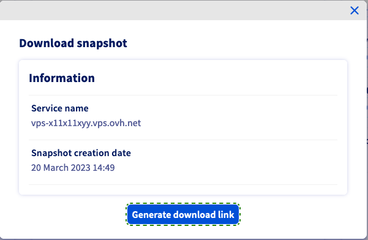

## Objectif

La création d'un snapshot (instantané) est un moyen simple et rapide de sauvegarder un système fonctionnel avant d'y apporter des modifications pouvant avoir des conséquences non souhaitées ou imprévues. Par exemple, tester une nouvelle configuration ou un nouveau logiciel. 
Un snapshot ne constitue pas pour autant une sauvegarde complète du système.

**Ce guide explique l'utilisation des snapshots pour votre VPS.**

<iframe width="560" height="315" src="https://www.youtube-nocookie.com/embed/Pazh9ozbkEk" title="YouTube video player" frameborder="0" allow="accelerometer; autoplay; clipboard-write; encrypted-media; gyroscope; picture-in-picture" allowfullscreen></iframe>

> [!primary]
>Avant d'appliquer une option de sauvegarde, nous vous recommandons de consulter les [options VPS](https://www.ovhcloud.com/fr/vps/options/) afin de comparer les détails et tarifs de chaque option.
>

## Prérequis

- Avoir accès à votre [espace client OVHcloud](https://www.ovh.com/auth/?action=gotomanager&from=https://www.ovh.com/fr/&ovhSubsidiary=fr).
- Un [VPS OVHcloud](https://www.ovhcloud.com/fr/vps/) déjà configuré.

## En pratique

Connectez-vous à votre [espace client OVHcloud](https://www.ovh.com/auth/?action=gotomanager&from=https://www.ovh.com/fr/&ovhSubsidiary=fr), rendez-vous dans la section `Bare Metal Cloud`{.action} et sélectionnez votre serveur sous la partie `Serveur privés virtuels`{.action}.

### Étape 1 : souscrire l'option snapshot

Depuis l'onglet `Accueil`{.action}, descendez jusqu'au menu « Résumé des options ». Cliquez sur `...`{.action} à droite de l'option `«Snapshot»` puis cliquez sur `Commander`{.action} dans le menu qui s'affiche alors.

{.thumbnail}

Veuillez alors prendre connaissance des informations de tarification de cette option, puis cliquez sur `Commander`{.action}. Vous serez guidé dans le processus de commande et recevrez un e-mail de confirmation.

### Étape 2 : prendre un snapshot

Une fois l'option activée, cliquez sur `...`{.action} à droite de l'option « Snapshot » puis cliquez sur `Prendre un Snapshot`{.action} dans le menu qui apparaît. La durée de création du snapshot dépend de l'espace de stockage utilisé. Par la suite, l'horodatage de la création s'affiche dans le menu « Résumé des options ».

### Étape 3 : supprimer/restaurer un snapshot

Étant donné que vous ne pouvez activer qu'un seul snapshot à la fois, vous devez supprimer le snapshot existant avant d'en créer un nouveau. Choisissez simplement `Supprimer le snapshot`{.action} dans le menu contextuel.

{.thumbnail}

Si vous êtes sûr de vouloir restaurer votre VPS à l'état du snapshot, cliquez sur `Restaurer le snapshot`{.action} et confirmez la restauration dans la fenêtre qui s'affiche alors.

> [!alert]
>
> Lorsque vous restaurez un VPS à partir d’un snapshot, ce dernier sera supprimé. Si vous souhaitez conserver le même snapshot, vous devez en créer un nouveau avant d'apporter des modifications au système restauré.
>

### Télécharger un snapshot

Le snapshot en cours peut être récupéré via un lien de téléchargement. Cliquez sur le bouton `...`{.action} à côté de l'option `Snapshot` et choisissez `Télécharger le Snapshot`{.action} dans le menu contextuel.

{.thumbnail}

> [!primary]
>
> Si votre VPS est issu d'une ancienne gamme, il est possible que vous receviez un message d'erreur car l'option n'est pas disponible sur les anciens VPS. Votre VPS est issu d'une ancienne gamme si son modèle de nommage est similaire à : *vpsXXXX.ovh.net* (où *X* représente un nombre). Vous pouvez vérifier cette référence de serveur dans l'onglet `Accueil`{.action} de votre [espace client OVHcloud](https://www.ovh.com/auth/?action=gotomanager&from=https://www.ovh.com/fr/&ovhSubsidiary=fr).
>

Dans la fenêtre qui s'affiche, cliquez sur `Générer le lien de téléchargement`{.action}.

{.thumbnail}

Après quelques secondes, un message de succès s'affiche. En dessous, vous pouvez copier la commande complète de téléchargement en un clic.

{.thumbnail}

La taille du snapshot et la date d'expiration du lien seront également affichées.

Notez que le lien de téléchargement expirera après **24 heures**.

La commande de téléchargemment utilise un `curl` au format suivant :

```bash
curl "https://storage.sbg.cloud.ovh.net/v1/AUTH_f5fgh4674dd706f15f6ffgf4z667d3f4g5f05/glance/5ceg3f93-8b49-436b-aefe-4185f9fc3f78?
temp_url_sig=f508cacda60256d5f211ddddf3f81130e935f0e4&temp_url_expires=1678247579" --output vps-x11x11xyy.vps.ovh.net --fail
```

Cette commande doit fonctionner depuis n'importe quel terminal de ligne de commande. Cependant, lorsque vous utilisez Windows *PowerShell*, vous devrez ajuster la commande ainsi :

```powershell
curl -Uri "https://storage.sbg.cloud.ovh.net/v1/AUTH_f5fgh4674dd706f15f6ffgf4z667d3f4g5f05/glance/5ceg3f93-8b49-436b-aefe-4185f9fc3f78?
temp_url_sig=f508cacda60256d5f211ddddf3f81130e935f0e4&temp_url_expires=1678247579" -OutFile vps-x11x11xyy.vps.ovh.net
```

{.thumbnail}

> [!primary]
>
> Pour éviter de consommer trop d'espace de stockage, nous vous déconseillons de télécharger les snapshots directement sur le VPS.
>

### Bonnes pratiques pour la création d'un snapshot

#### Configuration de l'agent QEMU sur un VPS

Les snapshots sont des images instantanées de votre système en cours d'exécution (« live snapshots »). Pour garantir la disponibilité de votre système lors de la création du snapshot, l'agent QEMU est utilisé pour préparer le système de fichiers au processus.

Le *qemu-guest-agent* requis n'est pas installé par défaut sur la plupart des distributions. En outre, les restrictions de licence peuvent empêcher OVHcloud de l'inclure dans les images d'OS disponibles. Par conséquent, il est recommandé de vérifier et d'installer l'agent au cas où il ne serait pas activé sur votre VPS. Connectez-vous à votre VPS en SSH et suivez les instructions ci-dessous, selon votre système d'exploitation.

##### **Distributions Debian (Debian, Ubuntu)**

Utilisez la commande suivante pour vérifier si le système est correctement configuré pour les snapshots :

```bash
$ file /dev/virtio-ports/org.qemu.guest_agent.0
/dev/virtio-ports/org.qemu.guest_agent.0: symbolic link to ../vport2p1
```

Si le résultat est différent (« No such file or directory »), installez le dernier package :

```bash
$ sudo apt-get update
$ sudo apt-get install qemu-guest-agent
```

Redémarrez le VPS:

```bash
$ sudo reboot
```

Vérifier le service pour vous assurer qu'il est en cours d'exécution :

```bash
$ sudo service qemu-guest-agent status
```

##### **Distributions Redhat (CentOS, Fedora)**

Utilisez la commande suivante pour vérifier si le système est correctement configuré pour les snapshots :

```bash
$ file /dev/virtio-ports/org.qemu.guest_agent.0
/dev/virtio-ports/org.qemu.guest_agent.0: symbolic link to ../vport2p1
```

Si le résultat est différent (« No such file or directory »), installez et activez l'agent :

```bash
$ sudo yum install qemu-guest-agent
$ sudo chkconfig qemu-guest-agent on
```

Redémarrez le VPS:

```bash
$ sudo reboot
```


Vérifier l'agent et vérifiez qu'il est en cours d'exécution :

```bash
$ sudo service qemu-guest-agent status
```

##### **Problèmes Kernel sur Cpanel**

Consultez notre guide [Sauvegarde automatique - Kernel panic (cPanel)](https://docs.ovh.com/fr/vps/cpanel_auto_backup/) pour savoir comment résoudre les problèmes de blocage des serveurs cPanel lors de la sauvegarde automatique OVHcloud.

##### **Windows**

Vous pouvez installer l'agent via un fichier MSI, disponible sur le site du projet Fedora: <https://fedorapeople.org/groups/virt/virtio-win/direct-downloads/latest-qemu-ga/>

Vérifiez que le service est en cours d'exécution à l'aide de la commande *PowerShell* suivante :

```powershell
PS C:\Users\Administrator> Get-Service QEMU-GA

Status   Name               DisplayName
------   ----               -----------
Running  QEMU-GA            QEMU Guest Agent
```

## Aller plus loin

[Utiliser la sauvegarde automatique sur un VPS](../autobackup-vps/)

Échangez avec notre communauté d'utilisateurs sur <https://community.ovh.com>.
