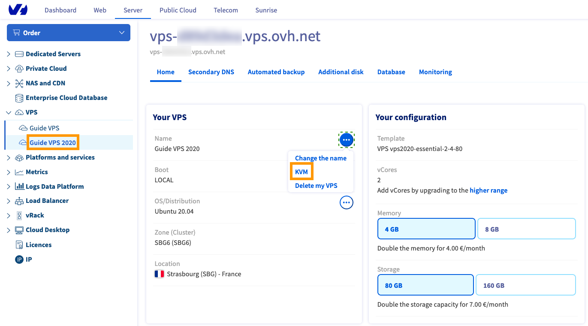
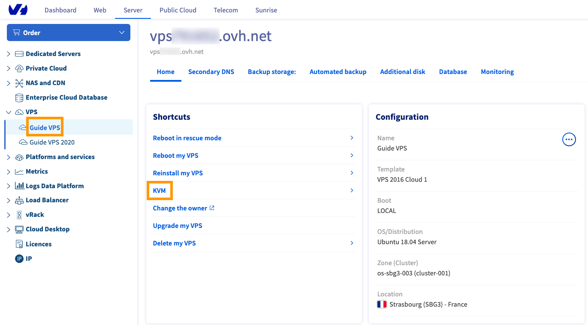
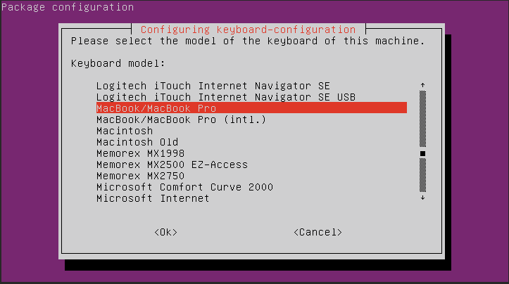

**Last updated 30th August 2022**

## Objective

The KVM console allows you to connect directly to your VPS without the need to use external software such as Terminal or PuTTY. This console is accessible via your OVHcloud Control Panel or the OVHcloud API.  

**This guide explains both of the KVM access methods.**

## Requirements

- A [Virtual Private Server](https://www.ovhcloud.com/en-ca/vps/) in your OVHcloud account
- Access to the [OVHcloud Control Panel](https://ca.ovh.com/auth/?action=gotomanager&from=https://www.ovh.com/ca/en/&ovhSubsidiary=ca)

## Instructions

### Connecting to the KVM via the OVHcloud Control Panel

#### With a current VPS range

Log in to the [OVHcloud Control Panel](https://ca.ovh.com/auth/?action=gotomanager&from=https://www.ovh.com/ca/en/&ovhSubsidiary=ca), go to the `Bare Metal Cloud`{.action} section and select your server under `Virtual Private Servers`{.action}. In this section, click on `...`{.action} next to the name of your VPS in the "Your VPS" box.

{.thumbnail}

#### With older VPS ranges

Log in to the [OVHcloud Control Panel](https://ca.ovh.com/auth/?action=gotomanager&from=https://www.ovh.com/ca/en/&ovhSubsidiary=ca), go to the `Bare Metal Cloud`{.action} section and select your server under `Virtual Private Servers`{.action}. In this section, click on the shortcut link labelled `KVM`{.action}.

{.thumbnail}

### Using the KVM console

The KVM screen will open, which is a small window showing a connection to your server. Since the window is rather small it will be quite difficult to navigate around your server's interface using the scrollbars. Therefore we recommend that you open the KVM in a new, full-screen window using the "Open in a new window" button in the bottom right corner of the popup.

> [!primary]
>
> You might experience double typing issues; this is caused by auto screen adjustment. We recommend opening the KVM in a new window using the "Open in a new window" button.
>
> Should you still have issues with the screen, we recommend removing the "auto" part from the URL. If the URL is https://compute.sbg1.cloud.ovh.net:6080/vnc_auto.html?token=xxxxxxxxxxxx then it should become https://compute.sbg1.cloud.ovh.net:6080/vnc.html?token=xxxxxxxxxxxx (the link for you may be different, this is only illustrating which part of the URL needs to be removed).
>

{.thumbnail}

> [!primary]
>
> The keyboard may have a different layout from your own. Be sure to check it, since the keyboard could be AZERTY instead of QWERTY, for example.
>

#### Changing the keyboard layout

You can enable your preferred keyboard configuration to make using the console more convenient. Enter the following command:

```bash
sudo dpkg-reconfigure keyboard-configuration
```

A graphical menu will open in which you can select a keyboard model.

{.thumbnail}

Use the arrow keys to navigate to the option that comes closest to your hardware, then press "Enter".

In the next menu, choose your country.

{.thumbnail}

In the third menu, you can specify your actual keyboard layout.

{.thumbnail}

Depending on your selections, there may be further options showing up after the third menu.

Back at the command line, enter the following command to apply the changes.

```bash
sudo systemctl restart keyboard-setup
```

> [!primary]
>
> These steps need to be repeated after a server reboot.
>

### Connecting to the KVM via the API

You may sometimes experience issues connecting to the KVM via your OVHcloud Control Panel, especially with older versions. In this case, you can use the API solution via the [OVHcloud API](https://ca.api.ovh.com/console/).

#### For a 2014 VPS

If you have a 2014 VPS, you may encounter *error 1006*. Going through the API using the call below could resolve this.

> [!faq]
>
> API:
>
>> > [!api]
>> >
>> > @api {POST} /vps/{serviceName}/openConsoleAccess
>> >
>>
>
> API call parameters:
>
>> > **serviceName**
>> >
>> >> ID of your VPS in the format vpsxxxxx.ovh.net
>> >
>> > **protocol** 
>> >
>> >> VNC
>

Despite the command going through on the API, the connection might take a few minutes – the time it takes for the port to be successfully opened.

We recommend using either of the following clients:

- [UltraVnc](https://www.uvnc.com/downloads/ultravnc.html){.external}
- [VNC Viewer](https://www.realvnc.com/en/connect/download/viewer/){.external}

Use the details provided by the API call to connect to the VPS remotely using either of the above-mentioned software clients.

#### For a 2016 VPS

If problems arise with the KVM, here is the recommended API for accessing the KVM:

> [!faq]
>
> API:
>
>> > [!api]
>> >
>> > @api {POST} /vps/{serviceName}/getConsoleUrl
>> >
>>
>
> API call parameters:
>
>> > **serviceName**
>> >
>> >> ID of your VPS in the format vpsxxxxx.ovh.net
>

> [!primary]
>
> Should you still have issues with the screen, we recommend removing from the URL the "auto" part. If the URL is (the link for you may be different, this is only illustrating which part of the URL needs to be removed) https://compute.sbg1.cloud.ovh.net:6080/vnc_auto.html?token=xxxxxxxxxxxx then it should become https://compute.sbg1.cloud.ovh.net:6080/vnc.html?token=xxxxxxxxxxxx
>

## Go further

Join our community of users on <https://community.ovh.com/en/>.
