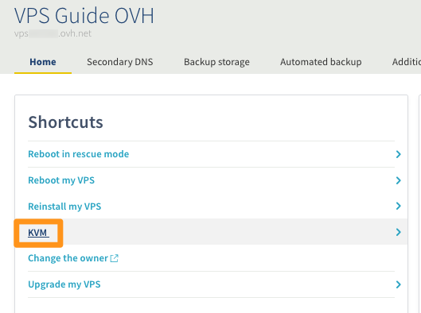
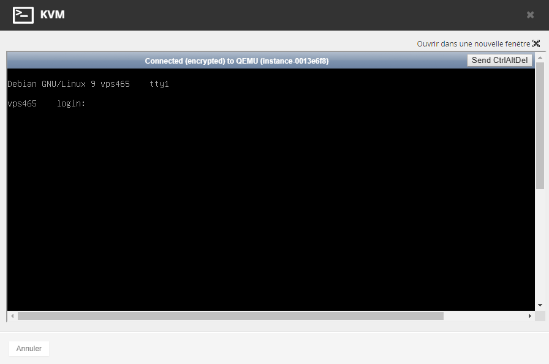

**Last updated 18th April 2018**

## Objective

The KVM console allows you to connect directly to your VPS without the need to use external software such as Terminal or Putty. This console is accessible via your Control Panel or the APIs.  

**This guide explains both of these access methods.**

## Requirements

- You must be logged in to your [Control Panel](https://www.ovh.com/auth/?action=gotomanager).

## Instructions

### Connecting to the KVM via the Control Panel

After logging in to your Control Panel, simply go to the page for managing your VPS. You will see a button labelled `KVM`{.action}:

{.thumbnail}

 
A window will then initiate the connection to your VPS. This could take a few seconds. Then all you have to do is connect:

{.thumbnail}

> [!primary]
>
> The keyboard may have a different layout to your own. Be sure to check it, since the keyboard could be AZERTY instead of QWERTY, for example.
>

### Connecting to the KVM via the APIs

You may sometimes experience issues connecting to the KVM via your Control Panel. In this case, you can use the API solution. First, log in via [OVH API](https://api.ovh.com/).

#### For 2014 VPS

If you have a 2014 VPS, you may encounter *error 1006* so going through the API could resolve this. Here is the API to use:

> [!api]
>
> @api {POST} /vps/{serviceName}/openConsoleAccess
>

Despite the command going through on the API, the connection might take one or two minutes – the time it takes for the port to be successfully opened.

#### For 2016 VPS

If problems arise with the KVM, here is the recommended API for accessing the KVM:

> [!api]
>
> @api {POST} /vps/{serviceName}/getConsoleUrl
>

## Go further

Join our community of users on <https://community.ovh.com/en/>.

