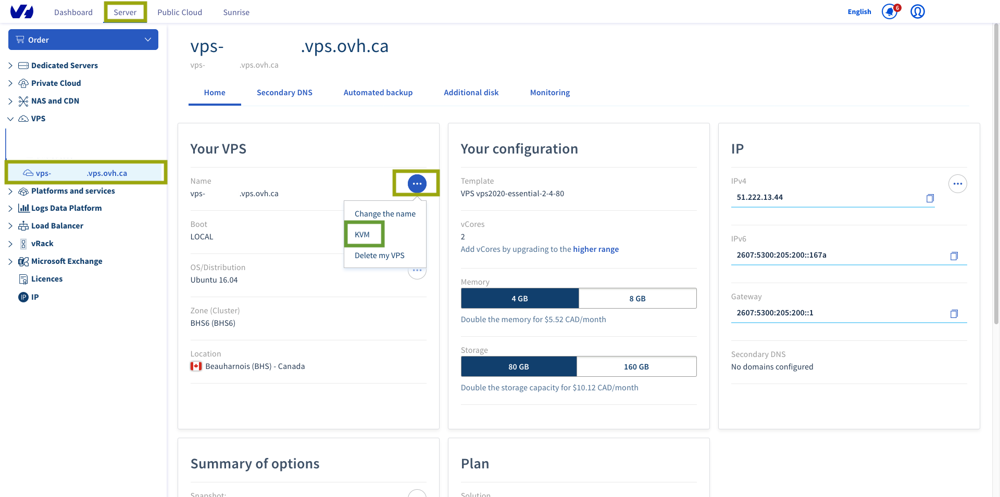

**Dernière mise à jour le 2018/04/18**

## Objectif

La console KVM permet une connexion directe à votre VPS sans avoir à utiliser un logiciel externe (terminal, Putty, etc.). Cette console est accessible via votre espace client ou les API.  

**Les deux solutions vous seront expliquées dans ce guide.**

## Prérequis

- Être connecté à l'[espace client](https://ca.ovh.com/auth/?action=gotomanager).

## En pratique

### Connexion au KVM via l'espace client

Une fois connecté à votre espace client, il vous suffit de vous rendre sur la page de gestion de votre VPS. Vous trouverez un bouton `KVM`{.action} :

{.thumbnail}
{.thumbnail}
 
Une fenêtre va alors initier la connexion sur votre VPS, ce qui peut durer quelques secondes. Vous n'aurez plus qu'à vous connecter :

{.thumbnail}

> [!primary]
>
> Le mappage du clavier peut être différent de celui de votre clavier. Pensez à bien vérifier, le clavier pouvant par exemple être en AZERTY au lieu d'être en QWERTY.
>

### Connexion au KVM via les API

Il est parfois possible que vous rencontriez des difficultés à vous connecter au KVM via votre espace client. Il vous reste donc la solution des API. Connectez-vous d'abord sur [API OVH](https://api.ovh.com/).

#### Sur un VPS 2014

Sur les VPS 2014, des erreurs 1006 peuvent survenir, mais le passage par l'API peut résoudre ce problème. Voici l'API à utiliser :

> [!api]
>
> @api {POST} /vps/{serviceName}/openConsoleAccess
>

Malgré le retour positif de l'API, il est possible que la connexion prenne une ou deux minutes pour s'établir, le temps que le port soit effectivement ouvert.

#### Sur un VPS 2016

En cas de problème avec le KVM, voici l'API conseillée pour l'accès au KVM :

> [!api]
>
> @api {POST} /vps/{serviceName}/getConsoleUrl
>

## Aller plus loin

Échangez avec notre communauté d’utilisateurs sur <https://community.ovh.com>.

