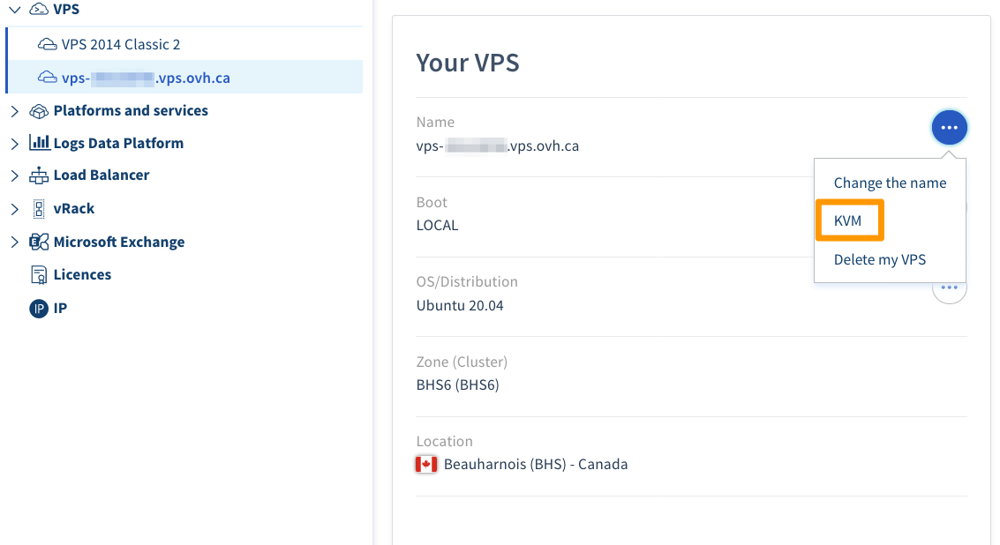

**Dernière mise à jour le 2020/07/20**

## Objectif

La console KVM permet une connexion directe à votre VPS sans avoir à utiliser un logiciel externe (terminal, Putty, etc.). Cette console est accessible via votre espace client ou les API.  

**Les deux solutions vous seront expliquées dans ce guide.**

## Prérequis

- Être connecté à l'[espace client](https://ca.ovh.com/auth/?action=gotomanager).

## En pratique

### Connexion au KVM via l'espace client

Connectez-vous à votre [espace client OVHcloud](https://ca.ovh.com/auth/?action=gotomanager){.external}, onglet `Server`{.action}. Cliquez sur `VPS`{.action} dans la barre de services à gauche, puis choisissez le serveur VPS concerné. Cliquez sur le bouton `···`{.action} à côté du nom de votre VPS et vous verrez `KVM`{.action}:

{.thumbnail}

 
Une fenêtre va alors initier la connexion sur votre VPS, ce qui peut durer quelques secondes. Vous n'aurez plus qu'à vous connecter :

{.thumbnail}

> [!primary]
>
> Le mappage du clavier peut être différent de celui de votre clavier. Pensez à bien vérifier, le clavier pouvant par exemple être en AZERTY au lieu d'être en QWERTY.
>

### Connexion au KVM via les API

Il est parfois possible que vous rencontriez des difficultés à vous connecter au KVM via votre espace client. Il vous reste donc la solution des API. Connectez-vous d'abord sur [API OVH](https://api.ovh.com/).

> [!api]
>
> @api {POST} /vps/{serviceName}/getConsoleUrl
>

## Aller plus loin

Échangez avec notre communauté d’utilisateurs sur <https://community.ovh.com>.

