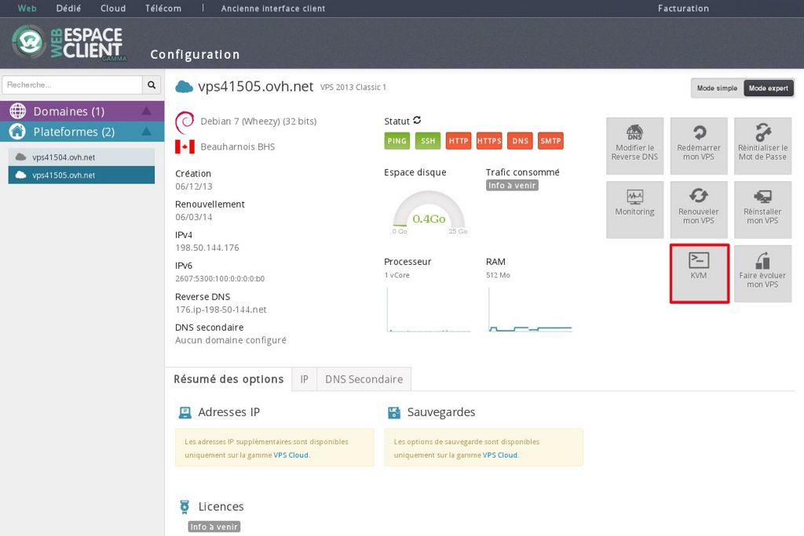
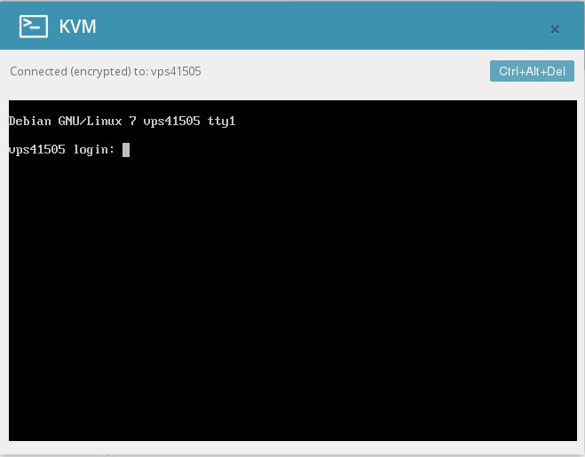

## 
Aceda num primeiro tempo ao Manager através do seguinte URL:


```
https://www.ovh.com/manager/web/login.html
```


## 

## Nota
Poderá ser necessário reiniciar o servidor VPS para poder fazer a primeira utilização quando se trata de um VPS Cloud
Após efetuar a ligação deve selecionar a VPS ao qual deseja ligar-se por KVM e escolher a opção "KVM":

{.thumbnail}
Irá ser aberta uma janela para que inicie a ligação à sua VPS e não será necessário que faça o login (Atenção ao teclado pois o mesmo pode variar conforme a instalação):

{.thumbnail}

