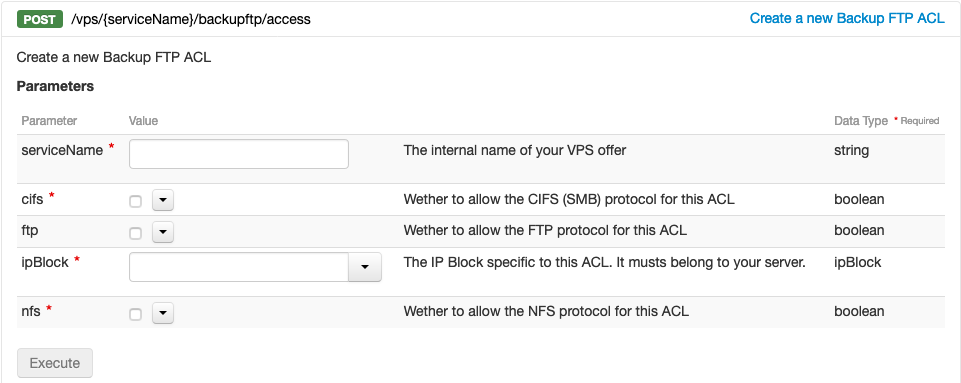

## FAQ VPS

### O que é e para que serve um VPS?

Um servidor privado virtual (VPS) permite alojar websites (lojas online, sites de e-commerce, conteúdos, media) e aplicações de software (portais, Extranet, soluções de trabalho colaborativo, wikis, CRM). Ao contrário do alojamento partilhado, os dados são isolados numa máquina virtual dedicada ao utilizador.

Os nossos VPS são o compromisso ideal entre o alojamento web e um servidor físico, combinando a fiabilidade e o desempenho de um servidor dedicado, sem as limitações associadas ao hardware.

### Qual a melhor opção: VPS ou alojamento web?

Depois de um alojamento web, o VPS é a evolução lógica como solução de alojamento. Os VPS oferecem mais possibilidades e uma maior liberdade em matéria de configuração, acesso e funcionalidade (root, Apache, PHP.init). Também poderá instalar um certificado SSL ou qualquer outro software à sua escolha.

Neste sentido, recomendamos que preste especial atenção no momento de escolher o seu VPS, uma vez requererá uma configuração adaptada às necessidades das aplicações alojadas assim como o crescimento da sua atividade.

### Qual a melhor opção: VPS ou alojamento Web Plesk?

Num alojamento web Plesk, é-lhe disponibilizado um espaço com Plesk pré-instalado. Pode alojar os seus websites, mas não é o administrador do serviço. Este só poderá servir para a gestão.
Ao escolher um VPS, é o administrador do seu servidor e a OVHcloud não tem acesso ao seu conteúdo. Assim, é livre de o utilizar em função das suas necessidades.

### Quais são as vantagens de um VPS relativamente a um servidor dedicado?

Os VPS têm a vantagem de o libertar da gestão de hardware, como o acompanhamento do estado dos discos rígidos, da memória viva (RAM) e da CPU. Esta solução é adaptada à maior parte das utilizações web, em projetos de dimensão controlada.
Um servidor dedicado é a solução ideal para os utilizadores que pretendem gerir eles próprios a parte de hardware, construir arquiteturas mais elaboradas, criar uma infraestrutura que inclua uma rede privada (vRack) ou ainda implementar soluções complexas diferentes dos serviços web.

Em geral, quando a atividade web dos clientes cresce, estes só evoluem para soluções de servidores dedicados e Public Cloud, já que oferecem infraestruturas mais complexas e flexíveis, capazes de se adaptar a um forte crescimento.

### Quais são as diferenças entre VPS e Public Cloud?

O VPS é uma solução adaptada aos ambientes de pré-produção e produção, que não requerem desempenhos constantes.
O Public Cloud da OVHcloud oferece uma infraestrutura multiservidor com uma alta disponibilidade das máquinas. Além disso, o vRack (uma rede privada) também está disponível com esta solução.

### Como escolher o meu VPS OVHcloud?

Para escolher um VPS adaptado às suas necessidades, convidamo-lo a verificar os seguintes aspetos:

- a quantidade de recursos necessária (processadores, memória, espaço em disco, largura de banda...) ;
- o sistema operativo necessário (Linux ou Windows);
- os requisitos técnicos essenciais para o bom funcionamento da aplicação (por exemplo, uma base de dados requer velocidade de leitura/escrita).

Isto permitir-lhe-á escolher entre as nossas soluções VPS:

- **VPS Starter**: máquina de entrada de gama para testar a nossa oferta (com uma distribuição Linux apenas, sem painel de gestão web);
- **VPS Value, Essential e Comfort**: ideais para o alojamento de websites, de serviços de e-commerce ou de sistemas de monitorização;
- **VPS Elite**: adaptado aos sites de e-commerce e aplicações mais exigentes em recursos CPU e memória.

### Quem pode usar um VPS?

Gerir um VPS requer conhecimentos básicos de administração de servidores. Estas noções são essenciais para gerir o sistema operativo (Linux ou Windows) instalado na máquina e configurar as aplicações. Acha que precisa de um VPS, mas considera não possuir as competências necessárias? Convidamo-lo a contactar um dos nossos parceiros. 

Se deseja usufruir de recursos garantidos sem conhecimentos em administração de servidores, aconselhamos os nossos [alojamentos web Performance](https://www.ovh.pt/alojamento-partilhado/alojamento-partilhado-performance.xml).

### Como aceder ao meu VPS?

A ligação ao VPS deverá ser feita em SSH graças ao endereço IP, ao nome de utilizador e à palavra-passe fornecidos por e-mail aquando da receção do comando.
A partir de um computador com Windows, será aconselhado que se ligue graças ao software Putty. A ligação poderá ser feita diretamente no terminal a partir de um computador Linux.

Para mais informações, consulte o manual ["VPS - primeira utilização"](../instalar-gerir-vps/).

### É possível alojar vários websites num VPS?

Sim. Um VPS pode ser particionado e organizado em função das suas necessidades. Assim, poderá alojar vários sites ou projetos, atribuindo a cada um deles um espaço privado com um determinado volume. Para simplificar estas operações, pode instalar um painel de gestão de websites, como Plesk ou cPanel.

### São realizados backups do meu VPS?

A OVHcloud não realizar backups dos dados alojados no VPS. Assim, cabe-lhe a si realizá-los.
Para isso, pode utilizar as seguintes opções: o backup manual (Snapshot) ou o backup automatizado.

### Como proteger o meu VPS?

Por predefinição, o VPS é fornecido "nu", não existindo nenhuma configuração de segurança neste último. Portanto, esta é a primeira coisa que têm de fazer quando recebem
Para isso, não hesite em consultar o guia ["Proteger um VPS"](../como-proteger-vps/).

### Qual é a largura de banda atribuída ao meu VPS? Ela está garantida?

A largura de banda apresentada na página das nossas ofertas é garantida. Trata-se da velocidade mínima que lhe é atribuída.

### Qual é o SLA aplicado ao meu VPS?

No conjunto das gamas VPS, a OVHcloud propõe um SLA de 99,9%.

### Como aceder ao backup storage a partir de um endereço de IP diferente do meu serviço? 

O acesso ao seu backup FTP pode ser restringido ao serviço a que está associado através da Área de Cliente OVHcloud.

Para poder adicionar outros endereços IP de serviços diferentes, pode utilizar a API OVHcloud.
Isto permitir-lhe-á recuperar os seus backups a partir de um serviço de outra localização.

> [!warning]
> Apenas os endereços IP OVHcloud podem ser autorizados.
>

Aceda a [https://api.ovh.com/](https://api.ovh.com/) e utilize a seguinte chamada:

> [!api]
>
> @api {POST} vps/{serviceName}/backupftp/access
>

Introduza os campos da seguinte forma:

- `serviceName `: o nome do seu VPS
- `cifs `: assinalar se necessário
- `ftp`: assinalar se necessário
- `ipBlock`: indique o IP que terá acesso sob a forma `1.2.3.4/32`
- `nfs`: assinalar se necessário

{.thumbnail}

Para verificar se o seu endereço IP está corretamente autorizado, utilize a seguinte chamada:

> [!api]
>
> @api {GET} /vps/{serviceName}/backupftp/access
>

{.thumbnail}

## Saiba mais

Fale com a nossa comunidade de utilizadores em <https://community.ovh.com/en/>.
