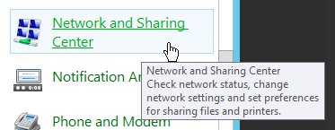
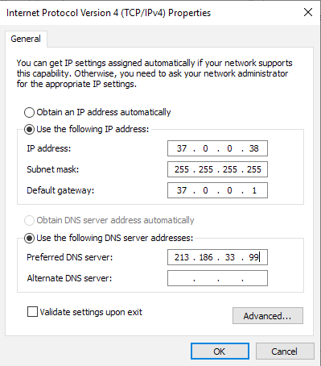

## Objectif

La migration nécessaire des services VPS 2014 implique leur déplacement vers une autre infrastructure (Private Cloud vers Public Cloud). La configuration réseau entre ces deux infrastructures est différente. Pour réussir la migration du service tout en conservant l'accès à votre VPS, le robot de migration effectue une action sur sa configuration réseau pour activer le protocole DHCP sur IPv4 (uniquement possible sur un système d'exploitation basé sur Ubuntu / Debian / CentOS). Pour les autres systèmes d'exploitation, nous vous suggérons d'activer vous-même la configuration DHCP de votre VPS, avant ou après la migration.

## Configuration du DHCP sur un serveur Windows

Ouvrez le Panneau de configuration Windows et cliquez sur `Centre réseau et partage`{.action}.

{.thumbnail}

Cliquez ensuite sur `Modifier les paramètres de la carte`{.action} dans le menu de gauche.

{.thumbnail}

Faites un clic droit sur votre interface réseau et sélectionnez `Propriétés`{.action}.

{.thumbnail}

Sélectionnez « Internet Protocol Version 4 (TCP / IPv4) » pour le mettre en surbrillance, puis cliquez sur le bouton `Propriétés`{.action}.

{.thumbnail}

Dans cette nouvelle fenêtre, cochez la case « Obtenir une adresse IP automatiquement ». Cliquez sur le bouton `OK`{.action} pour valider vos modifications.


## Reconfiguration des adresses IP statiques sur un VPS

Une fois la migration terminée, vous pouvez configurer à nouveau votre adresse IP statique et votre IP failover. Vous trouverez ici une sauvegarde de vos anciens fichiers de configuration :

- Debian/Ubuntu : /etc/network/interfaces.bkp

- CentOS : /etc/sysconfig/ifcfg-eth0.bkp

Les instructions suivantes fournissent des détails sur le processus d'ajout de votre adresse IP statique sur votre VPS.

### Via Linux

#### Configurer une adresse IP statique sur CentOS

##### Configuration de l'interface réseau


> [!primary]
>
À des fins d'exemple, nous utilisons les variables suivantes :
>
Interface réseau = eth0
>
IP statique = ip_v4_address
>
IP de broadcast = ip_v4_broadcast
>
Masque de sous-réseau = mask_ip_v4
>
Passerelle par défaut = default_gateway
>

Tout d'abord, connectez-vous à votre instance en ligne de commande et ouvrez votre fichier de configuration réseau.

Récupérez votre configuration DHCP actuelle :

```
ifconfig eth0
eth0 Link encap:Ethernet HWaddr fa:16:3e:f5:27:38
inet addr: ip_v4_address Bcast: ip_v4_broadcast  Mask: mask_ip_v4 
inet6 addr:  ip_v6_address /64 Scope:Link
UP BROADCAST RUNNING MULTICAST MTU:1500 Metric:1
RX packets:14261025 errors:0 dropped:0 overruns:0 frame:0
TX packets:12298444 errors:0 dropped:0 overruns:0 carrier:0
collisions:0 txqueuelen:1000
RX bytes:1468155083 (1.3 GiB) TX bytes:1841518946 (1.7 GiB)
netstat -r
Kernel IP routing table
Destination Gateway Genmask Flags MSS Window irtt Iface
default  default_gateway  0.0.0.0 UG 0 0 0 eth0
default_gateway * 255.255.255.255 UH 0 0 0 eth0
```

Modifiez votre fichier de configuration :

```
vi /etc/sysconfig/network-scripts/ifcfg-eth0
```

Ajoutez les lignes suivantes :

```
DEVICE="eth0"
BOOTPROTO=static
IPADDR="ip_v4_address"
NETMASK="mask_ip_v4"
BROADCAST="ip_v4_broadcast"
GATEWAY="default_gateway"
ONBOOT=yes
```

##### Redémarrage du service réseau

Enfin, redémarrez le service réseau avec la commande suivante :

```
ifup eth0
```

##### Votre système démarre sur le shell de secours dracut

Redémarrez votre VPS en mode rescue.

Une fois le VPS démarré en mode rescue, connectez-vous en SSH et montez votre disque dans dossier /mnt : 

```
mount /dev/sdb1 /mnt
```

Changer le répertoire racine du rescue : 

```
chroot /mnt
```

Listez les noyaux disponibles :

```
awk -F\' '$1=="menuentry " {print i++ " : " $2}' /etc/grub2.cfg
0 : CentOS Linux (3.10.0-862.6.3.el7.x86_64) 7 (Core)
1 : CentOS 7, OVH kernel x.xx.xx-xxxx-std-ipv6-64-vps
2 : CentOS Linux (3.10.0-514.26.2.el7.x86_64) 7 (Core)
```

Le noyau qui nous intéresse est le noyau OVHcloud (dans ce noyau, les pilotes virtio scsi sont directement compilés et activés par défaut).

Noyau OVHcloud : CentOS 7, OVH kernel x.xx.xx-xxxx-std-ipv6-64-vps

Listez la configuration par défaut de grub2 : 

```
grub2-editenv list
saved_entry=CentOS Linux (3.10.0-514.26.2.el7.x86_64) 7 (Core)
```

Nous modifions la configuration afin que le noyau OVHcloud soit le noyau par défaut (à adapter en fonction du retour de la liste des noyaux précédents):

```
grub2-set-default 1
grub2-editenv list
saved_entry=1
```

Redémarrez alors votre VPS.


#### Configurer une adresse IP statique sur Debian

##### Configuration de l'interface réseau

> [!primary]
>
À des fins d'exemple, nous utilisons les variables suivantes :
>
Interface réseau = eth0
>
IP statique = ip_v4_address
>
IP de broadcast = ip_v4_broadcast
>
Masque de sous-réseau = mask_ip_v4
>
Passerelle par défaut = default_gateway
>


Tout d'abord, connectez-vous à votre instance en ligne de commande et ouvrez votre fichier de configuration réseau.

Récupérez votre configuration DHCP actuelle :

```
ifconfig eth0
eth0 Link encap:Ethernet HWaddr fa:16:3e:f5:27:38
inet addr: ip_v4_address Bcast: ip_v4_broadcast Mask: mask_ip_v4
inet6 addr: ip_v6_address /64 Scope:Link
UP BROADCAST RUNNING MULTICAST MTU:1500 Metric:1
RX packets:14261025 errors:0 dropped:0 overruns:0 frame:0
TX packets:12298444 errors:0 dropped:0 overruns:0 carrier:0
collisions:0 txqueuelen:1000
RX bytes:1468155083 (1.3 GiB) TX bytes:1841518946 (1.7 GiB)
netstat -r
Kernel IP routing table
Destination Gateway Genmask Flags MSS Window irtt Iface
default default_gateway 0.0.0.0 UG 0 0 0 eth0
default_gateway * 255.255.255.255 UH 0 0 0 eth0
```

Modifiez votre fichier de configuration :

```
vi /etc/network/interfaces
```

Ajoutez les lignes suivantes :

```
auto eth0
iface eth0 inet static
address ip_v4_address
netmask mask_ip_v4
gateway default_gateway
```
##### Redémarrage du service réseau

Enfin, redémarrez le service réseau avec la commande suivante :

```
service networking restart
```

#### Configurer une adresse IP statique sur Fedora

##### Configuration de l'interface réseau

> [!primary]
>
À des fins d'exemple, nous utilisons les variables suivantes :
>
Interface réseau = eth0
>
IP statique = ip_v4_address
>
IP de broadcast = ip_v4_broadcast
>
Masque de sous-réseau = mask_ip_v4
>
Passerelle par défaut = default_gateway
>

Tout d'abord, connectez-vous à votre instance en ligne de commande et ouvrez votre fichier de configuration réseau.

Récupérez votre configuration DHCP actuelle :

```
ifconfig eth0
eth0 Link encap:Ethernet HWaddr fa:16:3e:f5:27:38
inet addr: ip_v4_address Bcast: ip_v4_broadcast  Mask: mask_ip_v4 
inet6 addr:  ip_v6_address /64 Scope:Link
UP BROADCAST RUNNING MULTICAST MTU:1500 Metric:1
RX packets:14261025 errors:0 dropped:0 overruns:0 frame:0
TX packets:12298444 errors:0 dropped:0 overruns:0 carrier:0
collisions:0 txqueuelen:1000
RX bytes:1468155083 (1.3 GiB) TX bytes:1841518946 (1.7 GiB)
netstat -r
Kernel IP routing table
Destination Gateway Genmask Flags MSS Window irtt Iface
default default_gateway 0.0.0.0 UG 0 0 0 eth0
default_gateway * 255.255.255.255 UH 0 0 0 eth0
```

Modifiez votre fichier de configuration :

```
vi /etc/sysconfig/network-scripts/ifcfg-eth0
```

Ajoutez les lignes suivantes :

```
DEVICE="eth0"
BOOTPROTO=static
IPADDR="ip_v4_address"
NETMASK="mask_ip_v4"
BROADCAST="ip_v4_broadcast"
GATEWAY="default_gateway"
ONBOOT=yes
```

##### Redémarrage du service réseau

Enfin, redémarrez le service réseau avec la commande suivante :

```
ifup eth0
```

### Via Windows

##### Configuration de l'interface réseau

> [!warning]
>
Windows ne vous permet pas de configurer une IP failover en plus de configurer une adresse IP principale en DHCP. Vous devez donc reconfigurer votre carte réseau avec une adresse IP définie manuellement.
>

Tout d'abord, connectez-vous à votre serveur à l'aide de RDP (Remote Desktop Protocol). Une fois que vous êtes connecté, ouvrez l'invite de commandes et exécutez la commande suivante pour récupérer vos informations réseau:

```
C:\>ipconfig

Windows IP Configuration

Ethernet adapter Ethernet:

   Connection-specific DNS Suffix  . : 
   Link-local IPv6 Address . . . . . : votre_adresse_ipv6
   IPv4 Address. . . . . . . . . . . : votre_adresse_ipv4
   Subnet Mask . . . . . . . . . . . : 255.255.255.255
   Default Gateway . . . . . . . . . : votre_passerelle
```

Notez votre adresse IPv4 et votre masque de sous-réseau.

Ouvrez le Panneau de configuration Windows et cliquez sur `Centre réseau et partage`{.action}.

{.thumbnail}

Cliquez ensuite sur `Modifier les paramètres de la carte`{.action} dans le menu de gauche.

{.thumbnail}

Faites un clic droit sur votre interface réseau et sélectionnez `Propriétés`{.action}.

{.thumbnail}

Sélectionnez « Internet Protocol Version 4 (TCP / IPv4) » pour le mettre en surbrillance, puis cliquez sur le bouton `Propriétés`{.action}.

{.thumbnail}

Modifiez manuellement votre configuration IP en utilisant les adresses précédemment notées à partir de la commande ipconfig. Lorsque vous avez terminé, cliquez sur `OK`{.action}.

{.thumbnail}

Pour configurer une adresse IP failover, consultez le guide suivant :

<https://docs.ovh.com/fr/public-cloud/configurer_une_ip_failover/>

## Résolution des problèmes liés au Snapshot

Si vous rencontrez des problèmes lors de l'utilisation de l'[option de Snapshot VPS](https://www.ovhcloud.com/fr/vps/options/) après la migration, reportez-vous à [notre guide sur l'utilisation du Snapshot](../snapshot-vps/#bonnes-pratiques-pour-la-creation-dun-snapshot).