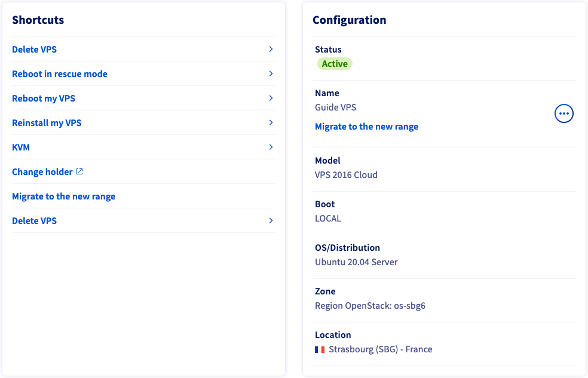

> [!primary]
> Tłumaczenie zostało wygenerowane automatycznie przez system naszego partnera SYSTRAN. W niektórych przypadkach mogą wystąpić nieprecyzyjne sformułowania, na przykład w tłumaczeniu nazw przycisków lub szczegółów technicznych. W przypadku jakichkolwiek wątpliwości zalecamy zapoznanie się z angielską/francuską wersją przewodnika. Jeśli chcesz przyczynić się do ulepszenia tłumaczenia, kliknij przycisk “Zgłóś propozycję modyfikacji” na tej stronie.
>

## Wprowadzenie

Możesz sprawdzić, czy VPS pochodzi z poprzedniej gamy serwerów, używając nazwy wyświetlanej w [Panelu klienta](https://www.ovh.com/auth/?action=gotomanager&from=https://www.ovh.pl/&ovhSubsidiary=pl): jeśli ten wewnętrzny numer referencyjny ma format *vpsXXXX.ovh.net* (gdzie *X* odpowiada liczbie) i nie przeniosłeś odpowiedniego serwera VPS do [naszej aktualnej gamy produktów](https://www.ovhcloud.com/pl/vps/), jest to VPS *legacy*. 

Model VPS gamy dostępny obecnie: *vps-XXXXX.vps.ovh.net* (gdzie *X* może być cyfrą lub literą).

Serwer VPS *legacy* wymaga kilku różnic w zarządzaniu.

**Niniejszy przewodnik wyjaśnia, jakie funkcje Panelu klienta OVHcloud są dedykowane do zarządzania serwerem VPS *Legacy*.**

## Wymagania początkowe

- [VPS *legacy*](https://www.ovhcloud.com/pl/vps/) na koncie OVHcloud
- Zalogowanie do [Panelu klienta OVHcloud](https://www.ovh.com/auth/?action=gotomanager&from=https://www.ovh.pl/&ovhSubsidiary=pl)

## W praktyce

Zaloguj się do [Panelu klienta OVHcloud](https://www.ovh.com/auth/?action=gotomanager&from=https://www.ovh.pl/&ovhSubsidiary=pl), otwórz zakładkę `Bare Metal Cloud`{.action} i wybierz Twój serwer spośród `Prywatne serwery wirtualne`{.action}.

W zakładce `Strona główna`{.action} serwerów VPS można przejść do głównych operacji w sekcji **Szybki dostęp**.

{.thumbnail}

### Usuń serwer VPS

Ta opcja otworzy okno służące do rozpoczęcia procesu [rezygnacji z usługi](/pages/account/billing/how_to_cancel_services).

### Restartuj do trybu Rescue

Kliknij tę opcję, aby uruchomić VPS w trybie rescue. Szczegółowe informacje znajdziesz w [naszym przewodniku](/pages/cloud/vps/rescue).

### Restart serwera VPS

Ta opcja w Panelu klienta uruchomi *hard reboot* serwera VPS, jeśli klikniesz przycisk `Zatwierdź`{.action} w oknie, które się wyświetli.

Restart może okazać się niezbędny do aktualizacji konfiguracji lub rozwiązania problemu. Jeśli to możliwe, wykonaj *soft reboot* za pomocą wiersza poleceń:

```bash
sudo reboot
```

### Reinstalacja serwera VPS

Kliknij na tę opcję, aby zainstalować nowy system operacyjny. W oknie, które się pojawi zostaniesz poproszony o wybór:

- system operacyjny spośród proponowanych systemów;
- język;
- [klucz SSH](/pages/cloud/dedicated/creating-ssh-keys-dedicated) (opcjonalnie)

Wybór systemów operacyjnych może być ograniczony do Twojej usługi.

> [!primary]
>
> Niektóre zastrzeżone systemy operacyjne lub platformy, takie jak Plesk lub cPanel, wymagają licencji, które generują dodatkowe koszty. Licencjami można zarządzać w Panelu klienta: przejdź do sekcji `Bare Metal Cloud`{.action}, a następnie otwórz `Licencje`{.action}.

Po zakończeniu instalacji otrzymasz e-mail. Proces ten może trwać do 30 minut.

#### Połączenie z serwerem VPS po reinstalacji

Podczas reinstalacji serwera VPS otrzymasz e-mail z hasłem root, aby zalogować się do serwera VPS przez [SSH](/pages/cloud/dedicated/ssh_introduction), chyba że wybrałeś [klucz SSH](/pages/cloud/dedicated/creating-ssh-keys-dedicated), który ma zostać zainstalowany.

#### Wyłączenie dostępu do serwera dla użytkownika root

Użytkownik **root** jest tworzony domyślnie w systemach GNU/Linux. Jest to najwyższy poziom dostępu do systemu operacyjnego. Może być niebezpieczne, jeśli udostępniasz Twój VPS za pośrednictwem użytkownika root i hasła, ponieważ to konto może wykonywać operacje nieodwracalne.

Połączenia użytkowników root można wyłączyć za pomocą protokołu SSH. Przed przejściem [do opisanych poniżej etapów, utwórz innego użytkownika](/pages/cloud/vps/secure_your_vps#createuser).

Do edycji tego pliku konfiguracyjnego użyj edytora tekstu, takiego jak *vim* lub *nano*:

```bash
sudo nano /etc/ssh/sshd_config
```

Znajdź następującą linię:

```console
PermitRootLogin yes 
```

Zamień **yes** na **no** po `PermitRootLogin`. Zapisz i wyjdź z edytora.

Aby zmiana ta została uwzględniona, uruchom ponownie usługę SSH za pomocą jednego z poniższych poleceń:

```bash
sudo systemctart ssh
```

```bash
sudo systemctart sshd
```

Powinno to wystarczyć do wdrożenia zmian. W przeciwnym razie zrestartuj serwer VPS (`~$ sudo reboot`).

Połączenia z serwerem za pośrednictwem użytkownika root (`ssh root@IPv4_VPS`) zostaną odrzucone.

### KVM

Użyj tej opcji, aby połączyć się z serwerem VPS przez KVM. Szczegółowe informacje znajdziesz w [naszym przewodniku](pages/cloud/vps/using_kvm_for_vps).

### Zmiana właściciela

Link ten przekierowuje Cię do formularza, który należy wypełnić w przypadku zmiany właściciela serwera VPS. Jeśli potrzebujesz pomocy w przeprowadzeniu tej procedury, skontaktuj się z naszymi zespołami pomocy, tworząc zgłoszenie w [Panelu klienta OVHcloud](https://www.ovh.com/auth/?action=gotomanager&from=https://www.ovh.pl/&ovhSubsidiary=pl).

### Przejdź na nową gamę

Możesz automatycznie przenieść VPS do aktualnej gamy. Sprawdź zalety tej oferty w [FAQ dotyczący migracji VPS](https://www.ovhcloud.com/pl/vps/vps-offer-migration/).

## Sprawdź również

[Wprowadzenie do protokołów SSH](/pages/cloud/dedicated/ssh_introduction)

[Tworzenie i wykorzystywanie kluczy SSH](/pages/cloud/dedicated/creating-ssh-keys-dedicated)

[Zabezpieczenie serwera VPS](/pages/cloud/vps/secure_your_vps)

[Skonfiguruj nową instalację Windows Server](/pages/cloud/vps/windows_first_config)

[Pierwsze kroki z serwerem VPS](/pages/cloud/vps/starting_with_a_vps)

Dołącz do społeczności naszych użytkowników na <https://community.ovh.com/en/>.
