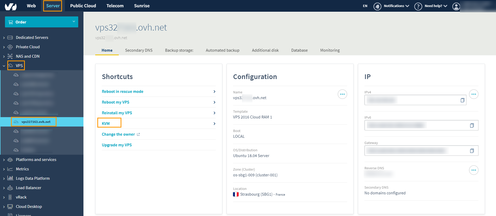

**Last updated 15th July 2018**

## Objective

When you install Windows Server 2012, 2012 R2 or 2016 on a [VPS](https://www.ovh.co.uk/vps/){.external}, the connection to your remote desktop can sometimes be disabled, as can the ICMP protocol response.

**This guide will show you which settings need to be changed to re-enable remote desktop connection and ICMP.**

## Requirements

* a [VPS](https://www.ovh.co.uk/vps/){.external} with Windows Server 2012, 2012 R2 or 2016 installed
* access to the OVH [Control Panel](https://www.ovh.com/auth/?action=gotomanager){.external}

## Instructions

### Step 1: Log in to the KVM

Once you have logged in to your [Control Panel](https://www.ovh.com/auth/?action=gotomanager){.external}, you simply go to the `Server`{.action} section, then to `VPS`{.action} in the left-hand column to select your VPS. In this section, you will you will see a button labelled `KVM`{.action}:

{.thumbnail}

The KVM screen will now open, which is a small window with a connection to your server. Since the window is so small it will be quite difficult to navigate around your server's interface using the scrollbars, so it's recommended that you open the KVM in a new, full-screen window using the "Open in a new window" button in the bottom right corner of the popup. Then all you have to do is connect:

> [!primary]
>
> If you have issues with double typing, the issue may originate due to auto screen adjustment. We recommend opening the KVM in a new window using the "Open in a new window" button.
> Should you still have issues with the screen, we recommend removing from the URL the "auto" part. If the URL is (the link for you may be different, this is only illustrating which part of the URL needs to be removed) https://compute.sbg1.cloud.ovh.net:6080/vnc_auto.html?token=xxxxxxxxxxxx then it should become https://compute.sbg1.cloud.ovh.net:6080/vnc.html?token=xxxxxxxxxxxx
>

{.thumbnail}

> [!primary]
>
> The keyboard may have a different layout to your own. Be sure to check it, since the keyboard could be AZERTY instead of QWERTY, for example.
>

### Step 2: Configure Windows settings

In the first setup screen, you will need to configure the settings for your **Country/region**, **Language**, and **Keyboard layout**. When you have done this, click `Next`{.action}.

{.thumbnail}

Next, choose a password for your administrator account. Enter it twice, then click `Finish`{.action}.

{.thumbnail}

Windows will now apply your settings. When this is done, you will see the following screen. At this point you will need to click the `Send CtrlAltDel`{.action} button to sign in.

{.thumbnail}

On the sign-in screen, enter the password you created for your Administrator account and hit the `Next`{.action} key on your keyboard.

{.thumbnail}

### Step 3: Modify Windows Firewall

Once the setup is complete and you have signed in, go to `Administrative Tools`{.action}, then `Windows Firewall with advanced security`{.action}.

{.thumbnail}

You will then need to enable the ICMP and the remote desktop connection rules *(right-click -> Enable rule)*.

{.thumbnail}

Your server will now be set up for remote desktop connections.

## Go further

Join our community of users on <https://community.ovh.com/en/>.
