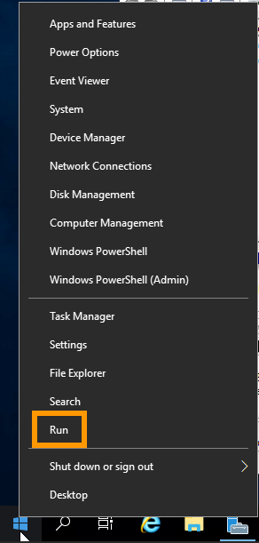

**Last updated 6th May 2022**

## Objective

After a fresh installation of a Windows Server operating system on a VPS, remote access and the ICMP (Internet Control Message Protocol) response might be disabled. However, you can use the OVHcloud KVM to access your VPS and configure the Windows Firewall application to re-enable ICMP and allow connections via Remote Desktop Protocol.<br>Activating Windows boot logs can be helpful for server error diagnostics.

**This guide explains how to enable ICMP, Remote Desktop Protocol and boot logs on a Windows VPS.**

## Requirements

- A Windows [VPS](https://www.ovhcloud.com/en-sg/vps/) in your OVHcloud account
- Access to the [OVHcloud Control Panel](https://ca.ovh.com/auth/?action=gotomanager&from=https://www.ovh.com/sg/&ovhSubsidiary=sg)

## Instructions

### Step 1: Log in with KVM

To access the KVM console of your VPS, please follow the [VPS KVM guide](../use-kvm-for-vps/).

### Step 2: Finish the Windows setup

When the KVM session is established, the initial setup screens will be displayed. Here you need to configure your **country/region**, the **Windows language**, and your **keyboard layout**. Once you have done this, click `Next`{.action}.

{.thumbnail}

In the second screen, enter a password for your Administrator account and confirm it, then click `Finish`{.action}.

{.thumbnail}

Windows will apply your settings and then display the Login screen. Click the `Send CtrlAltDel`{.action} button in the top right corner to sign in.

{.thumbnail}

Enter the password you have previously created for your Administrator account and click on the Arrow button.

{.thumbnail}

This completes the initial setup. Once logged in, you need to change the appropriate Windows Firewall settings.

### Step 3: Modify Windows Firewall

Open the `Administrative Tools`{.action} of the `System and Security`{.action} control panel and double-click on `Windows Firewall with Advanced Security`{.action}.

{.thumbnail}

Here you can enable the respective `ICMP` and `Remote Desktop` rules (right-click on the rule and select `Enable rule`{.action} in the context menu).

{.thumbnail}

Your server should now be responding to requests using these protocols.

### Activating Windows boot logs (optional)

Connect to your server via a Remote Desktop or [KVM](../use-kvm-for-vps/) session. Open the Windows start menu and click on `Run`{.action}.

{.thumbnail}

Enter "msconfig" and click on `OK`{.action}.

{.thumbnail}

In the new window, check the box next to `Boot log`. Click on `OK`{.action}.

{.thumbnail}

The next time your server boots, the logs will be saved into a .txt file. The file path is ```C:\Windows\ntbtlog.txt```.

To access the contents of this file in rescue mode, please follow the instructions in the [VPS rescue mode guide](../rescue/).

## Go further

Join our community of users on <https://community.ovh.com/en/>.
