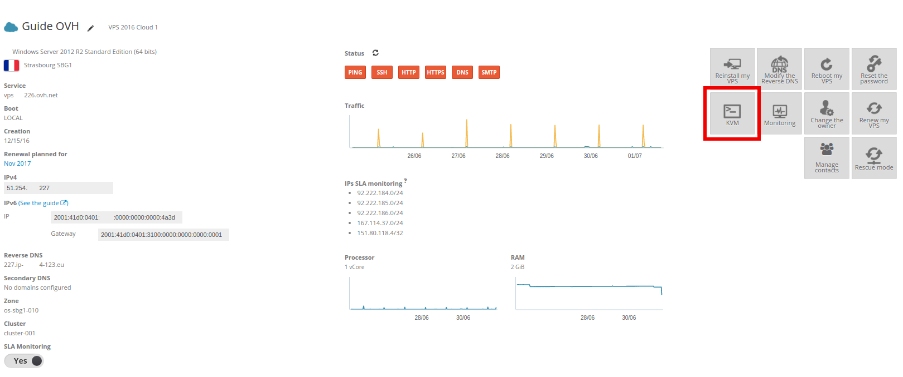

## Requisitos
Al instalar Windows Server 2012, 2012 R2 o 2016 en un VPS, es posible que tanto la conexión al escritorio remoto como la respuesta al protocolo ICMP estén desactivadas. Si ese es el caso, esta guía indica cómo activarlas.

Para ello, es necesario tener:

- un VPS con Windows Server 2012, 2012 R2 o 2016;
- acceso al [área de cliente de OVH](https://www.ovh.com/manager/){.external}.

## Procedimiento

### 1. Acceder al KVM
Para acceder al KVM, acceda al [área de cliente Dedicado de OVH](https://www.ovh.com/manager/dedicated/){.external} y, en la columna izquierda, seleccione su VPS.

Haga clic en el botón `KVM`{.action}.

{.thumbnail}

Se abrirá entonces un acceso de **teclado, pantalla y ratón** al VPS.

### 2. Configuracion de Windows
En la pantalla del KVM, verá iniciarse Windows. A continuación deberá configurar el idioma del teclado Windows y la contraseña del **administrador**.

{.thumbnail}

{.thumbnail}

### 3. Modificacion del firewall de Windows
Una vez finalizada la instalación, diríjase a `Herramientas administrativas`{.action} y haga clic en `Firewall de Windows con seguridad avanzada`{.action}.

{.thumbnail}

Por último, será necesario activar el protocolo ICMP y la conexión al escritorio remoto haciendo clic derecho y seleccionando `Habilitar regla`{.action}.

{.thumbnail}