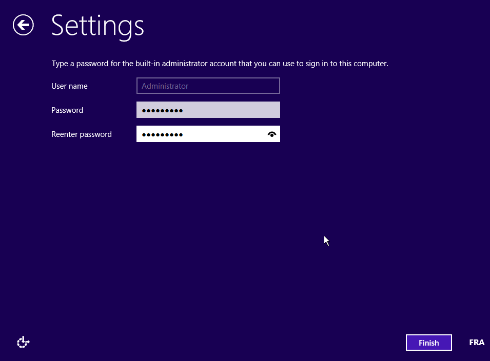

**Dernière mise à jour le 2018/01/31**

## Objectif

Lors de l'installation d'un Windows Server 2012, 2012 R2 ou 2016 sur un VPS, il est possible que la connexion au bureau à distance et la réponse au protocole ICMP soient désactivées. Si tel est le cas, ce guide vous explique où effectuer les modifications.

**Découvrez comment activer la connexion au bureau à distance via KVM si celle-ci est désactivée.**

## Prérequis

- Posséder un VPS avec une distribution Windows installée : Windows Server 2012, 2012 R2 ou 2016.
- Avoir accès à votre [espace client](https://ca.ovh.com/auth/?action=gotomanager).

## En pratique

### Étape 1 : accéder au KVM

Une fois la distribution installée il va falloir se connecter au KVM. Pour cela reportez-vous à ce [guide](https://docs.ovh.com/ca/fr/vps/utilisation-kvm-sur-vps/).

### Étape 2 : premiers paramétrages de Windows

Sur l'écran du KVM, vous constaterez le démarrage de Windows. Il vous faudra alors configurer la langue du clavier Windows, ainsi que le mot de passe `Administrator` :

{.thumbnail}

{.thumbnail}

### Étape 3 : modification du pare-feu Windows

Une fois l'installation terminée, rendez-vous dans `Outils d'Administration`{.action}, puis dans `Pare-feu Windows avec sécurité avancée`{.action}.

{.thumbnail}

Enfin, il vous sera nécessaire d'activer l'ICMP et la connexion au bureau à distance. `Clic droit` puis `Autoriser la règle`{.action} :

{.thumbnail}

## Aller plus loin

Échangez avec notre communauté d'utilisateurs sur <https://community.ovh.com>.