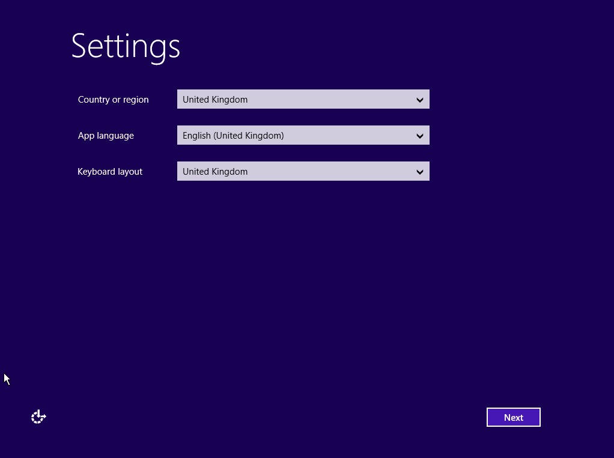

**Dernière mise à jour le 2019/06/15**

## Objectif

Lors de l'installation de Windows Server sur un [VPS](https://www.ovhcloud.com/fr-ca/vps/){.external}, il est possible que la connexion au bureau à distance et la réponse au protocole ICMP soient désactivées. Si tel est le cas, ce guide vous explique où effectuer les modifications.

**Découvrez comment activer la connexion au bureau à distance via KVM si celle-ci est désactivée.**

## Prérequis

- Posséder un [VPS](https://www.ovhcloud.com/fr-ca/vps/){.external} avec une distribution Windows installée.
- Avoir accès à votre [espace client](https://ca.ovh.com/auth/?action=gotomanager).

## En pratique

### Étape 1 : accéder au KVM

Une fois la distribution installée, connectez-vous au KVM. Pour cela reportez-vous à ce [guide](../utilisation-kvm-sur-vps/).

### Étape 2 : premiers paramétrages de Windows

Sur la première fenêtre de configuration, vous devrez configurer le **Pays/région**, la **Langue**, et le **Clavier**. Une fois complété cliquez sur `Next`{.action}.

{.thumbnail}

Ensuite, choisissez un mot de passe pour le compte administrateur. Répétez-le et cliquez sur `Finish`{.action}.

{.thumbnail}

Windows appliquera votre configuration. Une fois complété, vous verrez la page suivante. Vous devrez cliquer sur le bouton `Send CtrlAltDel`{.action} pour vous authentifier.

{.thumbnail}

Sur la page d'ouverture de session, entrez votre mot de passe que vous avez créé pour le compte administrateur et appuyez sur `Entrée`{.action}

{.thumbnail}

### Étape 3 : modification du pare-feu Windows

Une fois l'installation terminée, rendez-vous dans `Outils d'Administration`{.action}, puis dans `Pare-feu Windows avec sécurité avancée`{.action}.

{.thumbnail}

Enfin, il vous sera nécessaire d'activer l'ICMP et la connexion au bureau à distance. `Clic droit` puis `Autoriser la règle`{.action} :

{.thumbnail}

Votre serveur sera maintenant accessible via une connexion de bureau à distance.

## Aller plus loin

Échangez avec notre communauté d'utilisateurs sur <https://community.ovh.com>.
