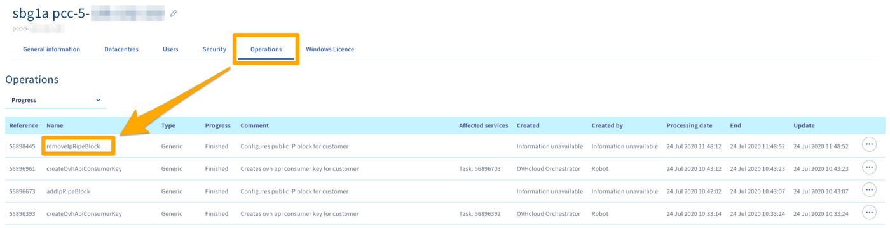

## Obiettivo

Un blocco IP Un blocco IP può essere utilizzato per rendere i tuoi servizi accessibili su Internet. 

**Questa guida ti mostra come ordinare, aggiungere e migrare un blocco IP associato al tuo Hosted Private Cloud.**

## Prerequisiti

- Essere contatto amministratore dell'infrastruttura [Hosted Private Cloud](https://www.ovhcloud.com/it/enterprise/products/hosted-private-cloud/) per ricevere le credenziali di accesso.
- Avere un utente attivo [creato nello Spazio Cliente OVHcloud](https://www.ovh.com/auth/?action=gotomanager&from=https://www.ovh.it/&ovhSubsidiary=it)

## Procedura

### Ordinare un blocco IP

Per ordinare un blocco IP aggiuntivo per il tuo **Private Cloud**, accedi allo Spazio Cliente OVHcloud. Nella sezione `Hosted Private Cloud`, clicca su `IP` nella colonna di sinistra e poi clicca su `Ordina IP aggiuntivi`{.action}. Quindi seleziona il tuo **Private Cloud** nel menu a tendina prima di passare allo step successivo.

Per la creazione del tuo blocco IP è necessario compilare diversi campi.

- Dimensione del blocco IP (da /28 a /24)

> [!primary]
>
> Ecco una tabella con il riepilogo dei numeri di IP presenti in un blocco e il numero di IP utilizzabili.
> 

|Dimensione del blocco|IP nel blocco|IP utilizzabili in OVHcloud|
|:---:|:---:|:---:|
|28|16|11|
|27|32|27|
|26|64|59|
|25|128|123|
|24|256|251|

> [!primary]
>
> Per conoscere gli indirizzi IP riservati al tuo blocco e il relativo utilizzo, consulta la nostra guida sul [plugin OVHcloud Network](/pages/hosted_private_cloud/hosted_private_cloud_powered_by_vmware/plugin_ovh_network).
>

- Paese del blocco IP:  importante in alcuni casi per il posizionamento dei tuoi servizi (un sito italiano avrà un SEO migliore in Italia se anche l’IP è italiano)
- Nome della rete (Informazione visibile nel whois del blocco IP)
- Numero dei clienti stimati (Quanti clienti finali saranno ospitati su questi IP).
- Descrizione della rete (Informazione visibile nel whois del blocco IP).
- Utilizzo (Informazione sull’utilizzo (Web, SSL, Cloud, ecc.)).

> [!success]
>
> Prima della consegna, pagherai le spese di attivazione del tuo blocco IP.
>

Dopo aver confermato l’ultimo step, ottieni il buono d’ordine del tuo blocco IP. Se il buono d’ordine è corretto, non ti resta che procedere al pagamento con uno dei metodi proposti in fondo alla pagina.

### Migrare un blocco IP tra due Hosted Private Cloud

Per migrare un blocco IP è necessario spostare manualmente i blocchi tramite l’APIv6 OVHcloud.

Utilizza la seguente chiamata API:

> [!api]
>
> @api {v1} /ip POST /ip/{ip}/move
> 

Completa i campi nel modo seguente:

- ip:blocco IP con /Mask
- nexthop « newPrimaryIp » (sensibile alle maiuscole)
- to: Hosted Private Cloud di destinazione in formato pcc-XXX-XXX-XXX-XXX

{.thumbnail}

Il risultato sarà di questo tipo:

{.thumbnail}

Se, in seguito, devi scollegare il blocco IP, puoi utilizzare questa chiamata API per spostare l’IP nel Parking degli IP. 

> [!api]
>
> @api {v1} /ip POST /ip/{ip}/park
> 

> [!warning]
>
> Questa chiamata interrompe la rete sulle VM che utilizzano gli IP in questione.
>

È possibile seguire la migrazione del blocco IP dal tuo[Spazio Cliente OVHcloud](https://www.ovh.com/auth/?action=gotomanager&from=https://www.ovh.it/&ovhSubsidiary=it){.external} nella sezione`Hosted Private Cloud`{.action} > `Private Cloud`{.action}. Clicca sul tuo servizio Hosted Private Cloud, quindi sulla scheda `Operazioni`{.action}.

Il riferimento dell’operazione è « removeIpRipeBlock ».

{.thumbnail}

Nella `Parking degli IP`{.action} viene mostrato l'IP.

{.thumbnail}

## Per saperne di più

Contatta la nostra Community di utenti all’indirizzo <https://community.ovh.com/en/>.
