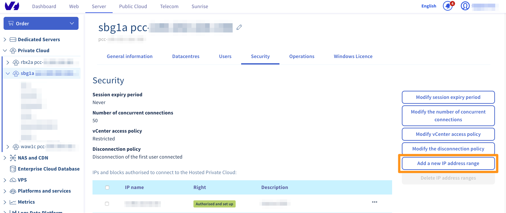
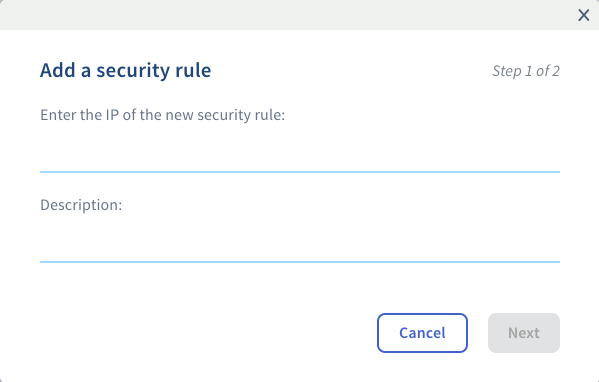

## Objectif

L'accès à votre vCenter est restreint uniquement aux adresses IP autorisées.

**Découvrez comment autoriser des adresses IP à se connecter au vCenter.**

## Prérequis

- Posséder une [infrastructure Private Cloud](https://www.ovhcloud.com/fr/enterprise/products/hosted-private-cloud/) sur votre compte OVHcloud.

<!-- CP-NAV-START:privatecloud-vmware-vsphere -->
---

### Accès à l'espace client OVHcloud

- **Lien direct :** [VMware vSphere](/links/control-panel/privatecloud-vmware-vsphere)
- **Pour accéder à vos services :** `Hosted Private Cloud`{.action} > `Managed VMware vSphere`{.action} > Sélectionnez votre service vSphere

---
<!-- CP-NAV-END:privatecloud-vmware-vsphere -->

## En pratique

Par défaut, l'accès à votre vCenter est restreint. Il est donc nécessaire d'ajouter les IPs qui seront autorisées à se connecter au service.

Rendez-vous dans l'onglet `Sécurité`{.action} et cliquez sur `Ajouter une nouvelle plage d'adresses IP`{.action}.

{.thumbnail}

Rajoutez ici l'IP concernée et éventuellement une description pour la retrouver plus facilement dans la liste ultérieurement.

Validez cet ajout en cliquant sur `Suivant`{.action}. Une fois que l'IP est bien marquée comme « **Autorisée et mise en place** », la connexion au vSphere sera possible depuis l'adresse IP en question.

{.thumbnail}

> [!primary]
>
> Veuillez noter que, pour des raisons de sécurité, vous ne pourrez autoriser qu'un maximum de 2048 adresses IP à se connecter à votre vCenter.
>

## Aller plus loin

Échangez avec notre [communauté d'utilisateurs](/links/community).