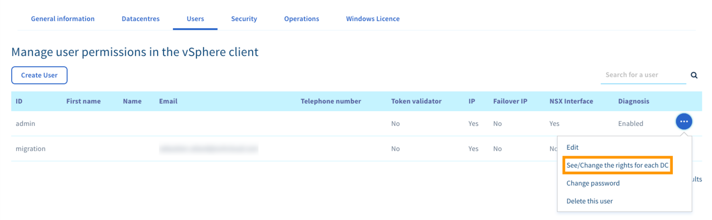

## Wprowadzenie

Celem niniejszego przewodnika jest wyjaśnienie, na czym polega zarządzanie prawami użytkowników w usłudze Private Cloud.

**Dowiedz się, jak zarządzać prawami użytkowników w Twojej infrastrukturze.**

## Wymagania początkowe

- Wykupienie usługi [Hosted Private Cloud](https://www.ovhcloud.com/pl/enterprise/products/hosted-private-cloud/).
- Dostęp do [Panelu klienta OVHcloud](https://www.ovh.com/auth/?action=gotomanager&from=https://www.ovh.pl/&ovhSubsidiary=pl).

## W praktyce

Kliknij **Server**, następnie **Private Cloud**, po czym wybierz infrastrukturę, na której chcesz zmodyfikować użytkowników.

Przejdź do zakładki **Użytkownicy** i kliknij trzy kropki po prawej stronie wiersza użytkownika, aby wyświetlić menu.

{.thumbnail}

W menu możesz dokonywać modyfikacji uprawnień użytkowników vSphere dla poszczególnych centrów danych:

{.thumbnail}

| Dostęp  | Możliwe uprawnienie | Opis |
|---|---|---|
| Dostęp do vSphere | Brak / Tylko odczyt / Odczyt i zapis | Globalne uprawnienia użytkownika w interfejsie vSphere |
| Dostęp do vmNetwork | Brak / Tylko odczyt / Operator | Uprawnienia do zarządzania w części sieci publicznej  (VM Network w interfejsie vSphere) |
| Dostęp do V(x)Lans | Brak / Tylko odczyt / Operator / Administrator | Uprawnienia do zarządzania w części sieci prywatnej (VxLan i VLAN) |
| Dodawanie zasobów | Tak/Nie | Uprawnienia do dodawania dodatkowych zasobów za pomocą wtyczki OVHcloud w vSphere Client (Host, Datastore, Kopie zapasowe Veeam) |

{.thumbnail}

## Sprawdź również

Przyłącz się do społeczności naszych użytkowników na stronie <https://community.ovh.com/en/>.
