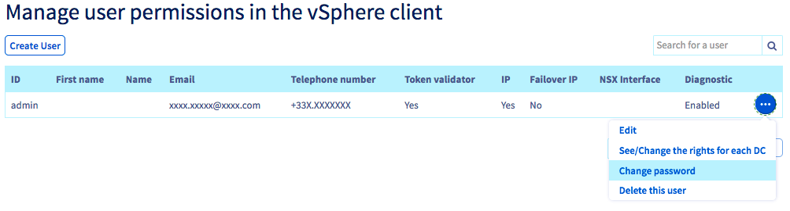
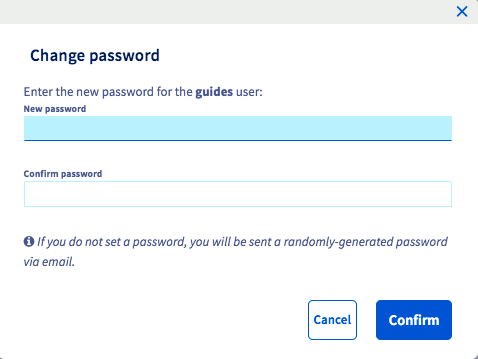

## Objective

vSphere client user permissions and passwords are managed from the OVHcloud Control Panel.

**Learn how to change your user password**

## Requirements

- A user account created from the OVHcloud Control Panel (see [this guide](/pages/hosted_private_cloud/hosted_private_cloud_powered_by_vmware/manager_ovh_private_cloud#users-tab))

<!-- CP-NAV-START:privatecloud-vmware-vsphere -->
---

### OVHcloud Control Panel Access

- **Direct link:** [VMware vSphere](/links/control-panel/privatecloud-vmware-vsphere)
- **Navigation path:** `Hosted Private Cloud`{.action} > `Managed VMware vSphere`{.action} > Select your vSphere service

---
<!-- CP-NAV-END:privatecloud-vmware-vsphere -->

## Instructions

### Change Password

Click the `Users`{.action} tab, then click the `(...)`{.action} button to the right of the user concerned and click `Change Password`{.action}.

{.thumbnail}

Enter a new password and confirm it.

{.thumbnail}

> [!primary]
> If you do not enter a password, a randomly generated password will be emailed to the user's associated address.
>

> [!warning]
>
>We recommend that you follow these few best practices to ensure that your infrastructure is not compromised. Your password must:
>
> - Have at least 8 characters.
> - Have at least 3 character types.
> - Not to be drawn from the dictionary.
> - Not include personal information.
> - Not be used for multiple access.
> - Be stored in a password vault.
> - Be changed every 3 months.
> - Be different from previous passwords.
>

## Go further

[Introduction to the Private Cloud Control Panel](/pages/hosted_private_cloud/hosted_private_cloud_powered_by_vmware/manager_ovh_private_cloud)

[Setting and managing an account password](/pages/account_and_service_management/account_information/manage-ovh-password)

Join our community of users on <https://community.ovh.com/en/>.