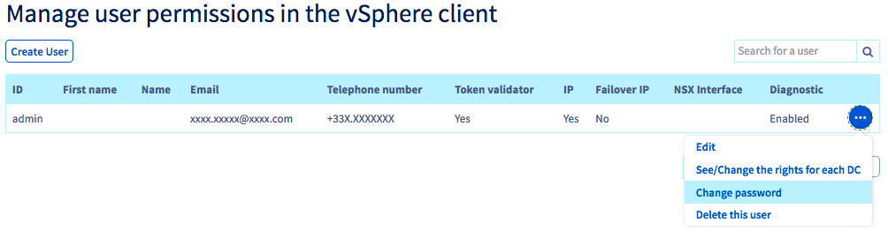
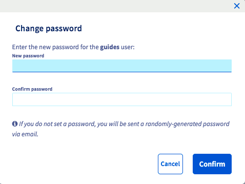

**Última actualización: 19/08/2021**
 
## Objetivo

Es posible gestionar los permisos y contraseñas de los usuarios del cliente vSphere directamente desde el área de cliente de OVHcloud.

**Esta guía explica cómo modificar la contraseña de usuario del cliente vSphere.**

## Requisitos

- Haber iniciado sesión en el [área de cliente de OVHcloud](https://ca.ovh.com/auth/?action=gotomanager&from=https://www.ovh.com/world/&ovhSubsidiary=ws){.external}.
- Haber creado una cuenta de usuario desde el área de cliente de OVHcloud. Para más información, consulte [esta guía](/pages/hosted_private_cloud/hosted_private_cloud_powered_by_vmware/manager_ovh_private_cloud#usuarios).

## Procedimiento

### Cambiar la contraseña

Conéctese al [área de cliente de OVHcloud](https://ca.ovh.com/auth/?action=gotomanager&from=https://www.ovh.com/world/&ovhSubsidiary=ws){.external}, acceda al menú `Servidores`{.action} y, en la sección `Private Cloud`{.action}, seleccione su servidor en la lista. A continuación, haga clic en la pestaña `Usuarios` (4).

{.thumbnail}

Haga clic en el botón `(...)`{.action} situado al final de la línea correspondiente al usuario y seleccione `Cambiar la contraseña`{.action}.

{.thumbnail}

Introduzca la nueva contraseña y confírmela.

{.thumbnail}

> [!primary]
> Si no introduce ninguna contraseña, se generará una contraseña de forma aleatoria, que será enviada por correo electrónico a la dirección asociada al usuario.
> 

> [!warning]
>
>Para evitar poner en riesgo la seguridad de su infraestructura, le recomendamos que tenga en cuenta las siguientes buenas prácticas de seguridad:
>
> - la contraseña debe tener al menos 8 caracteres;
> - la contraseña debe incluir al menos tres tipos de caracteres diferentes;
> - la contraseña no debe ser una palabra que esté en el diccionario;
> - la contraseña no debe incluir datos personales;
> - no utilice la misma contraseña para varias cuentas;
> - guarde sus contraseñas en un gestor de contraseñas;
> - cambie su contraseña cada tres meses;
> - utilice una contraseña diferente a las anteriores.
>

## Más información

[Presentación del área de cliente Private Cloud OVHcloud](/pages/hosted_private_cloud/hosted_private_cloud_powered_by_vmware/manager_ovh_private_cloud)

[Cambiar los permisos de un usuario](/pages/hosted_private_cloud/hosted_private_cloud_powered_by_vmware/change_users_rights)

[Establecer y gestionar la contraseña de su cuenta](/pages/account_and_service_management/account_information/manage-ovh-password)

Interactúe con nuestra comunidad de usuarios en <https://community.ovh.com/en/>.
