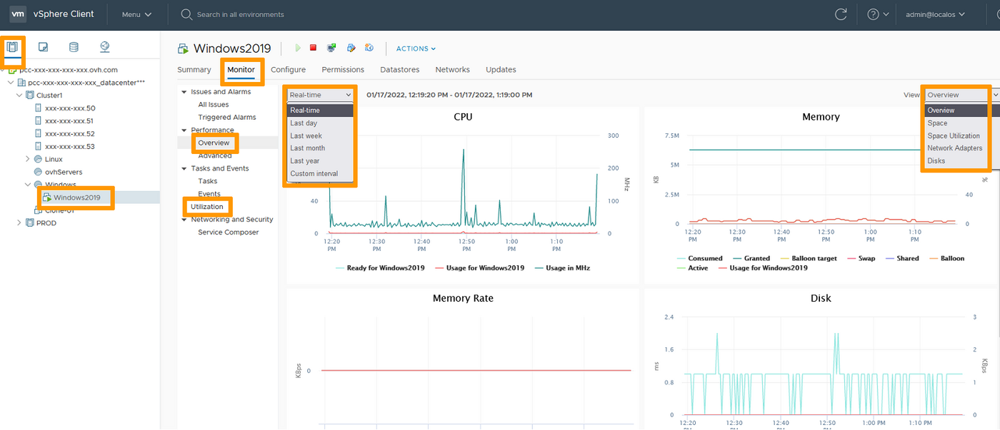
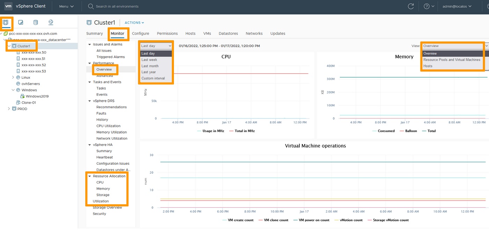
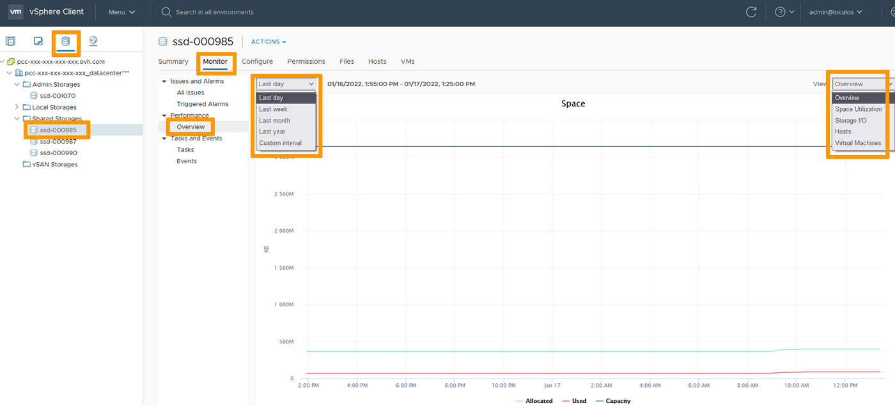

## Objectif

Utilisez les outils de surveillance de vSphere pour dépanner une VM.

**Découvrez comment résoudre les problèmes de performance d'une VM via l'interface vSphere**

## Prérequis

- Être contact administrateur de l'infrastructure [Hosted Private Cloud](https://www.ovhcloud.com/fr/enterprise/products/hosted-private-cloud/), afin de recevoir kes identifiants de connexion.
- Avoir un identifiant utilisateur actif (créé dans l'[espace client OVHcloud](https://www.ovh.com/auth/?action=gotomanager&from=https://www.ovh.com/fr/&ovhSubsidiary=fr))

## En pratique

Vous avez à disposition trois niveaux de surveillance dans vSphere :

- VM
- Cluster
- Stockage

### Surveillance de la VM

Dans l'interface vSphere, rendez-vous dans le tableau de bord `Hôtes et clusters`{.action}. 
Naviguez jusqu'à votre VM et selectionnez-la. 
L'onglet `Surveiller`{.action} montre une `Présentation`{.action} des performances. 
Vous pouvez choisir les mesures en temps réel ou definir une chronologie pour voir l'évolution des performances. 
Vous pouvez modifier la vue pour creuser des sujets spécifiques.

{.thumbnail}

La section `Utilisation`{.action} aidera également vos investigations.

### Surveillance du cluster

Dans l'interface vSphere, rendez-vous dans le tableau de bord `Hôtes et clusters`{.action}. 
Naviguez jusqu'à votre cluster et selectionnez-le. 
L'onglet `Surveiller`{.action} montre une `Présentation`{.action} des performances. 
Vous pouvez choisir les mesures en temps réel ou definir une chronologie pour voir l'évolution des performances. 
Vous pouvez modifier la vue pour creuser des sujets spécifiques.

{.thumbnail}

Les sections `Allocation des ressources`{.action} et `Utilisation`{.action} aideront également vos investigations.

> [!primary]
>
> Les pools de resources sont accessibles et surveillés à l'identique des clusters.
> 

### Surveillance du stockage

Dans l'interface vSphere, rendez-vous dans le tableau de bord `Stockage`{.action}. 
Naviguez jusqu'à votre datastore et selectionnez-le. 
L'onglet `Surveiller`{.action} montre une `Présentation`{.action} des performances. 
Vous pouvez choisir les mesures en temps réel ou definir une chronologie pour voir l'évolution des performances. 
Vous pouvez modifier la vue pour creuser des sujets spécifiques.

{.thumbnail}

## Aller plus loin

Échangez avec notre communauté d'utilisateurs sur <https://community.ovh.com>.
