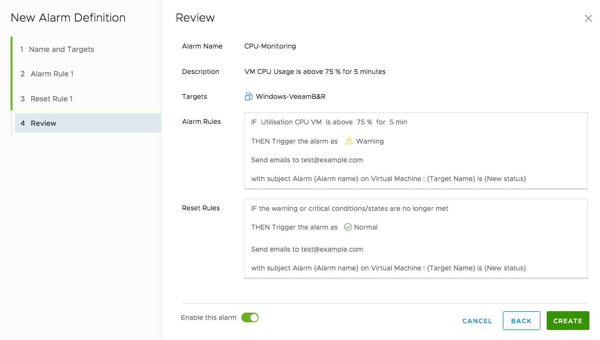

## Einleitung

Alarmmeldungen können für alle Komponenten Ihrer Private Cloud erstellt werden: das Rechenzentrum selbst, die Cluster, VM, Datastores, das Netzwerk...

**Diese Anleitung erklärt, wie Sie Alarmmeldungen einrichten können.**

## Voraussetzungen

- Sie nutzen ein Produkt der Art [Private Cloud](https://www.ovhcloud.com/de/enterprise/products/hosted-private-cloud/){.external}.
- Sie sind in Ihrem [vSphere Interface](/pages/hosted_private_cloud/hosted_private_cloud_powered_by_vmware/vsphere_interface_connexion) angemeldet.

## Praktische Anwendung

### Einen Alarm erstellen

Um eine Alarmmeldung einzurichten klicken Sie mit der rechten Maustaste auf das Rechenzentrum oder jede andere Komponente, die Sie überwachen möchten. Klicken Sie dann auf `Alarms`{.action} und `New Alarm Definition`{.action}.

{.thumbnail}

### Einen Namen und Bezug festlegen

Im ersten Schritt versehen Sie den Alarm mit einem Namen und legen fest, worauf er sich bezieht. Sie können auch eine Beschreibung hinzufügen.

{.thumbnail}

### Die Alarmregeln festlegen

Im zweiten Schritt legen Sie die Regeln der Alarmmeldung fest, sowie die Aktionen, die sie auslöst.

Im Feld `IF` können Sie aus einer Reihe von Variablen wählen, was den Alarm auslösen soll. Je nach ausgewählter Variable wird Ihnen eine Liste von Argumenten vorgeschlagen.

Im Feld `THEN` können Sie angeben, mit welcher Kritikalität der Alarm ausgelöst wird und welche Aktionen er auslöst. Beispielsweise kann das sein: Versenden einer E-Mail, Ausführen eines Skripts, Anhalten einer VM.

{.thumbnail}

Beispielsweise können Sie so den Arbeitsspeicher eines Hosts überwachen, indem Sie einen nicht zu überschreitenden Grenzwert angeben. Bei dessen Überschreitung wird der Alarm ausgelöst und Sie erhalten eine Warnung per E-Mail.

> [!primary]
> Sie können verschiedene Regeln für Ihren Alarm festlegen. Klicken Sie dazu auf `ADD ANOTHER RULE`{.action}.
>

### Alarm beenden

Im dritten Schritt legen Sie die Kriterien für die Beendigung des Alarms und das Auslösen neuer Aktionen fest.

{.thumbnail}

### Übersicht über die Alarmmeldung

Beim letzten Schritt sehen Sie eine Zusammenfassung der festgelegten Regeln. Sie können den Alarm mit dem Cursor aktivieren, oder ihn später auslösen lassen. Machen Sie dazu einen Rechtsklick auf die ausgewählte Komponente und klicken Sie dann auf `Alarms`{.action} und `Enable Alarm Actions`{.action}.

{.thumbnail}

In diesem Schritt können Sie auch einstellen, in welchen Abständen der Alarm wiederholt werden soll.

## Weiterführende Informationen

Für den Austausch mit unserer User Community gehen Sie auf <https://community.ovh.com/en/>.
