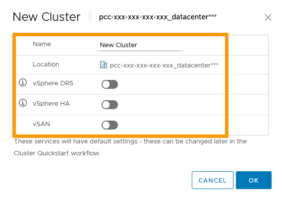
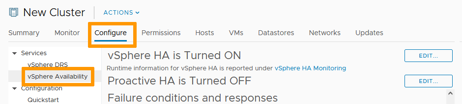
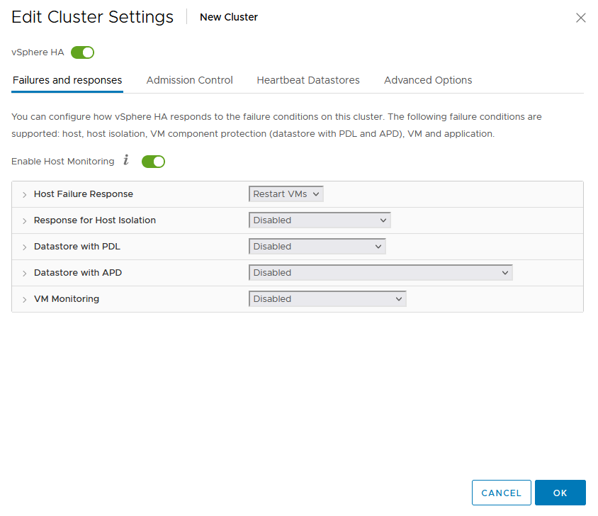
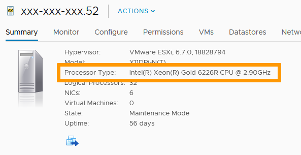
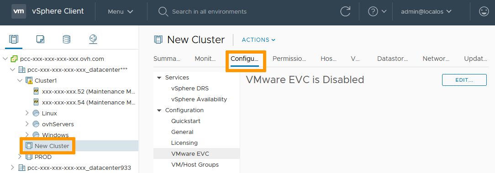
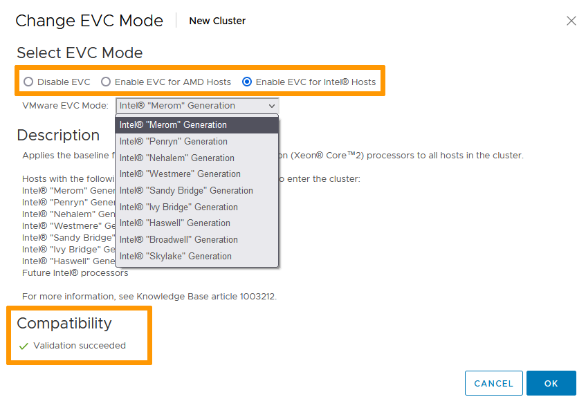

**Dernière mise à jour le 08/02/2022**

## Objectif

Vous pouvez créer plusieurs clusters dans votre infrastructure afin de segmenter vos activités. 
Découvrez comment créer et configurer les fonctionnalités des clusters (DRS, HA & EVC).

**Ce guide est un cas d'étude comprenant les étapes d'installation et de configuration.**

## Prérequis

- Être contact administrateur de l'infrastructure [Hosted Private Cloud](https://www.ovhcloud.com/fr-ca/enterprise/products/hosted-private-cloud/), afin de recevoir les identifiants de connexion.
- Avoir un identifiant utilisateur actif (créé dans l'[espace client OVHcloud](https://ca.ovh.com/auth/?action=gotomanager&from=https://www.ovh.com/ca/fr/&ovhSubsidiary=qc))

## En pratique

### Création du cluster

Dans l'interface vSphere, rezndez-vous dans le tableau de bord `Hôtes et clusters`{.action}.

{.thumbnail}

Faites un clic-droit sur votre Datacenter. 
Sélectionnez `Nouveau cluster`{.action}.

{.thumbnail}

Dans la fenêtre qui apparait, nommez le cluster et sélectionnez les options nécessaires. 
Cliquez sur `OK`{.action}.

{.thumbnail}

> [!warning]
>
> L'option vSAN nécessite des hôtes compatibles. Consultez [ce guide](/pages/hosted_private_cloud/hosted_private_cloud_powered_by_vmware/manager_ovh_private_cloud) pour apprendre comment en commander si cela s'avère nécessaire.
> 

### DRS

DRS répartit la charge de calcul sur vos différents hôtes. 
Si vous avez activé l'option, elle est en mode « Entièrement automatisé » par défaut.

Sélectionnez le cluster. Dans l'onglet `Configurer`{.action}, sélectionnez `vSphere DRS`{.action} et cliquez sur `Modifier`{.action}.

{.thumbnail}

Trois options sont disponibles:

- Manuelle. DRS génère des recommandations de placement pour la mise sous tension et des recommandations de migration pour les machines virtuelles. Les recommandations doivent être appliquées manuellement ou seront ignorées.
- Partiellement automatisé. DRS place automatiquement les machines virtuelles sur les hôtes lors de la mise sous tension de ces dernières. Les recommandations de migration doivent être appliquées manuellement ou seront ignorées.
- Entièrement automatisé. DRS place automatiquement les machines virtuelles sur les hôtes lors de la mise sous tension de ces dernières. Elles sont automatiquement migrées d'un hôte à l'autre pour optimiser l'utilisation des ressources.

Les modes automatisés vous permettent de régler la sensibilité du service, de modéré à élevé. 
Cliquez sur `OK`{.action}.

{.thumbnail}

### HA

La disponibilité offre de la redondance pour qu'une panne d'un hôte n'impacte pas les services qui tournent sur vos VMs. 

Pour modifier les paramètres par défaut, sélectionnez le cluster. Dans l'onglet `Configurer`{.action}, sélectionnez `Disponibilité vSphere`{.action} et cliquez sur `Modifier`{.action}.

{.thumbnail}

Vous pouvez alors personnaliser les différentes réponses aux possibles pannes d'hôte. 
Cliquez sur `OK`{.action}.

{.thumbnail}

### EVC

EVC (Enhanced vMotion Compatibility) permet la migration à chaud de vos VMs entre différents hôtes.

Avant d'activer la fonctionnalité, vérifiez la page de résumé de vos hôtes pour déterminer leurs types de CPU.

{.thumbnail}

Sélectionnez le cluster. Dans l'onglet `Configurer`{.action}, sélectionnez `VMware EVC`{.action} et cliquez sur `Modifier`{.action}.

{.thumbnail}

Activez EVC pour le type de CPU de vos hôtes. 
La compatibilité descendante est assurée. Pour vous aider à vérifier que les paramètres sont corrects, vous verrez une validation de la compatibilité en bas de la fenêtre. 
Cliquez sur `OK`{.action}.

{.thumbnail}

> [!warning]
>
> L'activation de l'EVC ne peut se faire que si le cluster n'a pas de VM active. Assurez-vous donc au préalable que toutes vos VMs sont éteintes ou évacuées. 
>

## Aller plus loin

Échangez avec notre communauté d'utilisateurs sur <https://community.ovh.com>.
