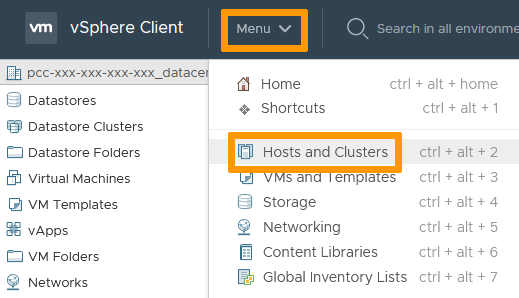
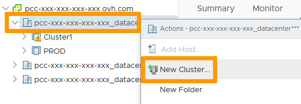
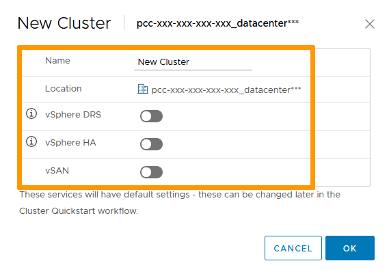
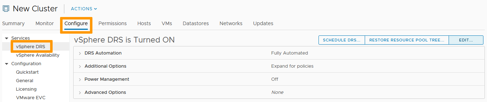
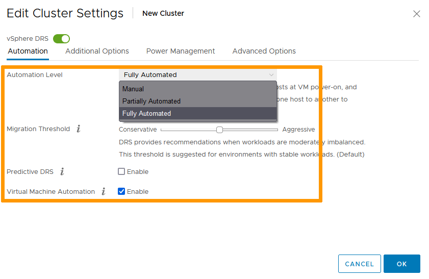
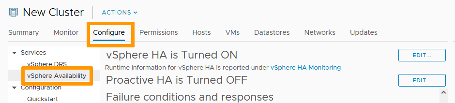
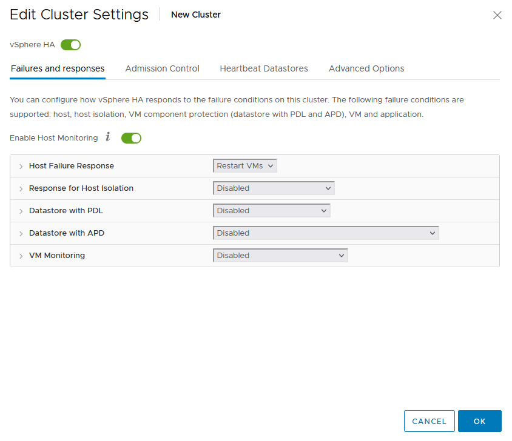
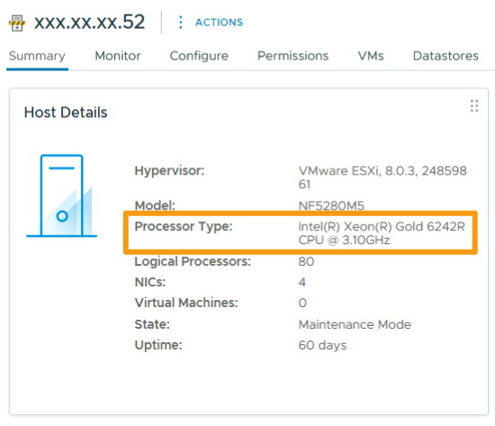
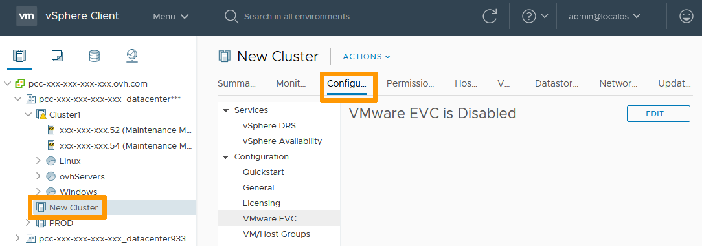
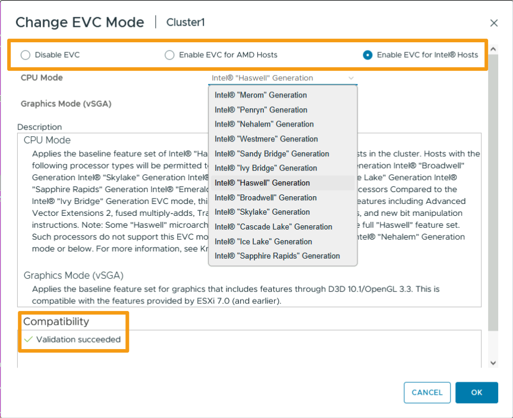

## Objectif

Vous pouvez créer plusieurs clusters dans votre infrastructure afin de segmenter vos activités. 
Découvrez comment créer et configurer les fonctionnalités des clusters (DRS, HA & EVC).

**Ce guide propose un exemple pas à pas de création d'un cluster et de configuration de ses fonctionnalités.**

## Prérequis

- Être contact administrateur de l'infrastructure [Hosted Private Cloud](https://www.ovhcloud.com/fr/enterprise/products/hosted-private-cloud/), afin de recevoir les identifiants de connexion.
- Avoir un identifiant utilisateur actif (créé dans l'[espace client OVHcloud](/links/manager))

## En pratique

### Création du cluster

Dans l'interface vSphere, rendez-vous dans le tableau de bord `Hôtes et clusters`{.action}.

{.thumbnail}

Faites un clic-droit sur votre Datacenter. 
Sélectionnez `Nouveau cluster`{.action}.

{.thumbnail}

Dans la fenêtre qui apparait, nommez le cluster et sélectionnez les options nécessaires. 
Cliquez sur `OK`{.action}.

{.thumbnail}

> [!warning]
>
> L'option vSAN nécessite des hôtes compatibles. Consultez le [guide du Panneau de configuration Hosted Private Cloud](/pages/hosted_private_cloud/hosted_private_cloud_powered_by_vmware/manager_ovh_private_cloud) pour savoir comment en commander si nécessaire.
> 

### DRS

DRS répartit la charge de calcul sur vos différents hôtes. 
Si vous avez activé l'option, elle est en mode « Entièrement automatisé » par défaut.

Sélectionnez le cluster. Dans l'onglet `Configurer`{.action}, sélectionnez `vSphere DRS`{.action} et cliquez sur `Modifier`{.action}.

{.thumbnail}

Trois options sont disponibles :

- Manuelle. DRS génère des recommandations de placement pour la mise sous tension et des recommandations de migration pour les machines virtuelles. Les recommandations doivent être appliquées manuellement ou seront ignorées.
- Partiellement automatisé. DRS place automatiquement les machines virtuelles sur les hôtes lors de la mise sous tension de ces dernières. Les recommandations de migration doivent être appliquées manuellement ou seront ignorées.
- Entièrement automatisé. DRS place automatiquement les machines virtuelles sur les hôtes lors de la mise sous tension de ces dernières. Elles sont automatiquement migrées d'un hôte à l'autre pour optimiser l'utilisation des ressources.

Les modes automatisés vous permettent de régler la sensibilité du service, de modéré à élevé. 
Cliquez sur `OK`{.action}.

{.thumbnail}

### HA

La haute disponibilité offre de la redondance : une panne d'hôte n'impacte pas les services qui tournent sur vos VMs. 

Pour modifier les paramètres par défaut, sélectionnez le cluster. Dans l'onglet `Configurer`{.action}, sélectionnez `Disponibilité vSphere`{.action} et cliquez sur `Modifier`{.action}.

{.thumbnail}

Vous pouvez personnaliser les réponses aux différentes pannes d'hôte. 
Cliquez sur `OK`{.action}.

{.thumbnail}

### EVC

EVC (Enhanced vMotion Compatibility) permet la migration à chaud de vos VMs entre différents hôtes.

#### Bonnes pratiques pour les clusters à matériel hétérogène

Cette section couvre :

- Appliquer les bonnes pratiques VMware by Broadcom
- Assurer la stabilité du cluster et la disponibilité des workloads
- Tirer pleinement parti du nouveau matériel PREMIER2026 Generation (basé sur Intel Emerald Rapids)
- Éviter les erreurs de configuration courantes impactant vMotion et la haute disponibilité (HA)

PREMIER2026 augmente les performances par hôte, étend la durée de vie du cluster et permet de scaler avec du matériel de nouvelle génération sans reconstruire depuis zéro.

Cependant, le mélange de générations de CPU dans un cluster introduit des problèmes de compatibilité, notamment pour vMotion (migration à chaud) et les mécanismes de redémarrage HA. C'est là qu'EVC devient indispensable.

#### Cas d'usage pris en charge :

- Cluster hétérogène (croissance progressive)
- Migration vers PREMIER2026 (cible homogène)

**Cas d'usage 1 : Cluster hétérogène (croissance progressive)**

Vous souhaitez conserver les hôtes existants (Essential / SDDC / Premier) et ajouter progressivement des hôtes PREMIER2026 pour faire évoluer votre cluster dans le temps.

Approche recommandée :

1. Activer EVC sur le cluster
2. Sélectionner un mode EVC compatible avec la génération de CPU la plus ancienne
3. Ajouter des hôtes PREMIER2026
4. Continuer à scaler progressivement

> [!warning]
>
> Implications : tous les hôtes fonctionnent sous une base CPU commune ; vous préservez la compatibilité mais ne pourrez pas exploiter pleinement les fonctionnalités CPU les plus récentes (légère limitation de performance due au masquage CPU).
>

**Cas d'usage 2 : Migration vers PREMIER2026 (cible homogène)**

Vous souhaitez migrer tous les workloads vers PREMIER2026 avant de désaffecter l'ancien matériel.

Approche recommandée :

1. Activer EVC sur le cluster (base temporaire pour la migration, peut nécessiter une extinction/allumage de vos VM)
2. Ajouter des hôtes PREMIER2026
3. Utiliser vMotion pour migrer tous les workloads
4. Retirer les anciens hôtes du cluster
5. (Optionnel) Reconfigurer ou désactiver EVC pour libérer toutes les capacités CPU (peut nécessiter une extinction/allumage de vos VM)

> [!warning]
>
> Implications : la compatibilité à court terme est assurée ; les performances à long terme sont optimisées, mais une phase de migration structurée est nécessaire.
>

**Approche alternative avec un nouveau cluster**

1. Créer un nouveau cluster (aucune configuration EVC requise)
2. Ajouter des hôtes PREMIER2026 dans ce nouveau cluster
3. Utiliser vMotion pour migrer tous les workloads depuis l'ancien cluster vers le nouveau (un rollback est possible mais nécessite une extinction/allumage de vos VM, EVC n'étant pas activé dans le nouveau cluster)
4. Retirer les anciens hôtes de l'ancien cluster
5. Supprimer l'ancien cluster

> [!warning]
>
> Implications : les performances à court terme sont optimisées, mais une phase de migration inter-cluster structurée est nécessaire. Aucune extinction/allumage de VM n'est requis.
>

#### Comment activer EVC

Avant d'activer la fonctionnalité, vérifiez la page de résumé de vos hôtes pour déterminer leurs types de CPU.

{.thumbnail}

Sélectionnez le cluster. Dans l'onglet `Configurer`{.action}, sélectionnez `VMware EVC`{.action} et cliquez sur `Modifier`{.action}.

{.thumbnail}

Activez EVC pour les types de CPU de vos hôtes. 
La compatibilité descendante est assurée. Une validation de la compatibilité apparaît en bas de la fenêtre pour confirmer vos paramètres. 
Cliquez sur `OK`{.action} lorsque vous avez terminé.

{.thumbnail}

> [!warning]
>
> L'activation de l'EVC ne peut se faire que si le cluster n'a pas de VM active. Assurez-vous donc au préalable que toutes vos VMs sont éteintes ou évacuées ; cela peut également nécessiter une extinction/allumage de vos VM.
>

## Aller plus loin

Échangez avec notre [communauté d'utilisateurs](/links/community).
