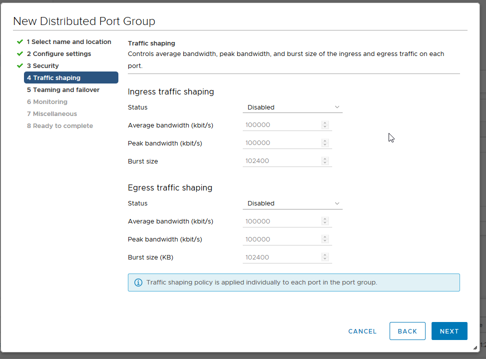
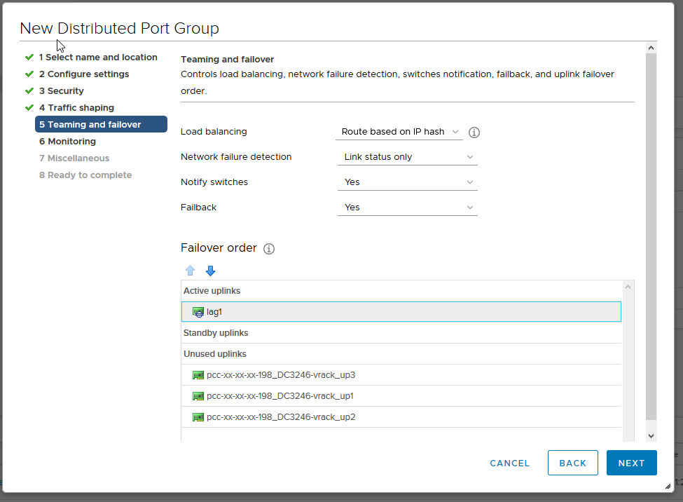

**Dernière mise à jour le 07/02/2022**

## Objectif

OVHcloud installe une base de 11 VLANs sur votre vRack.

**Ce guide explique comment ajouter des VLANs supplémentaires.**

## Prérequis

- Être contact administrateur de l'infrastructure [Hosted Private Cloud](https://www.ovhcloud.com/fr-ca/enterprise/products/hosted-private-cloud/), afin de recevoir les identifiants de connexion.
- Avoir un identifiant utilisateur actif avec les droits spécifiques pour la mise en réseau (créé dans l'[espace client OVHcloud](https://ca.ovh.com/auth/?action=gotomanager&from=https://www.ovh.com/ca/fr/&ovhSubsidiary=qc))

## En pratique

Dans les offres Hosted Private Cloud, les VLANs permettent d'isoler des communications privées entre les différents services OVHcloud compatibles vRack (serveur dédié, instance Public Cloud...). 

En premier lieu, rendez vous dans la vue `Mise en réseau` de votre client vSphere. Déployez le dossier **vrack** puis faites un clic droit sur le **dVS** finissant par *-vrack* et enfin cliquez sur `Nouveau groupe de ports distribués`{.action}.

{.thumbnail}

Nommez alors votre **Port Group** :

{.thumbnail}

Puis configurez les paramètres recommandés par OVHcloud :

- **Liaison de port** : Statique (réservation et assignation du port à une machine virtuelle)
- **Allocation de port** : Élastique (Permet d'élargir à chaud le nombre de port)
- **Nombre de ports** : 24
- **Type de VLAN** : VLAN (les autres sont [PVLAN](https://kb.vmware.com/s/article/1010691){.external} et Trunk)
- **ID du VLAN** : 21 (sachant que l'ID peut-être configuré de 1 à 4096)
- Cochez l'option *Personnaliser la configuration des stratégies par défaut*.

{.thumbnail}

Vous disposez de 3 paramètres de sécurité qui peuvent être activés en fonction de votre besoin : 

- *Mode Promiscuité* (élimine tout filtrage de réception que l'adaptateur de machine virtuelle peut effectuer afin que le système d'exploitation invité reçoive tout le trafic observé sur le réseau.)
- *Modifications de l'adresse MAC* (affecte le trafic qu'une machine virtuelle reçoit. Lorsque l'option est définie sur **Accepter**, ESXi accepte les demandes de modification de l'adresse MAC effective en une adresse différente de l'adresse MAC initiale.)
- *Transmissions forgées* (affecte le trafic transmis à partir d'une machine virtuelle. Lorsque l'option est définie sur **Accepter**, ESXi ne compare pas les adresses MAC source et effective).

> [!primary]
>
> L'utilisation la plus fréquente de ces 3 paramètres est le CARP, notamment utilisé sur **pfSense**.
> 

{.thumbnail}

Nous laissons la [Formation du trafic](https://docs.vmware.com/en/VMware-vSphere/6.5/com.vmware.vsphere.networking.doc/GUID-CF01515C-8525-4424-92B5-A982489BACE2.html){.external} désactivée.

{.thumbnail}

En ce qui concerne le *load balacing* , selectionnez *Route basée sur le hashage IP* qui est la meilleure méthode en terme de redondance et répartition.

> [!warning]
>
> Attention au niveau de de la configuration de l'ordre du failover, il est nécessaire de mettre la liaison montante `lag1` en *Active* (connexion entre le réseau virtuel et le réseau physique), sinon aucune communication entre les hôtes ne sera possible.
>

{.thumbnail}

Le `Netflow` est desactivé (rapport d'activité sur les flux de trafic)

{.thumbnail}

Laissez la valeur `Bloquer tous les ports` à « Non ».

{.thumbnail}

Un résumé des modifications vous est alors présenté. Cliquez sur `Terminer`{.action} pour confirmer la création.

{.thumbnail}

Nous constatons ici que le **VLAN21** est bien disponible et fonctionnel.

{.thumbnail}

## Aller plus loin

Échangez avec notre communauté d'utilisateurs sur <https://community.ovh.com>.
