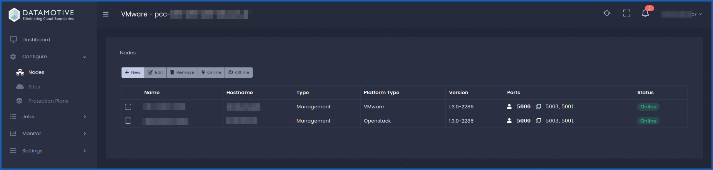
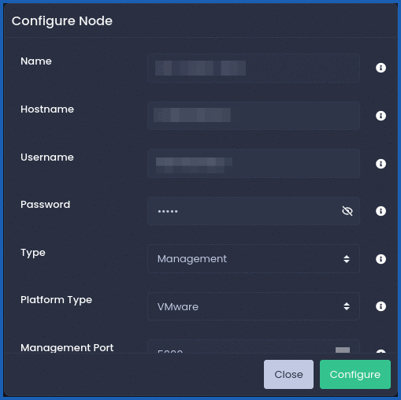
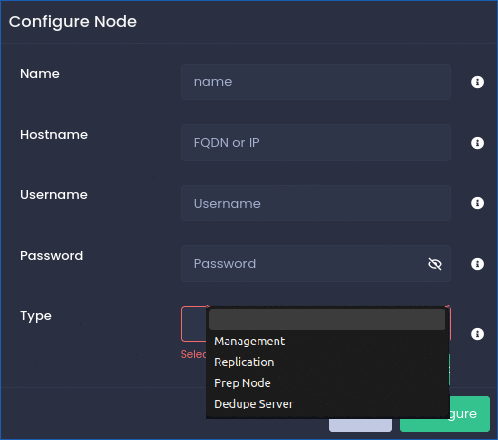

## Objectif

**L'objectif de ce quide est d'introduire la solution Datamotive au sein de l'univers Hosted Private Cloud - VMware on OVHcloud.**

## En pratique

Orchestrateur multi-cloud, Datamotive a reussi à construire une solution qui permet de simplifier le processus d'hybridation des environnements cloud privée et publique.

Elle dispose de 3 produits au sein de ça solution :

* `EasyMigrate` : Transformer la portabilité et la gestion des charges de travail.
* `EasyHybridDR` : Protégez vos charges de travail en toute transparence.
* `EasyAnalytics` : Transformez vos données en informations exploitables.

### Étape 1 - La console Datamotive

#### Comment se connecter à la console

Pour vous connecter à la console Datamotive, utilisez l'adresse IP ou le nom de domaine que vous avez configuré : 

- `Url` : https://XX.XX.XX.XX:5000/dashboard

Le port d'accès utilisé par défaut à la console de management est le port `5000`.

Si vous utilisez un annuaire Active Directory, vous pouvez utiliser le bouton `Sign In with Active Directory`.

{.thumbnail}

Vous serez redirigé sur le dashboard Datamotive.

{.thumbnail}

### Étape 2 - Les fonctionnalités de la console

#### Configure

La deuxième partie de la console Datamotive est la section de configuration `Configure`.

Elle dispose de 3 sous-sections :

- `Nodes`
- `Sites`
- `Protection Plans`

La section **Nodes** permet de lister les nodes sur lequel vous avez connecté votre console. Vous disposez de toutes les informations utiles nécessaires tel que le `Hostname`, `Type`, `Platform Type`, `Version`, `Ports`, `Status`.

{.thumbnail}

- `Name` : Nom de la VM ou de l'instance du nœud déployé.
- `Hostname` : Adresse IP ou FQDN du noeud.
- `Username` : Nom d'utilisateur du noeud déployé.
- `Password` : Mot de passe du noeud déployé.
- `Type` : Type de nœud, Replication - Le nœud agira en tant qu'unité de réplication sans état et gérera les opérations de réplication fournies. Déduplication - Le nœud effectuera la déduplication des données. Management - Le noeud agira en tant que serveur de gestion.
- `Platform type` : Sur laquelle le nœud est déployé. Les types de plateforme pris en charge sont VMware, AWS, GCP, Azure et OpenStack.
- `Management Port` : Port sur lequel le service de gestion est exécuté.
- `Replication Data Port` : Port sur lequel le service de données de réplication est en cours d'exécution.
- `Replication Controller Port` : Port sur lequel le service de contrôleur de réplication est en cours d'exécution.
Vous disposez d'une bar d'edition qui vous permet d'ajouter des nodes, de les éditer, de les supprimer, de les allumer et les éteindre.

Voici une capture de l'édition d'un node existant :

{.thumbnail}

Pour l'ajout d'un node, vous disposez de plusieurs types de node, `Management`, `Replication`, `Prep Node`, `Dedupe Server`.

Voici une capture de la création d'un nouveau node :

{.thumbnail}

-`Sites`

Pour la section **Sites** permet de lister les Sites pris en charge pour la protection et la récupération au sein de Datamotive.

Pour créer un Site, vous devez avoir : `Name`, `Description`, `Site`, `Type`, `Platform Type`, `Node`, `Region`.

Les nouveaux éléments de cette section sont la `Région` et le `Site Type` :

- `Region` : Région du site cloud où le serveur de gestion est déployé et où la protection doit être effectuée.
- `Site Type` : Les types de sites pris en charge, vous avez deux choix `Protection` et `Recover`.

Vous avez aussi dans cette section une bar de Management avec la possibilité d'**Edition**, de **Création** et de **Suppression** de Sites.

- `Protection Plans`

## Aller plus loin

Si vous avez besoin d'une formation ou d'une assistance technique pour la mise en œuvre de nos solutions, contactez votre Technical Account Manager ou rendez-vous sur [cette page](/links/professional-services) pour obtenir un devis et demander une analyse personnalisée de votre projet à nos experts de l’équipe Professional Services.

Posez des questions, donnez votre avis et interagissez directement avec l’équipe qui construit la solution Datamotive sur le [site Web](https://www.datamotive.io/).

Échangez avec notre [communauté d'utilisateurs OVHcloud](/links/community).