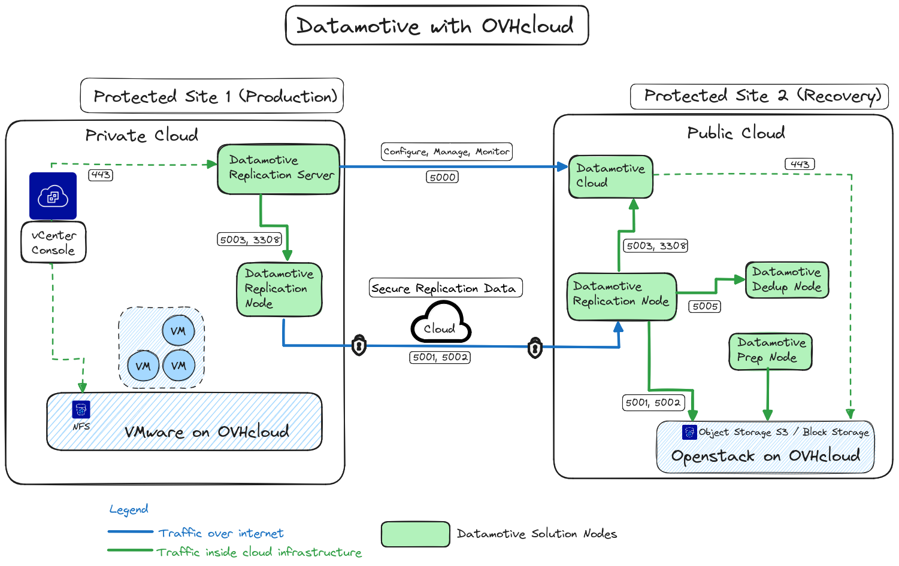
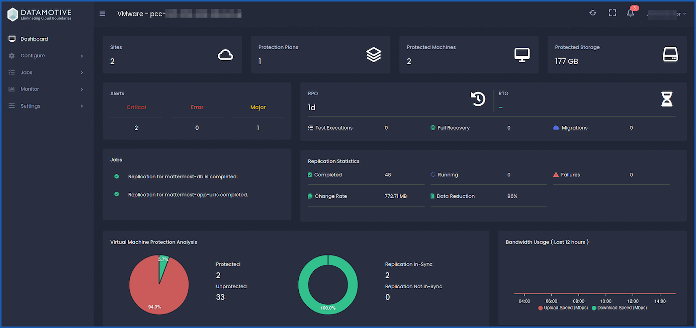
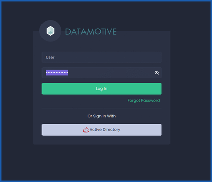

## Objectif

**L'objectif de ce quide est de présenter la solution Datamotive au sein de l'univers Hosted Private Cloud - VMware on OVHcloud.**

## En pratique

Orchestrateur multi-cloud, Datamotive a reussi à construire une solution qui permet de simplifier le processus d'hybridation des environnements cloud privés et publics.

### Introduction

La plateforme de portabilité de la charge de travail multicloud et hybride de DataMotive offre la reprise après sinistre et la migration de la charge de travail en tant que produits en libre-service et permet une réplication et une récupération simplifiées entre les hyperviseurs.

La plateforme **Datamotive Workload Portability** peut être utilisée pour protéger ou migrer vos machines virtuelles/instances sur le site principal en les répliquant périodiquement sur le site de récupération. Les machines virtuelles/instances protégées peuvent ensuite être récupérées selon les besoins dans le site de récupération en tant qu’instances natives cibles (par exemple, les instances protégées AWS EC2 sont récupérées en tant que machines virtuelles VMware natives).

Ce guide fournit des informations sur le déploiement, la configuration et la gestion des produits Datamotive. Il fournit également une vue d'ensemble de la plateforme Datamotive et de ses différents composants.

La plateforme dispose de 3 produits au sein de sa solution :

- `EasyMigrate` : Transformez la portabilité et la gestion des charges de travail.
- `EasyHybridDR` : Protégez vos charges de travail en toute transparence.
- `EasyAnalytics` : Transformez vos données en informations exploitables.

### Public visé

Ces informations sont destinées à toute personne souhaitant utiliser la solution Datamotive. Ces informations sont destinées aux administrateurs expérimentés de la virtualisation et de l'infrastructure cloud qui connaissent les technologies de virtualisation, la continuité des activités et les opérations des centres de données et du cloud.

**Version de la solution DataMotive prise en charge**

Le contenu de ce guide est applicable à la solution **Datamotive EasyMigrate & EasyHybridDR** version `1.1.2`.

### Architecture des composants de DataMotive

La plateforme **Datamotive Workload Portability** est composée des éléments suivants déployés en tant que machines virtuelles indépendantes. Tous les composants sont livrés sous forme d’appliances virtuelles ou d’images de machines cloud natives, en fonction de l’infrastructure cible. Toutes les appliances virtuelles sont entièrement sécurisées et basées sur des images certifiées CIS Ubuntu-20 Server Edition.

1. **Datamotive Management Server** : une appliance virtuelle déployée dans une infrastructure de site protégée ou de récupération où les machines virtuelles doivent être protégées, récupérées ou migrées. *Management Server* fournit une interface utilisateur, une CLI et des API RESTful aux administrateurs pour qu’ils puissent effectuer les activités Day0-DayN. Le serveur fait également office de nœud de réplication. Il est livré en tant qu'OVA pour l'environnement VMware on OVHcloud, image pour OpenStack et image de machine native cloud pour les environnements OVHcloud, AWS, GCP et Azure.
2. **Datamotive Replication Node** : une appliance virtuelle déployée sur un site protégé ou de récupération. Elle est utilisé pour exécuter les tâches de réplication de données. Ce nœud peut être utilisé pour augmenter la capacité de réplication globale de la solution en fonction du nombre de machines virtuelles/instances protégées. Le nombre maximum de tâches de réplication parallèle (1 tâche de réplication par disque/volume protégé) supporté par chaque nœud est défini par la limite fournie par les plateformes Cloud (la limite par défaut pour la réplication est de 40 et 25 pour la restauration). Il est livré en tant qu'OVA pour l'environnement VMware on OVHcloud, image pour OpenStack on OVHcloud et image de machine native cloud pour l'environnement OVHcloud, AWS, GCP et Azure. La solution DataMotive évolue horizontalement à l'aide des nœuds de réplication pour les environnements de grande taille où un grand nombre de charges de travail doivent être répliquées en parallèle.
3. **Datamotive Prep Node** : une appliance virtuelle Windows déployée dans l'infrastructure du site de récupération (OVHcloud, VMware on OVHcloud, AWS, GCP ou Azure). Cette appliance est sous tension et utilisée uniquement lorsque les machines virtuelles Windows sont récupérées ou migrées. Il est livré en tant qu'OVA pour l'environnement VMware, image pour OpenStack et image de machine native cloud pour l'environnement AWS, GCP et Azure. Chaque nœud de préparation prend en charge la récupération parallèle d’un maximum de 25 machines virtuelles/instances.
4. **Datamotive DeDupe Node** : une appliance virtuelle déployée à la fois dans l'infrastructure du site source et du site de récupération (public cloud) (OVHcloud, AWS, GCP et Azure). Il gère le checksum et les données des blocs de données transférés vers le site de récupération. Le nœud DeDupe, lorsqu’il est configuré pour être utilisé, permet d’utiliser des segments de données déjà répliqués, réduisant ainsi considérablement le transfert de données. Il est livré en tant qu'OVA pour l'environnement VMware on OVHcloud, image pour OpenStack on OVHcloud et image cloud native pour les environnements OVHcloud, AWS, GCP et Azure.

### Architecture de référence de déploiement et topologie réseau

{.thumbnail}

### Que pouvez-vous faire avec Datamotive ?

Datamotive fournit actuellement une interface utilisateur graphique, des API et un kit de développement Python entièrement fonctionnels et intuitifs pour effectuer toutes les opérations prises en charge. Une fois déployé, les administrateurs peuvent accéder à l'interface utilisateur graphique de Datamotive en se connectant au serveur de gestion sur le site protégé. 

L'URL permettant d'accéder au serveur d'administration est : `https://<ADRESS_IP_or_FQDN>:5000`.

Les informations d'identification par défaut pour accéder à l'application sont `administrateur/admin`.

Les administrateurs de reprise après sinistre peuvent effectuer les opérations Day1-DayN suivantes à l'aide de l'interface utilisateur graphique Datamotive. Les sections suivantes de ce document décrivent en détail l'interface utilisateur et les options associées.

### La console de gestion

Voici une vue de l'interface utilisateur de gestion auquel vous avez accès quand vous vous connectez :

{.thumbnail}

Vous pouvez accéder à toutes les fonctionnalités de Datamotive depuis le manuel d'utilisation sur le chemin d'accès de l'url `/docs`, par exemple : `https://<ADDRESS_IP_or_FQDN>:5000/docs`.

### Comment se connecter ?

Vous pouvez vous connecter en accédant à l'URL de votre environnement : `https://<ADDRESS_IP_or_FQDN>:5000`

Vous accédez à cette interface :

{.thumbnail}

## Aller plus loin

Si vous avez besoin d'une formation ou d'une assistance technique pour la mise en œuvre de nos solutions, contactez votre Technical Account Manager ou rendez-vous sur [cette page](/links/professional-services) pour obtenir un devis et demander une analyse personnalisée de votre projet à nos experts de l’équipe Professional Services.

Posez des questions, donnez votre avis et interagissez directement avec l’équipe qui construit la solution Datamotive sur le [site Web](<https://www.datamotive.io/>) officiel.

Échangez avec notre [communauté d'utilisateurs OVHcloud](/links/community).